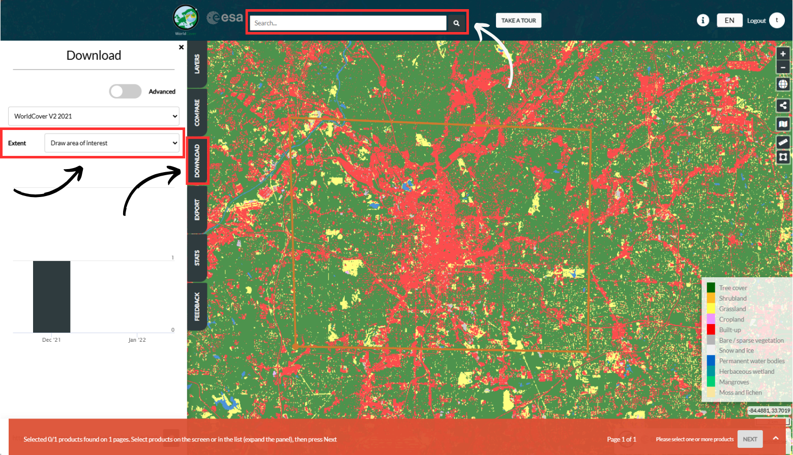
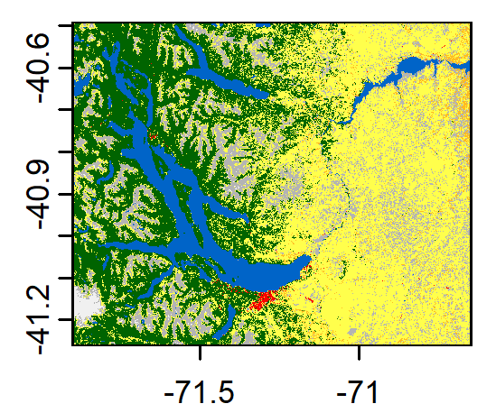

---
editor_options:
  markdown:
    wrap: 72
---

**NOTE:** You may be used to starting by setting your directory using
`setwd()`. However, we highly recommend using RStudio Projects. RStudio
Projects make it straightforward to divide your work into multiple
contexts, each with their own working directory, workspace, history, and
source documents. A Project is essentially a directory which will
contain all the files you need for a specific project. Go to RStudio and
click on *File \> New Project \> Exisiting Directory* and locate your folder in 
*UWIN_tutorials/IUWC25_OSM/*.

# UWIN Tutorial: Enhancing maps with OpenStreetMap Data

*Created by Kim Rivera and Tiziana Gelmi-Candusso - last updated April
2025*

This tutorial is aimed at those interested in (1) advancing their
spatial mapping skills and (2) integrating OpenStreetMap and other data
sources to enhance existing spatial datasets. This tutorial builds on
work described in the manuscript, ['Leveraging Open-Source Geographic
Databases to Enhance the Representation of Landscape Heterogeneity in
Ecological Models'
(2024)](https://onlinelibrary.wiley.com/doi/full/10.1002/ece3.70402) by
Gelmi-Candusso T., Rodriguez P., Fidino, M., Rivera, K., Lehrer, E.W.,
Magle, S., & Fortin M.

### Some helpful references:

1.  [Manuscript GitHub
    Repository](https://github.com/tgelmi-candusso/OSM_for_Ecology.git) -
    Tiziana Gelmi-Candusso
2.  [OpenStreetMap](https://www.openstreetmap.org/export#map=15/-41.15840/-71.31170)
3.  [Open Buildings](https://sites.research.google/gr/open-buildings/)
4.  [Introduction to spatial
    mapping](https://github.com/urbanwildlifeinstitute/UWIN_tutorials/blob/main/tutorials/week6_spatial_mapping/spatial-mapping.md) -
    Tiziana Gelmi-Candusso and Mark Jordan

### Tutorial Aims:

#### <a href="#OpenStreetMaps"> 1. What is OpenStreetMap and why should we use these data?</a>

#### <a href="#pullingandfiltering"> 2. Pulling and filtering data</a>

#### <a href="#building"> 3. Building landcover classes</a>

#### <a href="#integrating"> 4. Integrating Maps</a>

<a name="OpenStreetMaps"></a>

## 1. What is OpenStreetMap and why should we use these data?

Wildlife ecology and behavior are strongly driven by landscape
characteristics, especially in urban regions. Cities are among the
world's most heterogeneous landscapes however, global land cover maps
often represent urban areas as a single, homogeneous class therefore
limiting our ability to build useful spatial ecological models over
large scales. However, we can use community-based geographic databases,
such as OpenStreetMap (OSM), to improve the quality and spatial
resolution of urban land cover data. OSM is an open-source mapping
platform storing landscape information in the form of geographic polygon
features identified by a series of attributes.

Take the below example of Chicago, Illinois (USA). On the left we see a
relatively homogenous landscape of 'urban' land cover (in red) from the
Commission for Environmental Cooperation Land Use Land Cover data. On
the right we have the same dataset overlaid by spatial data collected
from OSM. We can see OSM greatly improves our ability to asses
heterogeneity in the urban landscape and therefore improve our
understanding of urban wildlife ecology.

<p float="center">


</p>

OSM data generated by community members are supplemented with
information from governmental and non-governmental agencies around the
globe and these data have been reliably used in diverse ecological
research studies. Extracting a few features from the OSM database for
small areas can be done directly online, however, extracting larger
study areas, or extracting the full database is much more difficult.
Therefore, we outline the framework to integrate OSM data as described
in [Gelmi-Candusso et al.,
2024](https://github.com/tgelmi-candusso/OSM_for_Ecology.git).

<a name="pullingandfiltering"></a> 

## 2. Pulling and filtering data
We will be working through an example study area in northern Patagonia,
Argentina. Collaborating UWIN partners here are based in the Centro
Científico Tecnológico Consejo Nacional de Investigaciones Científicas y
Técnicas (CONICET) in San Carlos de Bariloche in the province of Río
Negro, Argentina.

### Libraries

There are a handful of libraries we will want to install and load into
our console, including `osmextract` which was specifically created to
easily extract data from OpenStreetMaps. We will also be loading in some
custom functions which we will break down later in this tutorial.

``` r
# package_load:
# A general function to load packages, and if not on a computer
# to download them first
package_load<-function(packages = NA, quiet=TRUE, verbose=FALSE, warn.conflicts=FALSE){
  
  # download required packages if they're not already
  pkgsToDownload<- packages[!(packages  %in% installed.packages()[,"Package"])]
  if(length(pkgsToDownload)>0)
    install.packages(pkgsToDownload, repos="http://cran.us.r-project.org", quiet=quiet, verbose=verbose)
  
  # then load them
  for(i in 1:length(packages))
    require(packages[i], character.only=T, quietly=quiet, warn.conflicts=warn.conflicts)
}

package_load(
  c(
    "osmextract","tidyterra", "dplyr", "terra", "sf",
    "readr", "devtools", "ggplot2", "googledrive",
    "colourpicker", "tmap", "smoothr", "geos"
  )
)

# Load in libraries
library(osmextract)
library(tidyterra)
library(dplyr)
library(terra)
library(sf)
library(readr)
library(devtools)
library(ggplot2)
library(googledrive)
library(colourpicker)
library(tmap)
library(smoothr)
library(geos)

# Load in functions
setwd("./IUWC25_OSM")
source("./OSM_to_LULC_functions_Bariloche.R")  
```

## Download spatial data

### Example data

GitHub is limited to hosting file sizes \<2GB on the cloud repository.
If you want to run through the example in this tutorial, we will need to
download and add some large spatial datasets to our `./data` folder
which can be downloaded from a google drive folder called
'enhancing_maps'
[here](https://drive.google.com/drive/folders/1DkQkxmcbfXyEAb35bzoJrjVHREy6UHOL?usp=drive_link).

These include: 1. Open Buildings data (`Argentina_buildings.gpkg` and
`build.rds`) - This data can be downloaded directly from [Open
Buildings](https://sites.research.google/gr/open-buildings/) as a
`.csv.gz` file (also included in this folder). However, converting a
`.csv.gz` to a geopackage (to use more easily in R) can be
computationally heavy, therefore, we will read in the converted
geopackage directly and download an .rds file which will load in even
faster if needed. 2. Landcover map of Argentina
(`CCS-Map-300m-P1Y-2022-Argentina.nc`) - This is landcover data from the
Climate Data Store Data for Argentina we will use as the background of
our OSM map

### Custom data

For constructing your own custom map, we will integrate ESA Worldcover
data with OSM. You can access and download data from
[esa-worldover.org](https://esa-worldcover.org/en) \>
[Explore](https://viewer.esa-worldcover.org/worldcover/?language=en&bbox=-295.3125,-82.51774853061981,295.3125,82.51774853061983&overlay=false&bgLayer=OSM&date=2025-05-14&layer=WORLDCOVER_2021_MAP)
and Login or Register for a free TERRASCOPE account. This will allow you
to download data from the *DOWNLOAD* tab where you can search for a
specific region at the top of the viewer website and Ctrl + click on the
spatial tiles you want to download or use the *Extent* to draw and
download an area of interest (double click to exit polygon drawing).
Depending on your study region, you may need to download 1 or many
spatial tiles.

<p float="center">



</p>

Once you click *Next*, a Download tab will popup. You only need to
download **ESA_WORLDCOVER_10M_Map** files.

<p float="center">


</p>

Once downloaded, extract the downloaded zip files and add spatial .tif
files to your data folder.

### OSM data

OSM data is made up of various features which include linear (e.g. a
river or road) and polygon data (e.g. a building or lake). Additionally,
features can be assigned **keys** and keys are assigned **values**.
**Keys** are generally related to the classification of a landscape
feature while **values** are further descriptors of a key. For example,
there may be a feature called 'building', with the keys *building* and
*parking*. Note a feature may have multiple keys. Then, each of these
keys will also have an assigned value. The values may be described as a
*school* or a simple *yes* (as in yes this is a building). See examples
below.

| feature       | key      | value                        |
|---------------|----------|------------------------------|
| Institutional | amenity  | school                       |
| Building      | building | school, hospital, commerical |
|               | parking  | multi-storey                 |
| Water         | natural  | spring                       |
|               | landuse  | basin                        |

We will load in common feature keys and values which have been organized
and described in Gelmi-Candusso et al., 2024.

``` r
#table with the key-value pairs to be extracted 
osm_kv <- read_csv(
  "https://raw.githubusercontent.com/tgelmi-candusso/OSM_for_Ecology/main/urban_features/osm_key_values.csv"
) 
osm_kv <- osm_kv %>% 
  filter(!is.na(key))
keys <- unique(osm_kv$key)
```

We can use `osmextract::oe_get` (to download directly in R from online)
or `osmextract::oe_read` (to read in downloaded OSM spatial file) to
extract OSM data limited to our keys and study area.

#### Extracting OSM Data

Using `osmextract::oe_get`, we will want to limit our query to the
smallest geofrabrik (OSM) data which includes our study area. Our first
query pass may be the city level, state level or country level. To find
your region (not all cities are able to be queried), it's helpful to
start by querying at the smallest level, e.g. city and see if it
matches. If that query is unsuccessful, move on to state and if not
available, then to the country. It is also possible to set a boundary,
by clipping an extent, around your first query pass.

For our example, we can start by setting a larger query location for
Argentina and subset to a smaller bounding box based on our unique study
region. To find the best query for your data, you can try searching on:
<https://www.openstreetmap.org/>. To define your study city or a
bounding box more specifically, you can go to
[**OpenStreetMap.com**](https://www.openstreetmap.org/export#map=13/-41.15087/-71.32273)
**\> export \> manually select a different area** to find your boundary
box coordinates of interest.

Downloading may take a few minutes to load. If you want to follow the
example, you can read in `pol_feat.rds` from our `./data` folder if
needed (see code chunk below).

``` r
# for Argentina example read in:
pol_feat <- readRDS("./data/pol_feat.rds")
```

#### Downloading OSM data

Depending on your connection, it may be faster to download OSM directly
from their Geofabrik website. Data from each USA state can be downloaded
[here](https://download.geofabrik.de/north-america/us.html) and
continent or country data can be downloaded
[here](https://download.geofabrik.de/).

Once you locate your state or region of interest, download the .osm.pbf
file and add it to your data folder.

``` r
# Set our first query
# Replace with your study area country or region based on names listed on OSM's Geofabrik website: https://download.geofabrik.de/
place <- "Argentina" 

# Narrow down our first query to a bounding box using latitude/longitude coordinates which will help load data faster
# Argentina example
study_area_bbox <- sf::st_bbox(c(xmin=-71.900000,ymin=-41.262600,xmax=-70.650000,ymax=-40.490000), 
                               crs = "epsg:4326") %>% 
  st_as_sfc() 

# Download data directly from online
pol_feat <- osmextract::oe_get(place = place, # place we defined above
                               boundary = study_area_bbox, # more specific study area boundary (this helps speed up processing)
                               boundary_type = c("spat","clipsrc"),
                               provider ="geofabrik",
                               layer = "multipolygons",
                               stringsAsFactors = FALSE,
                               quiet = FALSE,
                               force_download = TRUE,
                               extra_tags=keys)

# Read in downloaded OSM data
pol_feat <- oe_read("./data/argentina-latest.osm.pbf",
                   boundary = study_area_bbox, 
                   boundary_type = c("spat","clipsrc"),
                   layer = "multipolygons",
                   stringsAsFactors = FALSE,
                   quiet = FALSE,
                   force_download = TRUE,
                   extra_tags=keys)
```

It can be helpful to check that you are grabbing the expected study area
as a common mistake is to mix up X and Y coordinates!

``` r
# Confirm the box is the correct coordinates for you study area 
plot(study_area_bbox, axes = TRUE)
```

<p float="center">


</p>

Great, now we have grabbed all the OSM data using our **keys** within
our outlined study area. Depending on your research questions or the
data available for your region, you may wish to limit OSM data to a more
specific area within your region, such as local municipalities or urban
landscapes. Although OSM data is very powerful in more populated
regions, it may do a poorer job describing natural landscapes around
urban areas. Therefore, we want to limit our OSM extraction to urban
regions only, and another global or national dataset to describe the
surrounding natural landscape (more on this later).

We can do this by cherry picking OSM polygons or boundaries using
`filter()` on the `pol_feat` data using OSM boundaries such as *osm_id*
or *admin_level*. Examine your study area on
[OpenStreetMap.com](www.openstreetmap.org) and determine if there are
any polygons or boundary you want to limit pulling OSM data from.
Remember, OSM functions best in urban regions so if your study area
abuts a large natural or protected area, you may want to exclude that
from your OSM data layer.

For our example in Argentina, we will isolate two cities, Villa La
Angostura and San Carlos de Bariloche and join them in the same
multi-polygon layer.

``` r
# This filtering grabs the townships of our study area and any landcover class in our study area tagged as 'scrub'. We do this because Bariloche's boundary is outside
# the barriers we want to grab OSM data. Grabbing the smaller municipalities lets us limit our boundary to the city area more specifically. Then we will use 
# a national landcover map to fill in regions not covered well by OSM (e.g. non-urban areas)
study_area_boundary <- pol_feat %>% 
  filter((boundary == "administrative" & admin_level %in% c(8,9) # admin_level=* key describes the administrative level of a feature within a subdivision hierarchy
          & osm_id != 3405247) | natural == "scrub")

# Now we grab the larger Bariloche boundary so we can subset our study area just to Bariloche
bariloche_boundary <- pol_feat %>% 
  filter(osm_id == 3405247)

# Here we subset to our Bariloche boundary (excluding Villa La Angostura). This is so 
# we can apply a smoothing function in our next step. Ignore the warning message here.
sf_use_s2(FALSE)
bariloche <- study_area_boundary %>% 
  st_intersection(bariloche_boundary)
```

Though we have a fairly good buffer around the urban region of
Bariloche, we can tidy the boundary up further using a smoothing
function. We can play with variables in this function to buffer the
boundary more widely or smooth gaps in the boundary. Then we can grab
all the OSM data within our new buffered area. See how the boundary
changed before and after smoothing below.

``` r
# notice that filtering to the townships of Bariloche misses some urban data nearby.
# By using a buffer and smoothing function, we can grab additional areas around 
# the small municipalities
sf_use_s2(TRUE)
bariloche_buffer <-
  st_geometry(bariloche) %>% 
  st_buffer(1) %>%  
  st_union() %>%
  as_geos_geometry() %>% 
  geos_concave_hull(ratio = .02) %>% 
  st_as_sfc() %>% 
  st_buffer(5) %>% 
  smoothr::smooth(method = "ksmooth", smoothness = 3)

plot(bariloche[1], main = "Bariloche boundary") # before smoothing
plot(bariloche_buffer[1], main = "Bariloche boundary smooth") #after smoothing

# Now we are ready to grab all OSM polygons which fall within our new 'bariloche buffer'
sf_use_s2(FALSE)
bariloche_poly <- pol_feat %>% 
  st_intersection(bariloche_buffer)
```

<p float="left">


</p>

We do not need to buffer or smooth Villa Angostura like we did for
Bariloche as the OSM boundary captures the urban region quite well.
Therefore we can just filter to the city's *osm_id* and convert our
boundary data.frame to a multipolygon. If we wanted to buffer or smooth
our data, we can use the same functions as above.

``` r
angostura_boundary <- pol_feat %>%
  filter(osm_id == 3442889)

plot(angostura_boundary[1], main = "Angostura boundary")

# convert to a multipolygon
sf_use_s2(TRUE)
angostura_buffer <- 
  st_geometry(angostura_boundary) %>% 
  as_geos_geometry() %>%
  st_as_sfc() 

# Grab all OSM polygons which fall within the Angostura polgygon
sf_use_s2(FALSE)
angostura_poly <- pol_feat %>% 
  st_intersection(angostura_buffer)
```

<p float="left">


</p>

Now we are ready to join our datasets and pull OSM linear data. As a
rule of thumb, we do not filter linear features soley within our urban
boundaries for OSM data as these will be useful to overlay on our global
landcover map which may not capture linear features well.

This may take a few minutes to load. If you are following the Argentina
example, you can read in `lin_feat` in from our `./data` folder (see
code chunk below).

``` r
# Join our two cities into one data.frame of polygons
pol_feat_agg <- rbind(bariloche_poly, angostura_poly)

# We're ready to grab out linear data from our study area region
lin_feat <- osmextract::oe_get(place = place,
                               layer = "lines", 
                               boundary = study_area_bbox,
                               boundary_type = 'clipsrc',
                               quiet = FALSE,
                               force_download = TRUE,
                               stringsAsFactors = FALSE, 
                               extra_tags=keys)
# Read in downloaded OSM data
lin_feat <- oe_read("./data/argentina-latest.osm.pbf",
                    layer = "lines",
                    boundary = study_area_bbox, 
                    boundary_type = "clipsrc",
                    stringsAsFactors = FALSE,
                    quiet = FALSE,
                    force_download = TRUE,
                    extra_tags=keys)

# for Argentina example read in:
lin_feat <- readRDS("./data/lin_feat.rds")
```

### Integrating Additional Data Sources

In addition to OSM data, we can incorporate other sources of relevant
data, such as Open Buildings data from Google. These data contain
outlines of buildings derived from high-resolution satellite imagery and
primarily focus on the continent of Africa and the Global South at
large. These data can further enhance our understanding of the urban
landscape and anthropogenic impact on our study area.

For this tutorial, we will not cover additional data integration, but a
code example is available below for Argentina.

<details closed>

<summary>See code to convert data here </a></summary>

``` r
# Read in building data downloaded from: https://sites.research.google/gr/open-buildings/
buildings <- read_csv("./data/961_buildings.csv.gz")
head(buildings)

building_df = st_as_sf(buildings, crs = "EPSG:4326", wkt = "geometry") # convert to spatial object
write_sf(building_df, "./data/Argentina_buildings.gpkg") # save as geopackage

# read in .gpkg file
build <- st_read("./data/Argentina_buildings.gpkg")
```

If `build` is loading too slowly, read in `build.rds`.

``` r
build <- readRDS("./data/build.rds")
```

Note that these data come with confidence values for each building's
probable existence. For our example, we will limit our dataset to
buildings with greater than 80% confidence of existing. Next, we will
format the data to easily bind it with our existing polygon data e.g.
`pol_data`.

``` r
# filter to buildings with >80% confidence
build_80 <- build %>% 
  filter(confidence > .8)

# Crop buildings layers to extent of study area or pol_feat if limited to specific polygons
build_80 <- st_crop(build_80, study_area_bbox)

# transform to pol_feat CRS
build_80 <- st_transform(build_80, st_crs(pol_feat))

# format data to be cohesive with pol_feat dataset
build_80$building <-rep("yes", nrow(build_80))
build_80 <- rename(build_80, geometry = geom)

# view building data plotted alongside pol_feat_agg
tmap_mode("view")
tm_shape(pol_feat_agg)+
  tm_fill(col = "red")+
tm_shape(build_80)+
  tm_fill(col = "blue") 
```

We can easily combine our data using `rbind`, however we need to match
our columns for each dataset. We can do this by adding all missing
columns to each dataset and populating them with NA's.

``` r
# Step 1: Make sure columns in both data.frames are the same
all_columns <- union(names(build_80), names(pol_feat_agg))  # Combine all unique columns from both

# Step 2: Add missing columns with NA in each data.frame
# Add missing columns to 'build'
missing_build <- setdiff(all_columns, names(build_80))  # Columns missing in 'build'
for (col in missing_build) {
  build_80[[col]] <- NA  # Add missing column with NA values
}

# Add missing columns to 'pol_feat_agg'
missing_pol_feat <- setdiff(all_columns, names(pol_feat_agg))  # Columns missing in 'pol_feat_agg'
for (col in missing_pol_feat) {
  pol_feat_agg[[col]] <- NA  # Add missing column with NA values
}
```

Now we are ready to row bind our datasets and save as a `sf` object.

``` r
combined <- rbind(build_80, pol_feat_agg)
pol_feat <- st_as_sf(combined)
```

Note that other data sources can be used to bolster existing OSM data
(like we have done here with the OSM `building` column) or be used to
create new sources or columns of data (for example, vacant lots).
However, any new columns that are added to the OSM data.frame, or
`pol_data`, will need to be added as new layers in our next steps.

</details>

<a name="building"></a> 

## 3. Building landcover classes
Categorizing OSM features Now we are ready to categorize OSM features
using the `vlayers()` function. We will filter OSM features from
Gelmi-Candusso et al., 2024 Table S4 and categorize them into classes.
This function grabs each landcover elements based on the filtered
polygon and linear OSM features (from our OSM keys) and creates
landcover 'classes' or features and puts them into a list. These classes
will represent the classes in our OSM-enhanced map. These layers can
easily be edited to add new, remove, and update landcover classes.

``` r
vlayers <- OSMtoLULC_vlayers(
  OSM_polygon_layer = pol_feat, 
  OSM_line_layer = lin_feat
)

# plot a layer to see if this worked as expected
plot(st_geometry(vlayers[[14]])) # This is the building layer
```

Example from Argentina:

<p float="center">


</p>

<details closed>

<summary>See the vlayers function</a></summary>

``` r
OSMtoLULC_vlayers <- function(OSM_polygon_layer, OSM_line_layer){
  
  # Create list to hold vector layers
  classL1 <- list()
  
  #class_01 <- industrial  
  classL1[[1]] <- OSM_polygon_layer %>% filter(landuse %in% c("industrial", "fairground") |
                                                 industrial %in% c("factory") |
                                                 power %in% c("substation"))
  #class_02 <- commercial 
  classL1[[2]] <- OSM_polygon_layer %>% filter(landuse %in% c("commercial", "retail"))
  
  # class_03 <- institutional  
  classL1[[3]] <- OSM_polygon_layer %>% filter(landuse %in% c("institutional", "education", "religious", "military") |
                                                 amenity %in% c("school", "hospital", "university", "fast_food", "clinic", "theatre", "conference_center", "place_of_worship", "police") |
                                                 leisure %in% c("golf_course")|
                                                 healthcare %in% c("clinic", "hospital"))
  #class_04 <- residential
  classL1[[4]] <- OSM_polygon_layer %>% filter(landuse %in% c("residential"))
  
  #class_05 <- landuse_railway
  classL1[[5]] <- OSM_polygon_layer %>% filter(landuse %in% c("railway"))
  
  #class_06 <- open_green
  classL1[[6]] <- OSM_polygon_layer %>% filter(landuse %in% c("park", "grass", "cemetery", "greenfield", "recreation_ground", "winter_sports")|
                                                 (!is.na(golf) & !(golf %in% c("rough","bunker"))) |
                                                 amenity %in% c("park") |
                                                 leisure %in% c("park", "stadium", "playground", "pitch", "sports_centre", "stadium", "pitch", "picnic_table", "pitch", "dog_park", "playground")|
                                                 sport %in% c("soccer")|
                                                 power %in% c("substation")|
                                                 surface %in% c("grass"))
  # class_07 <- protected_area
  classL1[[7]] <- OSM_polygon_layer %>% filter(leisure  %in% c("nature_reserve")|
                                                 #boundary %in% c("protected_area","national_park")|
                                                 protected_area %in% c("nature")|
                                                 landuse %in% c("nature_reserve", "natural_reserve", "landscape_reserve"))
  # class_08 <- resourceful_area
 
   classL1[[8]] <- OSM_polygon_layer %>% filter(landuse %in% c("orchard","farmland", "landfill","vineyard", "farmyard", "allotments", "allotment", "farmland")|
                                                 leisure %in% c('garden')|
                                                 !is.na(allotments))
  # class_09 <- heterogenous_green 
  classL1[[9]]  <- OSM_polygon_layer %>% filter(natural %in% c("garden", "scrub", "shrubbery", "tundra", "cliff", "shrub", "wetland", "grassland", "fell",
                                                               "heath","moor")|
                                                  landuse   %in% c("plant_nursery", "meadow", "flowerbed", "wetland")|
                                                  #!is.na("meadow")| # This part creates an error
                                                  golf %in% c("rough") | 
                                                  grassland %in% c("pairie"))
  
  #class_10 <- barren_soil 
  classL1[[10]]     <- OSM_polygon_layer %>% filter(natural %in% c("mud", "dune", "sand","scree","sinkhole", "beach")|
                                                   landuse  %in% c("brownfield", "construction")|
                                                   golf %in% c("bunker"))
  #class_11 <- dense_green
  classL1[[11]] <- OSM_polygon_layer %>% filter(landuse %in% c("forest")|
                                                  natural  %in% c("wood")|
                                                  boundary %in% c("forest", "forest_compartment"))
  #class_12 <- water 
  classL1[[12]]  <- OSM_polygon_layer %>% filter(landuse %in% c("basin")|
                                                   natural   %in% c("water", "spring", "waterway")|
                                                   waterway  %in% c("river", "stream", "tidal_channel", "canal", "drain", "ditch", "yest")|
                                                   (!is.na(water) & water != "intermittent")|
                                                   basin  %in% c("detention")|
                                                   intermittent != "yes"|
                                                   seasonal != "yes"|
                                                   tidal!= "yes")
  
  # class_13 <- parking_surface 
  classL1[[13]] <- OSM_polygon_layer %>% filter(parking %in% c("surface")|
                                                  aeroway   %in% c("runway", "apron"))
  
  # class_14 <- building
  classL1[[14]]     <- OSM_polygon_layer %>% filter( #!is.na("building")| # This part creates an error
    building %in% c("hospital", "parking", "industrial", "school", "commercial", "terrace", "detached", "semideatched_house", "house", "retail", "hotel", "apartments", "yes", "airport", "university")|
      parking   %in% c("multi-storey")|
      aeroway   %in% c("terminal"))
  
  # class_15 <- roads_very_high_traffic 
  classL1[[15]] <-  OSM_line_layer %>% filter(highway   %in% c("motorway",'motorway_link', "motorway_junction") &
                                                !grepl('/"bridge/"=>/"yes/"', OSM_line_layer$other_tags))
  
  # class_16 <- roads_sidewalk  
  classL1[[16]] <- OSM_line_layer %>% filter(footway    %in% c("sidewalk"))
  
  # class_17 <- roads_unclassified
  classL1[[17]] <- OSM_line_layer %>% filter(!(highway %in% c("footway","construction","escape","cycleway","steps","bridleway","construction","path","pedestrian","track","abandoned", "turning_loop","living_street", "bicycle road", "cyclestreet", "cycleway lane","cycleway tracks", "bus and cyclists", "service","services", "busway", "sidewalk", "residential", "rest_area", "primary", "motorway_junction", "secondary", "secondary_link", "tertiary", "tertiary_link", "motorway","motorway_link","trunk_link", "trunk", "corridor","elevator","platform","crossing","proposed", "razed")))
  
  # class_18 <- roads_very_low_traffic
  classL1[[18]] <-  OSM_line_layer %>% filter(highway    %in% c("services","service","turning_loop","living_street"))
  
  # class_19 <- roads_low_traffic
  classL1[[19]] <- OSM_line_layer %>% filter(highway    %in% c("residential", "rest_area", "busway"))
  
  # class_20 <- roads_med_traffic 
  classL1[[20]] <- OSM_line_layer %>% filter(highway    %in% c("tertiary", "tertiary_link"))
  
  # class_21 <- roads_high_traffic_low_speed
  classL1[[21]] <-  OSM_line_layer %>% filter(highway   %in% c("primary", "primary_link", "secondary", "secondary_link"))
  
  # class_22 <- roads_high_traffic_high_speed
  classL1[[22]] <- OSM_line_layer %>% filter(highway    %in% c("trunk", "trunk_link"))
  
  # class_23 <- streetcars
  classL1[[23]] <- OSM_line_layer %>% filter(railway    %in% c("tram"))
  
  # class_24 <- pedestrian_trails
  classL1[[24]] <- OSM_line_layer %>% filter(highway    %in% c("footway","construction","escape", "cycleway","steps","bridleway","path","pedestrian","track", "abandoned","bicycle road", "cyclestreet", "cycleway lane", "cycleway tracks", "bus and cyclists")|
                                               footway  != "sidewalk")
  
  # class_25 <- railway 
  classL1[[25]] <- OSM_line_layer %>% filter(railway    %in% c("light_rail","narrow_gauge","rail","preserved")|
                                               railway != "tram")
  # class_26 <- linear_features_not_in_use
  classL1[[26]] <- OSM_line_layer %>% filter(railway    %in% c("abandonded","construction","disused")|
                                               highway  %in% c("construction"))
  # class_27 <- barriers
  #classL1[[28]] <- OSM_line_layer %>% filter(!is.na("barrier"))
  classL1[[27]] <- OSM_line_layer %>% filter(barrier !='')
  
  return(classL1)
  
}
```

</details>

### Converting OSM features to rasters

Next, we will convert all the filtered OSM features into raster layers.
We will do this for each layer separately. Using the function `rlayers`,
we convert linear features into polygons using a specific buffer size
(see Gelmi-Candusso et al., 2024 Table S3). To rasterize we generate a
raster template using the extent of the downloaded study area. We will
define the extent of study area again using coordinate values. We will
not use a sfc object like 'study_area_bbox' as this will cause an error.
As a reminder:

| variable | coordinate        |
|----------|-------------------|
| xmin     | minimum latitude  |
| xmax     | maximum latitude  |
| ymin     | minimum longitude |
| ymax     | maximum longitude |

<details closed>

<summary>See the rlayers function</a></summary>

``` r
OSMtoLULC_rlayers <- function(OSM_LULC_vlayers, study_area_extent){
  classL1 <- OSM_LULC_vlayers
  rtemplate <- rast(res=0.001, ext = study_area_extent, crs= "EPSG:4326") 
  # rtemplate5 <- terra::project(rtemplate, "EPSG:5070")
  classL1  <- Filter(Negate(is.null), classL1) # eliminates any nulls
  
  refTable <- cbind.data.frame( # creates dataframe for each landcover class (or layer)
    "rid"=c(1:27), 
    "feature"=c("industrial", "commercial", "institutional", "residential", "landuse_railway",
                "open_green","protected area", "resourceful_area", "heterogenous_green", "barren_soil",
                "dense green","water", "parking_surface", "building","roads_very_high_traffic", 
                "roads_sidewalk", "roads_unclassified","roads_very_low_traffic", "roads_low_traffic",
                "roads_med_traffic", "roads_high_traffic_low_speed", "roads_high_traffic_high_speed",
                "streetcars", "pedestrian_trails", "railway", "linear_features_not_in_use","barriers"),
    "priority"=c(1:27),
    "geometry"=c(rep("poly",14), rep("line",13)),
    "buffer"=c(rep(NA,12),6,NA,NA,24,3,12,6, 12,18,36,6,3,12,6,1) # buffer in meters
  )
  
  classL2 <- list()
  
  for(i in 1:27){
    if(as.character(st_geometry_type(classL1[[i]], by_geometry = FALSE)) %in% c("POLYGON","MULTIPOLYGON", "GEOMETRY")){
      temp1 <- classL1[[i]] #stores vector layers
      if(nrow(temp1)>0){ # checks that layer is not empty
        temp1 <- st_make_valid(temp1) # check geometries are valid
        temp1 <- temp1 %>%  filter(!st_is_empty(.)) # removes empty geometries
        temp1 <- st_make_valid(temp1) 
        temp1 <- terra::project(svc(temp1)[1], rtemplate)
        temp1$priority <- refTable$priority[i]
        classL2[[i]] <- terra::rasterize(temp1, rtemplate, field="priority") # converts temp1 to a raster
        print(paste0("layer ", i, "/27 ready"))
      }
    }else{ # if the data is linear
      temp1 <- classL1[[i]]
      if(!is.null(temp1)){
        temp1 <- st_make_valid(temp1) 
        temp1 <- temp1 %>%  filter(!st_is_empty(.)) 
        temp1 <- st_make_valid(temp1) 
        temp1 <- st_transform(temp1, "EPSG:5070")
        temp1 <- st_buffer(temp1, dist=refTable$buffer[i]) # buffers are set in the refTable above
        temp1 <- terra::project(svc(temp1)[1], rtemplate)
        temp1$priority <- refTable$priority[i]
        classL2[[i]] <- terra::rasterize(temp1, rtemplate, field="priority")
        print(paste0("layer ", i, "/27 ready"))
      }else{print(paste0("layer ", i, "/27 null"))}
    }
  }
  return(classL2)
}
```

</details>

Note that in the `rlayers()` function, we set the resolution of our data
using `rast(res=0.001)`. This resolution is based on our coordinate
system, here WGS84. A resolution of .001 roughly translates to 100
meters. Setting your resolution is a balance between computational
efficiency and data granularity. To run our example here, it is best to
keep the resolution low, `res = .001` but for data analyses and
modeling, a finer resolution, such as `res= 0.00009` would capture
roughly 10x10m of data. To work with a finer-scale resolution for the
Argentina example, you can download the .tif rlayers
[here](https://drive.google.com/drive/folders/1xBk93YDDZerMvgEUfT90x4JxA5a15-KJ?usp=drive_link)
which have a resolution of .00001 for your use and comparison later in
the tutorial. If you want to read in the .tifs files, use the code
below.

<details closed>

<summary>To read in .00001 resolution rlayers </a></summary>

``` r
# List all .RDS files in the directory
rlayer_files <- list.files('./data', pattern = "\\.tif$", full.names = TRUE)

# Read each .RDS file back into a list, these do not load in order
loaded_rlayers <- lapply(rlayer_files, terra::rast)

# Add in null list items where data was missing to keep order cohesive with remaining code
loaded_rlayers <- append(loaded_rlayers, "NULL", after = 14)
loaded_rlayers <- append(loaded_rlayers, "NULL", after = 22)

# Check the data is working as expected and plot the buildings layer 
plot(loaded_rlayers[[14]], col = "black") # building polygons

# Give each list element its appropriate landcover name
names(loaded_rlayers) <- c("industrial", "commercial", "institutional", "residential", "landuse_railway",
                    "open_green", "protected_area", "resourceful_area", "heterogenous_green", 
                    "barren_soil", "danse_green", "water", "parking_surface", "building", "roads_very_high_traffic",
                    "roads_sidewalks", "roads_unsclassified", "roads_very_low_traffic", "roads_low_traffic",
                    "roads_med_traffic", "roads_high_traffic_low_speed", "roads_high_traffic_high_speed",
                    "street_cars", "pedestrian_trails", "railway", "linear_features_not_in_use",
                    "barriers")
```

</details>

Example from Argentina:

``` r
extent <- as.vector(ext(c(xmin=-71.900000,xmax=-70.650000, ymin=-41.262600,ymax=-40.490000)))

# this function assigns each landcover class information such as its geometry or a buffer
rlayers <- OSMtoLULC_rlayers(
  OSM_LULC_vlayers = vlayers,
  study_area_extent = extent
)

# Test this worked by plotting our building layer again 
plot(rlayers[[14]], col = "black") # 14 = building list
```

<p float="center">


</p>

We can visually see that we have lost data in our buidlings layer due to
the decrease in our spatial resolution.

### Merging rasters

It's time to stack and collapse our rasters by merging all layers into
one raster layer. We will overlay each raster following their priority
(created in the rlayers function). We have defined the priority of each
layer to represent movement barriers for wildlife, e.g. road features
are built over water features to maintain bridges in the landscape.

``` r

OSM_only_map <- merge_OSM_LULC_layers(
  OSM_raster_layers = rlayers
)
```

<details closed>

<summary>See the OSM_only_map function </a></summary>

``` r
  merge_OSM_LULC_layers <- function(OSM_raster_layers){ 
  classL2 <- OSM_raster_layers
  classL2 <- Filter(Negate(is.null), classL2)
  classL2 <- rev(classL2) #Seattle loses class 16 when we revert but reverting works as expected to overlay classes
  r3 <- terra::app(rast(classL2), fun='first', na.rm=TRUE)
  return(r3)
}
```

</details>

Let's have a quick view of our final OSM map using `ggplot()`. Below if
an example from Argentina.

``` r
ggplot() +
  geom_spatraster(data = as.factor(OSM_only_map), aes(fill = first)) +
  # You can use coord_sf
  coord_sf(crs = 4326) +
  scale_fill_manual(values = viridis::viridis(27), breaks = 1:27,
                    labels = c("industrial", 
                               "commercial", "institutional",
                               "residential","landuse_railway", "open green",
                               "protected area", "resourceful area","heterogeneous green area",
                               "barren soil","dense green area", "water",
                               "parking surface", "buildings",
                               "roads (v.h. traffic)", 
                               "sidewalks", "roads_na",
                               "roads (v.l. traffic)", "roads (l. traffic)", "roads (m. traffic)",
                               "roads (h.t.l.s)", "roads (h.t.h.s)", 
                               "trams/streetcars",
                               "walking trails", "railways", "unused linear feature",
                               "barriers"),
                    na.value = "white")
```

<p float="center">


</p>

We can also interact with our map using `tmap` and get a closer look at
our featured lines and polygons

``` r
tmap_mode("view")
tm_shape(as.factor(OSM_only_map)) +
  tm_raster(col.scale = tm_scale_categorical(values = terrain.colors(27)))
```

<a name="integrating"></a> 

## 4. Integrating maps 
As a reminder, the OSM database is primarily populated by community contributions, thus
there are likely gaps of information. To enhance our map and to ensure
we don’t have any gaps in the final output of the framework we will
integrate the `OSM_only_map` onto a global or continental land cover map
(depending on your region of interest).

### Example data

For Argentina, we will be overlaying OSM data on top of a global dataset
from [Climate Data Store
(CDS)](https://cds.climate.copernicus.eu/datasets/satellite-land-cover?tab=download).
These data describe land cover into 22 classes which have been defined
using the United Nations Food and Agriculture Organization’s (UN FAO)
Land Cover Classification System (LCCS) and do a good job describing the
natural landscape within our study region.

#### Read in and view data

``` r
# read in global dataset
my_map = rast("./data/CCS-Map-300m-P1Y-2022-Argentina.nc")

# subset raster to just the landcover data
my_map <- my_map$lccs_class

# crop map to OSM map extent
my_map_crop <- crop(my_map, ext(OSM_only_map))

# view the global landcover map
ggplot(data = as.factor(my_map_crop)) +
  geom_raster(aes(x = x, y = y, fill = lccs_class)) +
  theme(
    legend.title = element_text(size=11), #change legend title font size
    legend.text = element_text(size=8)) + #change legend text font size
  scale_fill_manual(name = "Landcover Class", 
                    #values= viridis::viridis(36),
                    values = c("#BFAE15", "#84D982", "#84D982",
                      "#BFAE15", "#BFAE15", "#84D982",
                      "#144F28", "#144F28", "#144F28", 
                      "#144F28", "#144F28", "#144F28", 
                      "#144F28", "#144F28", "#144F28",
                      "#144F28", "#144F28", "#84D982", 
                      "#84D982", "#768A5E", "#29612C", 
                      "#43993D", "#84D982", "#64B39B", 
                      "#B6C49A", "#B6C49A", "#B6C49A",
                      "#31635E", "#31635E", "#5A967A",
                      "#000000", "#A68964", "#A68964",
                      "#A68964", "#088da5", "#6CF7EE"),
                    breaks = c(10:12, 20, 30, 40, 50, 60:62, 70:72,
                               80:82, 90, 100, 110, 120:122, 130, 140, 150:152, 160, 170,
                               180, 190, 200:202, 210, 220), # to match map values
                    labels=c("cropland, rainfed", "herbaceous cover", "tree or shrub cover",
                             "cropland, irrigates, or post-flooding",
                             "mosaic cropland >50%",
                             "mosaic natural vegetation >50%", "tree cover, evergreen >15%",
                             "tree cover, deciduous >15%",
                             "tree cover, deciduous, closed >40%",
                             "tree cover, deciduous, open 15-40%",
                             "tree cover, needleleaved, evergreen, >15%",
                             "tree cover, needleleaved, evergreen >40%",
                             "tree cover, needleleaved, evergreen, 15-40%",
                             "tree cover, needleleaved, deciduous, >15%",
                             "tree cover, needleleaved, deciduous >40%",
                             "tree cover, needleleaved, deciduous, 15-40%",
                             "tree cover, mixed leaf",
                             "mosaic tree and shrub",
                             "mosaic herbaceous cover",
                             "shrubland",
                             "evergreen shrubland",
                             "deciduous shrubland",
                             "grassland",
                             "lichens and moses",
                             "sparse vegetation (tree, shrub, herbaceous cover)",
                             "spare shrub <15%",
                             "sparse herbaceous cover <15%",
                             "tree cover, flooded, fresh or brakish water",
                             "tree cover, flooded, saline water",
                             "shrub or herbaceous cover, flooded, fresh/saline/brakish",
                             "urban areas",
                             "bare areas",
                             "consolidated bare areas",
                             "unconcolidates bare areas",
                             "water bodies",
                             "permanent snow and ice")) +
  theme_void() +
  theme(legend.position = "right")+
  coord_equal()

# To save map as a .png
# ggsave("./figures/CDS_LULC_map.png", dpi = 300, scale = 1.5, width = 10, height = 8.5, units = "in")
```

<p float="center">


</p>

### Custom data

For this tutorial, we will overlay OSM data on top of a global landcover
dataset from the [European Space Agency -
WorldCover](https://esa-worldcover.org/en), a set of yearly median and
percentiles composites at 10m resolution, derived from the Copernicus
Sentinel-1 and Sentinel-2 archives, for the years 2020 and 2021. More
information on this data can be found in the [Worldcover Product User
Manual](https://worldcover2021.esa.int/data/docs/WorldCover_PUM_V2.0.pdf),
including mapping classification values which we will need later in this
tutorial.

``` r
# read in ESA raster data
# change file name to your study area .tif
my_map = rast("./data/ESA_WorldCover_10m_2021_v200_S42W072_Map.tif")  #version 2
# crop map to OSM map extent
my_map_crop <- crop(my_map, ext(OSM_only_map))
plot(my_map_crop)
```

<p float="center">



</p>

## Stitching tiles 
  
``` r
#load the different tiles
my_map1 = rast("./data/global_LULC/WORLDCOVER/ESA_WORLDCOVER_10M_2021_V200/MAP/ESA_WorldCover_10m_2021_v200_N33W084_Map/ESA_WorldCover_10m_2021_v200_N33W084_Map.tif")
my_map2 = rast("./data/global_LULC/WORLDCOVER/ESA_WORLDCOVER_10M_2021_V200/MAP/ESA_WorldCover_10m_2021_v200_N33W087_Map/ESA_WorldCover_10m_2021_v200_N33W087_Map.tif")

#you can mosaic more than two tiles here, it will take a minute or two to process

my_map <- terra::mosaic(my_map1, my_map2)
```

### Reclassify Data

To integrate these maps, we need to reclassify our global data to be
cohesive with our OSM classification system. These data will then fill
in any NA cells (in the OSM map) with the information provided from our
global dataset.

When integrating global or local spatial data, we must create a
reclassification dictionary which describes how the global data will
transpose to the OSM dataset. We can choose to convert existing classes
into representative OSM classes or retain the global landcover classes
to be added to those of OSM. Note that most datasets will assign each
class a numeric value which can usually be found in the spatial
dataset's documentation. Classifications and further information on CDS
can be found
[here](http://dast.data.compute.cci2.ecmwf.int/documents/satellite-land-cover/D4.3.3-Tutorial_CDR_LC-CCI_v2.0.7cds_PRODUCTS_v1.0.1.pdf)
and ESA can be found
[here](https://worldcover2021.esa.int/data/docs/WorldCover_PUM_V2.0.pdf)
(see example below).

<p float="center">


</p>

We have prepped an example dictionary for CDS and ESA. Use this as a
model for your own reclassification dictionary. We will then read in the
.csv and extract just the numeric values. 

#### Example data

``` r
# Read in reclassification dictionary for example data
reclass_values <- read_csv("./data/reclass_cds_2_mcsc.csv")

# Select classification values only
CDS_to_OSM_table <- reclass_values %>% 
  dplyr::select(cds_value, mcsc_value)
```

#### Custom data

``` r
# Read in reclassification dictionary for custom data
reclass_values <- read_csv("./data/reclass_esa_2_mcsc.csv")

# Select classification values only
ESA_to_OSM_table <- reclass_values %>% 
  dplyr::select(esa_value, mcsc_value)
```

### Integrate Data

Now we are ready to create our final product, our integrated OSM and
global landcover map!

<details closed>

<summary>See the integrate_OSM_to_globalLULC() function</a></summary>

``` r
integrate_OSM_to_globalLULC <- function(OSM_lulc_map, global_lulc_map, reclass_table){
  
  #load global lulc raster that will work as a background layer to cover any missing data in the OSM_database
  r5 <-  global_lulc_map
  r3 <-  OSM_lulc_map

  r3p <- project(r3, crs(r5)) #reproject OSM-only raster to global LULC raster to crop the global LULC
  r5 <- crop(r5, r3p) #crop
  
  #reproject cropped global LULC to our frameworks projection
  r6 <- terra::project(r5, r3, method="near", align=TRUE)

  # crop again after reprojection to ensure rasters have the same extent
  r6 <- terra::crop(r6, r3)
  r6 <- terra::extend(r6, r3) # this is to ensure the rasters line up before masking.
  r7 <- classify(r6, reclass_table)
  r4 <- ifel(is.na(r3), r7, r3)
 
  return(as.factor(r4))
} 
```

</details>

#### Example Data

``` r
sf_use_s2(TRUE) # TRUE means we will use the s2 spherical geometry package for geographical coordinate operations
OSM_enhanced_LULC_map <- integrate_OSM_to_globalLULC(OSM_lulc_map = OSM_only_map,
                                                     global_lulc_map = my_map, 
                                                     reclass_table = CDS_to_OSM_table)
```

#### Custom Data

``` r
sf_use_s2(TRUE) # TRUE means we will use the s2 spherical geometry package for geographical coordinate operations
OSM_enhanced_LULC_map <- integrate_OSM_to_globalLULC(OSM_lulc_map = OSM_only_map,
                                                     global_lulc_map = my_map, 
                                                     reclass_table = ESA_to_OSM_table)
```

Voilà! We now have a new and improved integrated OSM land use land cover
map! Our object, `OSM_enhanced_LULC_map`, is a `SpatRaster` which can be
saved as a .tif or shapefile to be easily opened here or in ArcGIS or
other mapping programs.

``` r
# To save SpatRaster as .tif
terra::writeRaster(
  OSM_enhanced_LULC_map,
  "Bariloche_enhanced_lcover.tif",
  overwrite=TRUE
)

# To save raster as a shapefile
# Convert SpatRaster to raster
raster_data <- rast("./data/Bariloche_enhanced_lcover.tif")

# Convert raster to polygons
polygon_data <- as.polygons(raster_data)

# Create a new column which adds classification levels and can be used as an attribute table in ArcGIS
polygon_data$landuse_class <- values(raster_data)

# Save shapefile
writeVector(polygon_data, "Bariloche_enhanced_lcover.shp", overwrite = TRUE)
```

We can also use `ggplot2` to view our map in R and export as a .png,
.tif, etc.

``` r
OSM_enahnced_LULC_plot <- ggplot(data = OSM_enhanced_LULC_map) +
   geom_raster(aes(x = x, y = y, fill = first)) +
   theme( #change legend key size
  #       legend.key.height = unit(1, 'cm'), #change legend key height
  #       legend.key.width = unit(1, 'cm'), #change legend key width
        legend.title = element_text(size=11), #change legend title font size
        legend.text = element_text(size=8)) + #change legend text font size
    scale_fill_manual(name = "Landcover Class", 
                      values=c("#843438","#df919a", "#B5605E",
                             "#A37279", "#F7D200","#D4ED88",
                             "#AFDC70", "#BFAE15", "#84D982",
                             "#A68964", "#144F28","#088da5",
                             "#C2C2C2", "#000000",
                             "#F00400", "#6B6666",
                             "#ffce00","#F2C3A2", "#FCAC74",
                             "#ED9026", "#F25250", "#9C0300",
                             "#E8DBDA", "#783F04",
                             "#FFDA61", "#400000", 
                             "#BA0A07", "#518F77",
                             "#768A5E", "#29612C", "#43993D",
                             "#64B39B","#B6C49A", "#31635E",
                             "#5A967A", "#6CF7EE"),
                    breaks = c(c(1:27), 110, 120, 121, 122, 140, 150, 160, 180, 220), # to match map values
                    labels=c("industrial", "commercial", "institutional",
                             "residential","landuse_railway", "open green",
                             "protected area", "resourceful area","heterogeneous green area",
                             "barren soil","dense green area", "water",
                             "parking surface", "buildings",
                             "roads (v.h. traffic)", "sidewalks", "roads_na",
                             "roads (v.l. traffic)", "roads (l. traffic)", "roads (m. traffic)",
                             "roads (h.t.l.s)", "roads (h.t.h.s)", "trams/streetcars",
                             "walking trails", "railways", "unused linear feature",
                             "barriers", "mosaic herbaceous cover",
                             "shrubland", "evergreen shrubland","deciduous shrubland",
                             "lichens and moses", "sparse vegetation (tree, shrub, herbaceous cover)", 
                             "tree cover, flooded",
                             "herbaceous, flooded", "permanent snow and ice")) +
  theme_void() +
  theme(legend.position = "right")+
  coord_equal()

OSM_enahnced_LULC_plot

ggsave("OSM_enahnced_LULC_map.png", dpi = 500, scale = 1.5, width = 10, height = 8.5, units = "in")
```

<p float="center">


</p>

# EXTRAS

<Details closed>

<Extras>See code to convert data here </a></summary>

#### Golf course extraction

```R

#Isolating golf courses
packages.needed<- c("tmap","osmextract","tidyterra","dplyr", "terra", "sf", "readr", "readr", "ggplot2")
install.packages(packages.needed)
library(tmap)
library(osmextract)
library(tidyterra)
library(dplyr)
library(terra)
library(sf)
library(readr)
library(devtools)
library(ggplot2)


## grab OSM data
osm_kv <- read_csv(
  "https://raw.githubusercontent.com/tgelmi-candusso/OSM_for_Ecology/main/urban_features/osm_key_values.csv"
) 
osm_kv <- osm_kv %>% 
  filter(!is.na(key))
keys <- unique(osm_kv$key)

# Download and convert database for both polygon and linear features 
# if you have not done so already, 
# otherwise read in the already saved files. 

if(
  !file.exists("data/pol_feat_DC.rds")
){
  pol_feat_DC <- osmextract::oe_get(
    "District of Columbia",
    provider="geofabrik",
    layer = "multipolygons", 
    extra_tags=keys
  )
  saveRDS(
    pol_feat_DC,
    "data/pol_feat_DC.rds"
  )
} else {
  pol_feat_DC <- readRDS(
    "data/pol_feat_DC.rds"
  )
}

if(
  !file.exists("data/lin_feat_DC.rds")
) {
  lin_feat_DC <- osmextract::oe_get(
    "District of Columbia",
    layer = "lines", 
    extra_tags=keys
  )
  saveRDS(
    lin_feat_DC,
    "data/lin_feat_DC.rds"
  )
} else {
  lin_feat_DC <- readRDS(
    "data/lin_feat_DC.rds"
  )
}

head(pol_feat_DC)

```

```R

#jumping straight to vector layer #OSMtoLULC_vlayers generating vector layers from features
OSM_polygon_layer <- pol_feat_DC
golf <- list()
#separate golf course features into as many distinct classes you need
golf[[1]] <- golf_courses_area <- OSM_polygon_layer %>% filter(leisure %in% c("golf_course"))
golf[[2]] <- golf_course_grass <- OSM_polygon_layer %>% filter((!is.na(golf) & !(golf %in% c("rough","bunker"))))
golf[[3]] <- golf_course_not_grass <- OSM_polygon_layer %>% filter((!is.na(golf) & (golf %in% c("rough","bunker"))))

plot(golf_course_grass[,1])

```

```R

#convert to rasters
#create template
golf_raster <- list()
study_area_extent <- as.vector(ext(pol_feat))
rtemplate <- rast(res=0.0001, ext = study_area_extent, crs= "EPSG:4326") #PR #we have 30 m.
#finer resolution we tried was 0.00003

for(i in 1:length(golf)){
  temp1 <- golf[[i]]
  if(nrow(temp1)>0){
    temp1 <- st_make_valid(temp1) #PR
    temp1 <- temp1 %>%  filter(!st_is_empty(.)) #PR
    temp1 <- st_make_valid(temp1) # PR
    temp1 <- terra::project(svc(temp1)[1], rtemplate)
    temp1$priority <- 28+i
    golf_raster[[i]] <- golf_courses_area_raster <- terra::rasterize(temp1, rtemplate, field="priority") 
    print(paste0("layer ", i, "/28 ready"))
  }
  
}

plot(golf_raster[[1]])

```

```R
#overlay raster layers (what would be landcover classes or whatever features have been classified)
classL2 <- golf_raster
classL2 <- Filter(Negate(is.null), classL2)
classL2 <- rev(classL2) #Seattle loses class 16 when we revert but reverting works as expected to overlay classes
r3 <- terra::app(rast(classL2), fun='first', na.rm=TRUE)

plot(r3)
golf_courses_all<- r3
```

```R
#plot on live mode to check ll the golf courses are there
tmap_mode("view")
tm_shape(golf_courses_all)+
  tm_raster(col.scale = tm_scale_categorical(labels=))

```

```R

#to overlay to the LULC map
#first make list with golf_courses_all and LULC
full_map <- list()
full_map[[1]] <- OSM_enhanced_LULC_map
full_map[[2]] <- golf_courses_all

classL2 <- full_map
classL2 <- Filter(Negate(is.null), classL2)
classL2 <- rev(classL2) #Seattle loses class 16 when we revert but reverting works as expected to overlay classes
r3 <- terra::app(rast(classL2), fun='first', na.rm=TRUE)


tmap_mode("view")
tm_shape(r3)+
  tm_raster(style="cat")

```
</details>
