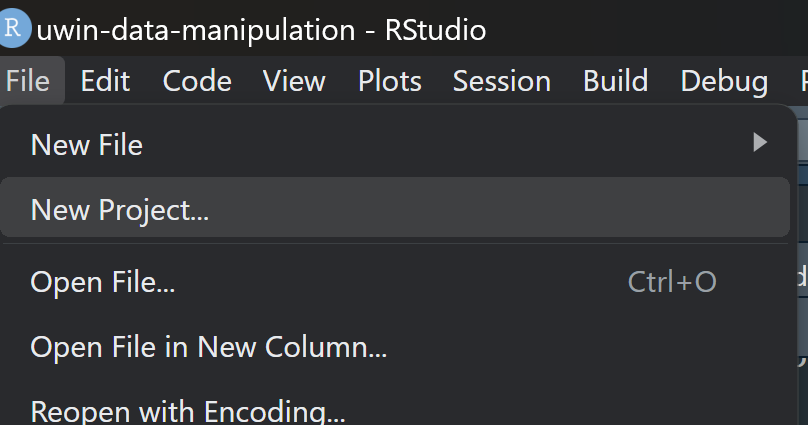
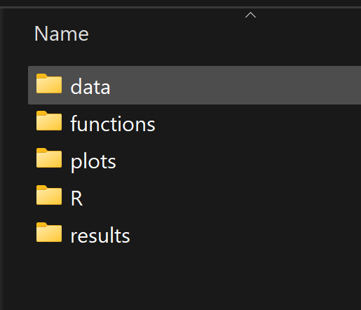
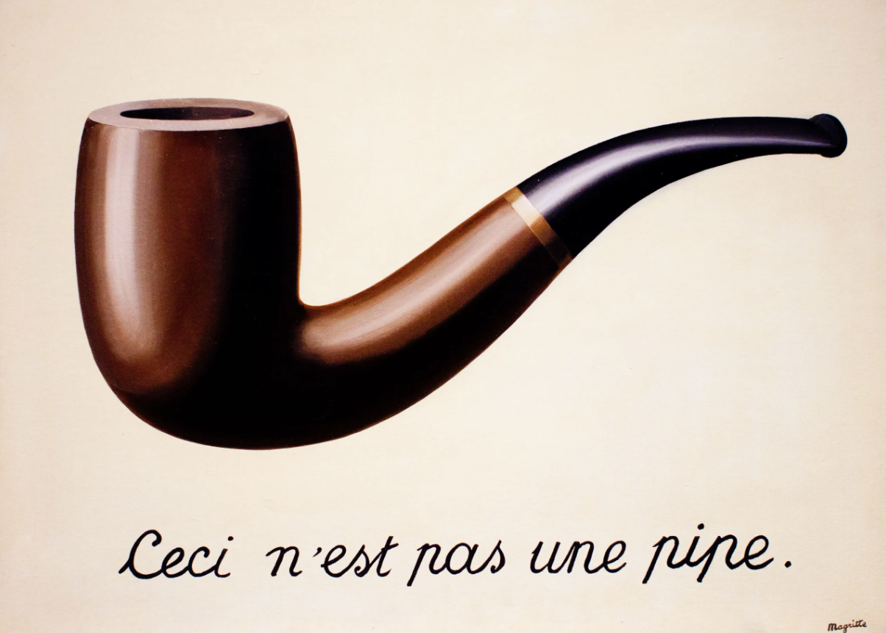
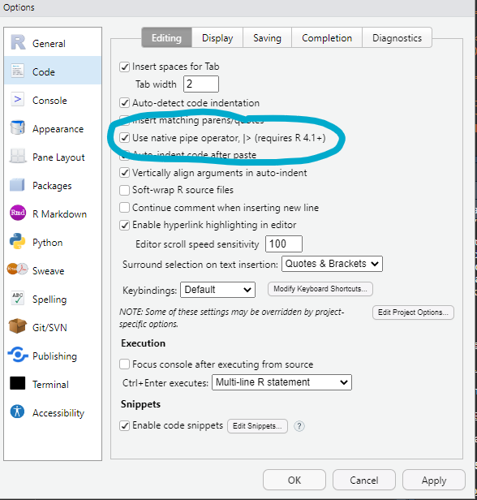
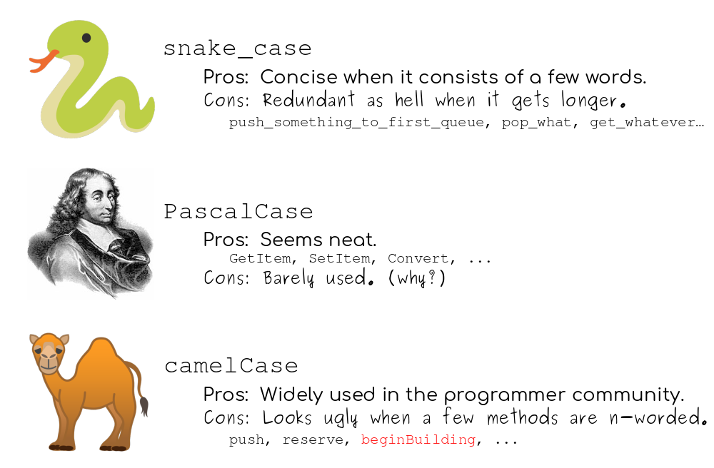

# Introduction to Data Manipulation and Cleaning in R using the Tidyverse

*Authors: Gabriela Palomo, Hannah Griebling, & Kimberly Rivera*

## Learning objectives

-   After today's lecture, you'll be able to:

    -   Understand the structure of analysis ready data
    -   Understand the main tidyr and dplyr verbs to help clean data
    -   Organize and clean commonly seen ecological data 

## Packages

These are the packages that we are going to be working with for this tutorial.

```{r}
# install relevant packages
install.packages("tidyr")
install.packages("dplyr")
install.packages("readxl")
install.packages("lubridate")
install.packages("stringr")
install.packages("ggplot2")
install.packages("janitor")

# read in libraries of packages to R session
library(tidyr)
library(dplyr)
library(readxl)
library(lubridate)
library(stringr)
library(ggplot2)
library(janitor)
```

## Organize the project and directory

Perhaps you are used to starting by setting your directory using `setwd()`. However, we highly recommend you use RStudio Projects. RStudio projects make it straightforward to divide your work into multiple contexts, each with their own working directory, workspace, history, and source documents.

We are going to start by creating a Project in RStudio. A Project is essentially a directory which will contain all the files you need for a specific project. It will have a `*.RProj` file associated with it to begin with.

Go to RStudio and click on File \> New Project.

<p float="center">
  

</p>

Now you see three options:

-   **New directory**: choose this option if you want to create a folder that will contain all the subdirectories and files of this particular project.
-   **Existing directory**: use this option if you already created a folder which will contain all the subdirectories and files for this particular project. Choose that folder here.
-   **Version Control**: choose this option if you are going to work with a repository already stored in GitHub.

For our own project, let's go ahead and choose 'Existing Directory' and navigate to "GitHub/UWIN_tutorials/Mada_workshop/Mada_data_cleaning" and create a new project with an appropriate name, for example: '2025_data_cleaning'

### Other files inside the main directory

You will have a series of directories inside your project, depending on the type of work that you'll be working on. Some people recommend following the same structure that you would use if creating an r package. However, we think that at a minimum, you could have the following structure:

<p float="center">
  

</p>


-   **Data** is a directory that has all your original .csv files with the data that you will use in your analysis.
-   **Functions** is a directory that houses all the functions you create and that you will be using throughout your analysis. Some people include this directory as a subdirectory of R.
-   **Plots** is a directory in which you will put all the graphs you create as part of your analysis.
-   **R** is a directory that will have all the scripts needed for your analysis.
-   **Results** is a directory that you may or may not need. The idea is to include all the resulting .csv or .rds files in here and keep them separate from your original files.
-   You may need other directories, especially if you are working with spatial data, for example, shapefiles, rasters, maps, etc.

## Naming files

Now we should discuss a very important topic which is **naming files**.
1. File names should be **machine readable**: avoid spaces, symbols, and special characters. Don't rely on case sensitivity to distinguish files.
2. File names should be **human readable**: use file names to describe what's in the file.
3. File names should play well with default ordering: start file names with numbers so that alphabetical sorting puts them in the order they get used.

Here are a few examples of **bad names**:

-   `Document 1.docx`
-   `manuscript_final.docx`
-   `final_document_final.qmd`
-   `data.csv`

Here are a few examples of **good names**:

-   `2024_05_03_manuscript_name.R`
-   `01_data_cleaning.R`
-   `02_model.R`
-   `fig-01.png`
-   `exercise-uwin-workshop.qmd`

Why are these **good names**? Well because if you have several of those, you can arrange them by date (descending or ascending), or by order of fig-01, fig-02.

### Warning!

It's important to note that `fig-01.png` is not the same as `fig-1.png` because your computer will read the following files in this order: `fig1.png`, `fig10.png`, `fig11.png`, `fig2.png`.

## Let's talk about pipes

-   At the beginning there was only one [pipe operator](https://magrittr.tidyverse.org/reference/pipe.html), `%>%`, which is from the `magrittr` package.

-   The idea is to have a way to pipe an object forward into a function or call expression.

-   It should be read as 'then'. For example: The following code is read as follows: start with object df THEN select col1.

```{r, echo=TRUE, eval = FALSE}
df %>% select(col1)
```
<p float="center">
  

</p>

## Native pipe in base R

-   Now, base R has it's own pipe called native pipe, `|>`, which is also read as 'then'.

-   You can activate this native pipe by going to Tools \> Global options \> Code and selecting that option.

<p float="center">
  

</p>

-   You can read more about the differences between both pipes [here](https://www.tidyverse.org/blog/2023/04/base-vs-magrittr-pipe/).

## `dplyr` verbs: data transformation

-   `dplyr` is a package based on a grammar of data manipulation, providing a consistent set of verbs that help you solve the most common data manipulation challenges:

    -   `mutate()` adds new variables that are functions of existing variables
    -   `select()` picks variables based on their names
    -   `filter()` picks cases based on their values
    -   `group_by()` groups variables for you to perform operations on the grouped data. Always remember to `ungroup()` once you are finished
    -   `if_else()` vectors to use for TRUE and FALSE values of condition
    -   `case_when()` a sequence of two-sided formulas. The left hand side determines which values match this case. The right hand side provides the replacement value
    -   `_join()` joins add columns from y to x, matching observations based on the keys. There are multiple types of joins. 
-   These can be linked together by pipes `|>` or `%>%`

-   Cool [cheatsheet for dplyr](https://github.com/rstudio/cheatsheets/blob/main/data-transformation.pdf)

## `tidyr` for tidying data

-   The `tidyr` package has a series of functions that are named after verbs that will help you tidy and clean data.

-   The goal of `tidyr` is to help you create **tidy data**. Tidy data is data where:

    -   Each variable is a column; each column is a variable

    -   Each observation is a row; each row is an observation

    -   Each value is a cell; each cell is a single value

-   Cool [cheatsheet for tidyr](https://github.com/rstudio/cheatsheets/blob/main/tidyr.pdf)

## Data organization for analyses!
First things first, let's see the data that we are going to be working with. Let's navigate to our `data` folder and find the raw file called 'All Lemurs.xlsx'. This is an excel file with numerous excel sheets. The data we want to work with today is on a sheet, or tab, called 'All Observations'. Often when we collect and save data, we like to save it in one place, like an excel file with multiple sheets. However, running analyses on multiple tabs can get confusing and is not possible to work with these data in R. To clean and analyze our 'All Observations' data we can save and export this data into a separate file. 

### What is CSV and why do we use it?
CSV, or Comma-Separate Values, are a simple and adaptable data format used widely in the coding community. Is allows data to be stored in a tabular format and is compatible with many data tools while still being easy to read by humans. Therefore, when possible, it is best to save and read data into R as a .csv file. This can be done by simply saving an excel file, or .xlsx file as a .csv. To do this navigate to File > Save As > Folder > Save as type "CSV (Common delimited)". 

Depending on how your data is formatted, R may read your data in a less legible way and may require some extra cleaning to *tidy* the data. Let's follow these steps to save our 'All Observations' data as a .csv file. Note it is best to use files without spaces, like lemur_data.csv, lemur.csv, lemur.data.csv, or LemurData.csv. Now, we are ready to read in our .csv data with a function called `read.csv()`. 

```R
# read in .csv data
lemur_data <- read.csv("./data/lemurs.csv", col.names = TRUE)
```
We get a warning that there are "more columns than column names" and "header and 'col.names' are of different lengths". This means that some columns are missing names or there may be columns with empty data cells like spaces that got entered into the file. 

We can overcome this error by adding our own unique column names. It can be good practice to update file names which are long, have spaces, or numbers at the beginning, all formats which will cause an error or problems coding in R. We also see that some of our column names start with a capital letter and others are separated by a space. Let's update these names to a more R-friendly format. We can programmtically by changing columns names with col.names = c("col1", "col1"), for example. We can also open our .csv file and update our column names manually. Lets try this programmatically.

```R
lemur_data <- read.csv("./data/lemurs.csv", header = TRUE,
                       col.names = c("Site", "Date",	"Time",	"Species",
                                     "Group_size",	"Height_m",	"Distance_m",
                                     "Compass_degree", "UTM_x",	"UTM_y",
                                     "Lat",	"Long",	"Accuracy_m",
                                     "Elevation_m",	"Trail_marker",	"Transect",
                                     "Habitat", "Scientist",	"Activity_behavior",
                                     "Cue"))
```

### Naming
Let's review some common naming conventions:

<p float="center">
  

</p>

This is important to remember so that you (and your team) can always stick to a name convention to make things easier for everyone. Whichever you use, DO NOT USE A SPACE TO SEPARATE WORDS.

-   These are ok for the name of a column: 'day01', 'Day_1', 'day1', 'day-01', 'day-1'
-   This is not ok: 'day 1'

You can leave the column names as is, but we want to show you a super handy function in package `janitor` that can help us rename all the columns to fit one naming convention. The options for `case` are 'snake', 'lower_camel', 'title', 'upper_camel'.

```{r}
# clean_names has the following cases: 
# "snake"
# "lower_camel"
# "upper_camel"
# "title" 
# detect abbreviations with abbreviations = c()
lemur_data <- janitor::clean_names(dat = lemur_data, 
                                     case = 'upper_camel')
# view new data
colnames(lemur_data)
```
If you wanted to edit a specific column name, we can also use the function `rename()`.

```R
lemur_data <- lemur_data %>% 
  rename("Latitude" = "Lat") %>% 
  rename("Longitude" = "Long")
```
Let's visually examine our data and see if there are any changes we need to make with data our formatting. The function `glimpse` helps us looks at the head of each data column and tells us how R interpretted what each data column class is, for example chr = character, int = integer, dbl = double-precision floating-point number (number with decimals). More information on data classes [here](https://users.phhp.ufl.edu/rlp176/Courses/PHC6089/R_notes/DataClasses.html).

```R
glimpse(lemur_data)
```
After examining our data, we see there are data types we want to change. For example, there are some characters columns we want to be numbers and other important updates like changing our date to be dates and our times to be times. 
 
Before we start to clean our data, let's add a unique identifier to observations, we can do that here by adding a count to each row, noting that the numbers are arbitrary and only helpful to reference a certain data point. This will help us to stay organized while we make updates to our data. 

```R
# Add observation ID
lemur_data$ID <- (c(1:nrow(lemur_data)))
```
### Common Errors
There are a few common errors we want to lookout for when tidying or cleaning data for analyses. These include:
1. Data/Time errors - Date and time data can be very tricky to manage, especially if there are mistakes in data entries or inconsistencies in the format each scientists uses, for example formatting day/month/year versus month/day/year. We need to make sure our dates and times are in the same format to ensure R reads them in correctly and we can format them as a date and time programmatically. This makes data analyses and visualization much easier later on!
2. Duplicate naming (for example: Male and male) - Even though as humans, we see 'Male' and 'male' as the same, R treats capitals and lowercase letters as distinct. Therefore, 'Male' and 'male' will be treated as two different names in R.
3. Adding spaces before or after data - Similar to capitalizations and spelling mistakes, R recognizes spaces like a unique character. Therefore 'Male' and ' Male' will appear to be two different names.
4. Spelling errors (for example: Female and femal) - Again, though we might recognize this spelling mistake, and know the data recorder meant to mark the animal as 'female', we need to correct this in our data to conduct our analyses correctly.

Let's check out some useful tools in R to account for these errors. 

#### Date and Time
A great library within dplyr is lubridate which has a useful [cheat sheet](https://rawgit.com/rstudio/cheatsheets/main/lubridate.pdf). Let's look at the head of our data to determine what format we want to put our dates into.

```R
head(lemur_data$Date)
```

It appears our `Date` data is formatted month/day/year. Let's use the lubdridate package to change this column to a date in R. 

To do this, we use the `mutate()` function to modify our Date. However, we have to tell R if we want this mutatation, or modification, to create a new column or to write over an existing column. Since we want to correct our exisiting column, we can tell R that `Date` is the column we want it to write our newly formatted values into. 

```R
lemur_prep <- lemur_data %>% 
  mutate(Date = mdy(Date))
```
We have a message that 108 rows which were not converted to a date and are now NA, this is likely because there are dates with different formatting within our column. It can usually help to plot our data and see if the dates make sense.

```R
hist(lemur_prep$Date, breaks = "months")
```
We can also look at which dates got converted to NA. This is where our ID number for each observation can be helpful! We can use a filter() function to do this.

```R
# select data that are NA
examine <- lemur_prep %>% 
  filter(is.na(Date))

# create a new data.frame that grabs the original data based on the ID's of our 'bad date' data we just filtered
bad_dates <- semi_join(lemur_data, examine, by = "ID",  copy = FALSE)
```
Now we can see why these dates did not format correctly! We can see that some are formatted day/month/year and others, month/day/year. We also see that some data use slashes '/', and others are formatted with dots, '.'. Now that we identified the key problems, we can begin to correct dates to follow a single format. We will want to start by grabbing date data for every site we found in 'bad_dates'. It's important for us to verify the entire site data because it is possible for example, that when we formatted the data earlier, some days got converted to months and months to days. For example, 12/11/10 could mean December 11, 2010 OR November 12, 2010!

We can also return to our paper or original records to confirm our suspicions. Let's pretend we verified our data with our paper or field records and now we know the correct formatting for these sites should be formatted day/month/year. We also know that our data was only collected in the years 2010 - 2012. To fix this, we will go back to our original dataset 'lemur_data' and correct these sites before converting all of our date data.

We can grab one site and fix it, or we can grab multiple. Note that 2AJB and FRK use different syntax: 2AJB uses '/' and FRK uses '.', but R can still reformat these correctly.

```R
# First try one site
correct_dates <- lemur_data %>% 
  filter(Site == "2AJB") %>% 
  mutate(Date = dmy(Date))

# Now we can add other sites that have errors, we can look at our 'bad_dates dataframe' to confirm which sites.
unique(bad_dates$Site)

correct_dates <- lemur_data %>% 
  filter(Site == "2AJB" | Site == "FRK" | Site == "FLJ" | Site == "VIN") %>% 
  mutate(Date = dmy(Date))
```

We want to join our correct dates back to our original dataset, we can do this again with another join, a left join. Let's first just select the columns we need from correct_dates: Date and ID. It can be helpful to change the object name to know where we are at in our cleaning process; that way we can go back to past data frames and see the last place we successfully made changes.

```R
lemur_date <- lemur_prep %>%
  left_join(correct_dates %>% select(ID, CorrectedDate = Date), by = "ID") %>% # This selects only the ID and Date column and renames it to a new column 'CorrectedDate'
  mutate(Date = if_else(!is.na(CorrectedDate), CorrectedDate, Date)) %>% # We use an if_else() statement, where if there is a 'CorrectedDate' data, we replace the old dtaa information in the 'Date' column
  select(-CorrectedDate) # Now that we merged the columns, we can get rid of our 'CorrectedDate' column

# view range of dates again
hist(lemur_date$Date, breaks = "months")

```
This is making a lot more sense! We can follow the same process for our time data too. 

```R
# format time data
lemur_time <- lemur_date %>% 
  mutate(Time = hm(Time))
```
With these correctly formatted, it's easy to look at one component of the date or time. For example:

```R
day(lemur_time$Date)
hour(lemur_time$Time)
```

Next, let's look at our other data columns and see if any common errors appear here, such as spelling or empty cells. Let's start with species names.

#### Other Common Errors
```R
unique(lemur_time$Species)
```
We have one species *Microcebus rufus* that is listed here twice, one with just the species names the other with a astrix*. This will cause issues in our data analyses as it will be considered as two distinct species. Therefore we should match the names and create a new column which indicates if they have an astrix or not.

We can do this by using an if_else() statement, where if there is a "Microcebus rufus*", we put a 1 in the new column 'Astrix' and if not, a 0.

```R
lemur_species <- lemur_time %>% 
  mutate(Astrix = if_else(Species == "Microcebus rufus*", 1, 0))

# check unique species names
unique(lemur_species$Species)
```

If we need to apply multiple 'if_else' statement across a single column, we can use another function called 'case_when`. Using `mutate()` again, we can apply `case_when()` like we did with `if_else`. This function allows us to target specific columns and instances of data entry we want to change. We can use different opertors to tell R how we want to change our columns. 

| Operator     | Description                       |
|--------------|-----------------------------------|
| `>`          | greater than                      |
| `>=`         | greater than or equal to          |
| `<`          | less than                         |
| `<=`         | less than or equal to             |
| `==`         | exactly equal to                  |
| `!=`         | not equal to                      |
| `a | b`      | logical OR (either `a` or `b`)    |
| `xor(a, b)`  | exclusive OR (only `a` or only `b`) |
| `a & b`      | logical AND (both `a` and `b`)    |
| `is.na()`    | detects missing (`NA`) values     |
| `!is.na()`   | filters out missing values        |
| `%in%`       | checks if a value is in a set     |

In our case, we want to change multiple values in the GroupSize column to be specific numbers. 

```R
unique(lemur_species$GroupSize)

lemur_group <- lemur_species %>% 
  mutate(
    GroupSize = case_when(
      GroupSize == "4 to 5" ~ 4,
      GroupSize == "3 to 5" ~ 3,
      GroupSize == "3 to 4" ~ 3,
      GroupSize == "4?" ~ 4,
      GroupSize == "2?" ~ 2,
      GroupSize == "2 to 4" ~ 2,
      GroupSize == "6 to 7" ~ 6,
      TRUE ~ as.numeric(GroupSize)
  ))
```

If there are any values we did not specify here, and are not a valid number, the data will get 'coerced' or changed to to NA automatically. It's important to know that NA may mean a few different things, for example, not applicable, not available, not assessed, or no answer. This is different than zero data. 

Let's see how our data has changed.

```R
unique(lemur_species$GroupSize)
unique(lemur_group$GroupSize)
```

Much better! We can move on to our next data column, `HeightM`. 

```R
unique(lemur_group$HeightM)
```

Lets start by naming a new object related to height, now that we are done fixing errors in `GroupSize`. Then we can edit values that are not valid numbers. Remember, anything that is not a number and you don't edit here, will turn to NA. Try this now on your own!

<details closed><summary> HeightM Solution</a></summary>

```R
lemur_height <- lemur_group %>% 
  mutate(
    HeightM = case_when(
      HeightM == "15?" ~ 15,
      HeightM == "5 to 8" ~ 5,
      TRUE ~ as.numeric(HeightM)
    ))

unique(lemur_height$HeightM)
unique(lemur_group$HeightM)
```
             
</details>

Now that you're getting more pratice with case_when(), you can tidy the `DistanceM` on your own too! Some values here have minimums and maximums. It's important to know that we cannot have columns with mixed data types, e.g. we can't have numbers and characters. For example the value "< 500" will be read in R as a character while "500" alone will be a numeric value. If they are placed in the same column, all numeric values will change to characters. 

Let's use these numbers as our final measurement. For example, >500 == 500, >200 == 200.

<details closed><summary>Distance Solution</a></summary>

```R
# view unique values
unique(lemur_height$DistanceM)

# make changes
lemur_dist <- lemur_height %>% 
  mutate(
    DistanceM = case_when(
      DistanceM == ">100" ~ 100,
      DistanceM == ">500" ~ 500,
      DistanceM == "<500" ~ 500,
      DistanceM == ">200" ~ 200,
      DistanceM == "~20" ~ 20,
      TRUE ~ as.numeric(HeightM)
    ))

# check changes
unique(lemur_height$DistanceM)
unique(lemur_dist$DistanceM)
```
             
</details>

Let's examine some of our numeric columns. We can use `hist()` like we did for dates to confirm that our numbers make sense with what we know about our data and measurements. For example, we know that our compass degrees must range from 0 - 360 degrees. 

```R
# view our numeric columns
glimpse(lemur_dist)

hist(lemur_dist$CompassDegree)

hist(lemur_dist$UtmX)
hist(lemur_dist$UtmY)

hist(lemur_dist$Latitude)
hist(lemur_dist$Longitude)

hist(lemur_dist$AccuracyM)
```
We can see under glimpse that 'ElevationM' is a character string, not numeric. Likley, there is an error here.

```R
unique(lemur_dist$ElevationM)
```
There is only one value here that is not a number, we can turn this to NA and adjust to a correct value if we were able to confirm the value with our paper record later.

```R
lemur_elev <- lemur_dist %>% 
  mutate(ElevationM = as.numeric(ElevationM))

hist(lemur_elev$ElevationM)
```

Let's check out our remaining character columns `Habitat` and `Scientist`. These columns are correct in that it is categorical data saved as character strings. Let's see if there are any duplicate names or other errors. 

<details closed><summary> HeightM Solution</a></summary>

```R
# view values
unique(lemur_elev$Habitat)

# We want to change empty values to NA and also correct spelling differences so they get reconized as being the same
# we can use case_when() again for this
lemur_habitat <- lemur_elev %>% 
  mutate(
    Habitat = case_when(
      Habitat == "" ~ NA,
      Habitat == "slope" ~ "Slope",
      TRUE ~ as.character(Habitat)
    ))

# check our values
unique(lemur_habitat$Habitat)

# Again for Scientist
unique(lemur_habitat$Scientist)

# since we are only changing one value, we can use the if_else() function
lemur_sci <- lemur_habitat %>% 
  mutate(Scientist = if_else(Scientist == "", NA, Scientist))

unique(lemur_sci$Scientist)
```
             
</details>

Almost done! We now want to examine a more complicated column, `ActivityBehvaior`. This column contains information of lemur behavior we observed while following troops in the field. Some of these data contain one activity or behavior, such as `feeding`. While others are multiple acitivities or behaviors, such as `moving, and grunting`. As a group, lets look at all the recorded behaviors and activities an decide how they will be grouped or recategorized. It's important to be consistent. If we want to track two behaviors with a common "," or "and" or "then", all of those options are OK, but only choose one method and use this for each value. That way, if we want to breakup the behaviors or activities later on, we can separate them by one symbol or word. 

We will map this out together, then do you best to build a case_when() function to change the values to our final activities/behaviors. 

<details closed><summary>One example:</a></summary>

```R
lemur_act <- lemur_sci %>% 
  mutate(
    ActivityBehavior = case_when(
      ActivityBehavior == "Stop; Feeding"| ActivityBehavior == "Stop then Feeding"  ~ "Stop, Feeding",
      ActivityBehavior == "Jumping " | ActivityBehavior == "Jump" | 
      ActivityBehavior == "Jupming" ~ "Jumping",
      ActivityBehavior == "Stop  " | ActivityBehavior == "stop" |
      ActivityBehavior == "Stot (stop?)" | ActivityBehavior == "Stop " ~ "Stop",
      ActivityBehavior == "Sleep" ~ "Sleeping",
      ActivityBehavior == "" ~ NA,
      ActivityBehavior == "Moving / Grunting" ~ "Movement, Grunting",
      ActivityBehavior == "Stop and Jumping " ~ "Stop, Jumping" ,
      ActivityBehavior == "Stop and stand" ~ "Stop, Stand",
      ActivityBehavior == "Stop and Jumping " ~ "Stop, Jumping" ,
      ActivityBehavior == "Stop then moved" ~ "Stop, Movement",
      TRUE ~ as.character(ActivityBehavior)
    ))

unique(lemur_act$ActivityBehavior)
```
             
</details>

OK, last one! We are onto the final column, `Cue`. Now that we are case_when() experts, we can do this easily!

<details closed><summary>One example:</a></summary>

```R
unique(lemur_act$Cue)

lemur_cue <- lemur_act %>% 
  mutate(
    Cue = case_when(
      Cue == "see" | Cue == "Seen" ~ "See",
      Cue == "Heard" ~ "Hear",
      Cue == "" ~ NA,
      TRUE ~ as.character(Cue)
    ))

unique(lemur_cue$Cue)
```
</details>

### Lessons Learned
We did it! Now that our data is tidy, we can easily summarise our data and run analyses! Here's are some fun things we can try:

```R
lemur.summary <- lemur_clean %>%                   # the data frame object that will be passed in the pipe
  group_by(Species) %>%    # now we group by species
  tally()                     # and tally how many species we counted in our data

lemur.habitat <- lemur_clean %>%                   
  group_by(Species, Habitat) %>%    # now we group by species for each habitat type
  tally()                    # and tally how many species were detected in each habitat type
```
We can even plot these summaries to see where different lemur species like to hang out! We will cover more like this in the next R tutorial! You can also learn more about bar plots [here](https://www.sthda.com/english/wiki/ggplot2-barplots-quick-start-guide-r-software-and-data-visualization).

```R
habitat_plot <- lemur.habitat %>% 
  na.omit(Habitat) %>% # this let's us see all habitat data that is not NA
  ggplot(aes(x=Species, y=n, fill=Habitat)) + 
  geom_bar(stat="identity", position=position_dodge())

habitat_plot
```

And we can't forget to save our new tidy data!
```R
write.csv(lemur_clean, "./data/lemur_cleaned.csv", row.names = FALSE) # row.names = FALSE stop R from adding a new column with row names
```

What have we learned from this data cleaning? How might be change our data collection tools or recording techniques to make this process easier next time?

<details closed><summary>Possible Solutions:</a></summary>


1. Limiting what values are available on a data sheet
a. for example allow people to circle responses on paper records OR
b. drop down menu on digitial recording 
2. Training or group meetings deciding on data standarization such as date/time format
4. Be mindful of zero versus NA data

</details>


## END
