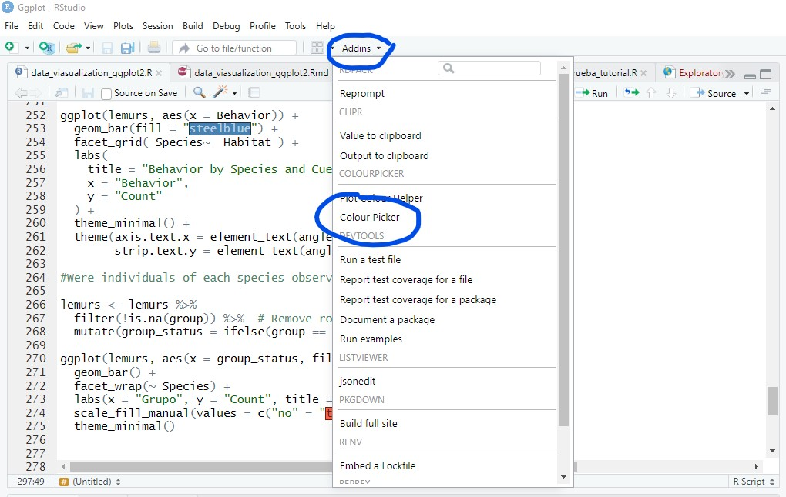

# Introduction to Data Visualization in R using the Ggplot2

*Authors: Lucía Zamora and Kimberly Rivera*

## Learning objectives

-   After today's lecture, you'll be able to:

    -   Understand the layered grammar of graphics in `ggplot2` and how to build plots incrementally
    -   Prepare and structure tidy data for visualization using appropriate variable types
    -   Create basic and advanced plots with `geom_bar()`, `geom_point()`, `geom_histogram()`, `geom_boxplot()`, and `geom_sf()`
    -   Apply color palettes and customize themes, scales, and labels for clarity and aesthetics
    -   Use faceting (`facet_wrap()` and `facet_grid()`) to compare groups and explore multi-dimensional patterns
    -   Visualize spatial data by integrating geographic and observational layers
    -   Export publication-quality graphics using `ggsave()`
    
    

- Extra: Apply best practices in scientific visualization:

    -   Explain the importance of perceptually uniform, colorblind-friendly palettes
    -   Select appropriate scientific color palettes (viridis, cividis, cmocean, batlow, ColorBrewer) based on the nature of the data (sequential, diverging, qualitative)
    
    
## Packages

These are the packages that we are going to be working with for this tutorial.

```{r, eval=FALSE}
# install relevant packages
install.packages("tidyverse")
install.packages("ggplot2")
install.packages("colourpicker")
install.packages("viridis")
install.packages("RColorBrewer")
install.packages("ggrepel") 
install.packages("sf")
install.packages("rnaturalearth")
install.packages("rnaturalearthdata")


```

    
## Presentation

We are going to use the package `ggplot2` to create publication ready graphs in r. To begin, we are going to go over a presentation linked below to learn the basic components of `ggplot2` and the grammar of graphics. Once we have covered the basics, then we will proceed to the tutorial.

Here's a link to the presentation: https://gabspalomo.github.io/slides/uwin_ggplot2/ppt/uwin_intro_ggplot2.html#/title-slide


## Introduction 

A core principle of ggplot2 is that it enables you to build complex plots incrementally, one layer at a time.
Each layer can use a different data set and apply its own aesthetic mappings, allowing you to create rich, multi-layered visualizations that combine information from multiple sources.

<p float="center">
  

</p>

Image taken from: https://ourcodingclub.github.io/tutorials/datavis/


## Data 

Every layer we add must have some data associated with it, and the data must be in the form of a tidy data frame, where each column represents a variable and each row represents an observation.
This structure may seem strict, but it's extremely useful for several reasons:

- It makes your data explicit and clearly organized.
- A single data frame is much easier to save, share, or reproduce than a collection of separate vectors.
- It promotes a clean separation of tasks: ggplot2 focuses on turning data frames into visualizations, while other tools (like dplyr, tidyr, or data import functions) can help prepare the data in the correct format.

Importantly, each layer in a ggplot can use a completely different dataset, as long as it's formatted as a tidy data frame.
This flexibility allows you to combine and compare multiple sources of information within the same plot.

Let's begin by loading the packages we will need and the dataset we will use.
Then we will create our first base layer in ggplot2 — think of it like a blank canvas where we’ll gradually add layers to build our final plot.

```{r}

library(tidyverse) # Data manipulation and visualization (includes ggplot2, dplyr, etc.)
library(ggplot2)# Data visualization
library(viridis)# Color palettes for plots (colorblind-friendly)
library(RColorBrewer)# More color palettes for plots
library(ggrepel)# Prevents overlapping text labels in ggplot2
library(sf)# Handling and plotting spatial (geographic) data
library(rnaturalearth)# Provides map data (countries, borders, etc.)
library(rnaturalearthdata)  # Support data for rnaturalearth


```

```{r}
# Load the dataset
lemurs <- read_csv("./data/lemur_cleaned.csv")
landcover <- read_csv("./data/mada_landcover.csv")

# Get a quick look at the structure of the data
glimpse(lemurs)
glimpse(landcover)
```

The function `glimpse()` (from the dplyr package, part of the tidyverse) gives a quick, compact overview of a data frame or tibble, showing column names, data types, and sample values.

Using `glimpse(lemurs)` helps you spot variables that may need to be converted — for example, from character to factor for categorical data, or to date/time formats for temporal analysis.

In our dataset, the Time and Date columns are stored as character strings, but they should be converted to appropriate date-time formats for proper plotting.

Variables like Habitat and Transect represent categories or groups but now they are categorized as character. Converting them to factors tells R to treat them as categorical variables, which improves how models handle them and allows plotting functions to correctly group and label the data. Factors also save memory and help avoid mistakes from treating categories as continuous values.

```{r}

lemurs$Site <- as.factor(lemurs$Site)
lemurs$Date <- as.Date(lemurs$Date, format = "%d-%m-%y")
lemurs$Time_L<-as.POSIXct(strptime(lemurs$Time_L,"%H:%M")) # R requires a full date-time for POSIXct objects, so it defaults to today's date if only time is provided.
lemurs$Transect <- as.factor(lemurs$Transect)
lemurs$Habitat <- as.factor(lemurs$Habitat)
lemurs$Scientist <- as.factor(lemurs$Scientist)
lemurs$ActivityBehavior <- as.factor(lemurs$ActivityBehavior)
lemurs$Cue <- as.factor(lemurs$Cue)

landcover$Site <- as.factor(landcover$Site)

```

## Mapping components

As we seen, there are six main building blocks, each with their own arguments.

`ggplot(data = data, mapping = aes(x = x, y = y)) +`

  `geom_*( ) + # geometries: e.g., geom_point(), geom_bar(), ...`
  `coord_*( ) + `
  `facet_*( ) + # dividing your data into facets: facet_grid() and facet_wrap()`
 ` scale_*( ) + # controls visual values: colors, fills, shapes. E.g., scale_manual().`
 ` theme_*( )   # Controls the overall appearence of the plot: fonts, font size, etc.`
  

If we not define it, ggplot2 adds a default values for each aesthetic used in the plot.

Let's start with our first layer of the graph:

```{r}
ggplot(lemurs, aes(x = Transect))
```

This creates the plot object and defines the data and the aesthetic mapping: we’re saying we want to plot something on the x-axis using the Transect column.
But since we haven’t added a layer yet, nothing is drawn.
We will add our first layer: `geom_bar()` tells ggplot2 to draw bars, and it automatically counts how many observations fall into each transect category.

The function `geom_*()` define the type of visual element to draw, like bars, points, or lines.
For example: `geom_bar()` for bar charts, `geom_point()` for scatter plots, `geom_line()` for time series or trends.

```{r}
ggplot(lemurs, aes(x = Transect)) +
  geom_bar() #Automatically counts observations per category and uses that as the y-value
```

Now, we will define de functions  `scale_*( )` and `theme_*( )`.    
The `scale_*()` functions customize the mapping between data values and visual properties like axis limits, breaks, labels, and colors.

The `theme_*( )` functions control the non-data elements of a plot — that is, everything except the actual data visualized by geoms.
This includes things like:
-Background color and grid lines
-Fonts and text styles for titles, labels, and axes
-Axis lines and ticks
-Legends and their placement
-Margins and spacing

You can quickly switch between different preset styles (e.g., `theme_minimal()`, `theme_classic()`, `theme_light()`) or create your own custom theme.

Now we modify the scale of the y axis, we will give a cleaner look with `theme_minimal()` and also we will add a title and axis labels using `labs()`.

```{r}

ggplot(lemurs, aes(x = Transect)) +
  geom_bar() +
  labs(
    title = "Number of Observations per Transect",
    x = "Transect",
    y = "Number of Observations"
  ) +
   scale_y_continuous(
    breaks = seq(0, 100, by = 10),
    limits = c(0, 100)   
  ) +
  theme_minimal()


```

Now let’s see how many observations were recorded at each hour by using other `geom_*()` functions.

- `geom_bar()` is used for categorical data and counts the number of observations in each category.
- `geom_histogram()` is used for continuous numerical data and bins the data into intervals to show distribution.


```{r}

ggplot(lemurs, aes(x = Time_L)) +
   geom_histogram()+ 
  labs(
    title = "Observation Times Throughout the Day",
    x = "Hour of Day", y = "Number of Observations"
  )+
   scale_y_continuous(
    breaks = seq(0, 100, by = 10),
    limits = c(0, 100)   
  ) +  
  scale_x_datetime(
  labels = scales::date_format("%H:%M"),  # Uses the 'scales' package to format x-axis labels;
                                          # shows only hours and minutes, hiding the default date
  date_breaks = "2 hours"                 # Sets tick marks every 2 hours
) +
  theme_minimal()

```


## Customizing Bar Colors with `scale_fill_brewer()`

As mentioned earlier, `scale_*()` functions control visual properties such as colors, fills, and shapes. In the example below, we will use `scale_fill_brewer()`, which applies a ColorBrewer palette to the fill aesthetic—ideal for categorical variables.

In this plot, we aim to compare observation hours across different sites using a boxplot.
`geom_boxplot()` shows the distribution of a continuous variable by visualizing its median, quartiles, and potential outliers. It's commonly used to compare distributions across categories.

By setting `fill = Site` inside `aes()`, we assign a different color to each site's boxplot. Then, `scale_fill_brewer(palette = "Paired")` customizes those colors using the "Paired" palette, enhancing the visual distinction between categories.

More information about R Color Brewer’s palettes here: <https://r-graph-gallery.com/38-rcolorbrewers-palettes.html>

```{r}
#Observation Times by Site (Boxplot)
ggplot(lemurs, aes(x = Site, y = Time_L, fill = Site)) +
  geom_boxplot() +
  labs(
    title = "Distribution of Observation Hours by Site",
    x = "Site", y = "Hour of Observation"
  ) +
  scale_fill_brewer(palette = "Paired") +
  theme_bw() 

```

In the following example, you can see a few basic customizations to the legend. These include setting a custom legend title, changing the position of the legend, and adjusting the font size of both the legend title and its labels.

```{r}
ggplot(lemurs, aes(x = Site, y = Time_L, fill = Site)) +
  geom_boxplot() +
  labs(
    title = "Distribution of Observation Hours by Site",
    x = "Site", y = "Hour of Observation"
  ) +
  scale_fill_brewer(palette = "Paired") +
   guides(fill = guide_legend(title = "Study Site")) +  # sets a custom legend title
theme_bw() +  # Applies the base black-and-white theme
  theme(
    legend.position = "bottom",  # Moves the legend to the bottom
    legend.text = element_text(size = 10), # Changes the font size of the legend items
    legend.title = element_text(size = 15)   # Changes the font size of the legend title
  )

```


## Faceting 

- And if we want to compare data between species?
 
Faceting lets you split a plot into multiple panels based on the values of one or more variables.
It’s like creating a small version of the same plot for each group in your data — useful for comparisons.

 - `facet_wrap()`creates a set of plots wrapped into a grid based on a single variable.
 - `facet_grid()` allows for a two-dimensional layout, separating plots by rows and columns using two variables (e.g., `facet_grid(Sex \~ Species)`).

### Facet_wrap

You might want to explore the number of observations by Species and Habitat. The following two plots show the same data organized differently to highlight different perspectives.


```{r}
#facet_wrap
ggplot(lemurs, aes(x = Habitat)) +
  geom_bar(fill = "steelblue") +
  facet_wrap(~ Species) +
  labs(
    title = "Observations per Habitat by Species",
    x = "Habitat",
    y = "Count"
  ) +
  theme_minimal()

```


It's a little difficult to read the x-axis, right? Let's fix it.
Also, we will exclude rows where Habitat is NA


```{r}
ggplot(lemurs[!is.na(lemurs$Habitat), ], aes(x = Habitat)) +  # Excludes rows where Habitat is NA
  geom_bar(fill = "steelblue") +
  facet_wrap(~ Species) +
  labs(
    title = "Observations per Habitat by Species",
    x = "Habitat",
    y = "Count"
  ) +
  theme_minimal()+
  theme(axis.text.x = element_text(angle = 45, hjust = 1)) # helps when labels are long or overlapping.
```

```{r}
ggplot(lemurs[!is.na(lemurs$Habitat), ], aes(x = Species)) +  # Excludes rows where Habitat is NA
  geom_bar(fill = "steelblue") +
  facet_wrap(~ Habitat, ncol = 1) + #ncol = 1 inside facet_wrap() arranges all facet plots in a single vertical column
  labs(
    title = "Observations per Species by Habitat",
    x = "Species",
    y = "Count"
  ) +
  theme_minimal()+
  theme(axis.text.x = element_text(angle = 45, hjust = 1)) 

```
 
The first plot shows the number of observations per Habitat, faceted by Species. It's useful when you want to see where each species was observed.

The second plot shows the number of observations per Species, faceted by Habitat. It's better when comparing species composition within each habitat.
 
Both plots display the same data but organize it differently to highlight either species distribution across habitats or habitat composition within species. 

Alright, let’s take it a step further and work on a more detailed example using the dataset landcover. We will transform the data and create a faceted bar plot showing the proportion of different ground cover types by site, with several customizations.

```{r}
#Converts wide data to long format for easier plotting.
landcover_long <- landcover %>%
  pivot_longer(  # pivot_longer() turns columns of different cover types into key-value pairs.
    cols = c(tree.cover, shrubland, grassland, cropland,  bare.sparse, perm.water),
    names_to = "Cover",
    values_to = "Proportion"
  ) %>%
  mutate(Cover = recode(Cover,# mutate() and recode() rename the cover types for better labels
    "tree.cover" = "Tree",
    "shrubland" = "Shrubland",
    "grassland" = "Grassland",
    "cropland" = "Cropland",
    "bare.sparse" = "Bare/Sparse",
    "perm.water" = "Permanent Water"
  ))

#Create a bar plot showing proportion of each cover type.

ggplot(landcover_long, aes(x = Cover, y = Proportion, fill = Cover)) +
  geom_bar(stat = "identity") +
  facet_wrap(~ Site, ncol = 3) + #separate plots for each site, arranged in 3 columns
  scale_y_continuous(labels = scales::percent_format(accuracy = 1)) + #formats y-axis labels as percentages with 1% accuracy
  scale_fill_brewer(palette = "Paired") + #applies a color palette from RColorBrewer
  labs(
    title = "Percentage of ground cover by site",
    x = "Cover type",
    y = "Proportion (%)"
  ) +
  theme_bw() +
  theme( #Adjusts theme for better readability: 
    axis.text.x = element_text(angle = 45, hjust = 1),#angled x-axis labels
    legend.position = "right", #legend on the right
    strip.text = element_text(size = 12)#larger facet titles
  )

# `percent_format()` is a function from the scales package that formats numbers (e.g., 0.25) as percentages (25%).
# 
# `accuracy = 1` controls the rounding precision. 
#  accuracy = 1 means round to whole percentages (e.g., 25%, 38%) 
#  accuracy = 0.1 would give you decimals (e.g., 25.4%).

```


## Customizing Bar Colors with `scale_fill_manual()`

In the previous plots, first we used `fill = "steelblue"` inside `geom_bar()` to apply a single color to all bars. This simple approach works well when you’re not distinguishing between categories.

As we moved toward more complex plots, we wanted to assign different colors based on a variable—such as species or habitat. To do this, we mapped that variable to the fill aesthetic inside `aes()`, which allowed ggplot to automatically assign colors to each category.

At that point, we were able to control how those colors were displayed using `scale_fill_` functions. For example, `scale_fill_brewer()` allowed us to choose from predefined color palettes. This was useful for creating clear, visually appealing plots without manually selecting colors.

If you want full control over the colors, you can use `scale_fill_manual()` instead. This function allows you to assign specific colors to each category. R supports over 650 named colors, which you can explore by running `colors()` in the console.

```{r, results='hide'}
colors()
```


Another option is to use color codes.
Each color you can imagine has a code, called a “hex code”, a combination of letters and numbers.
You can get the codes for different colors online, from Paint or similar programs, or even from RStudio, which is very convenient!
There is a very useful RStudio Colourpicker addin for this. If you didn't install the package at the start of the workshop, you can install it now:

```{r install-colourpicker, eval=FALSE}
install.packages("colourpicker")
```

To find out the code for a color you like, click on Addins/Colour picker.


<p float="center">
  

</p>

When you click on All R colours you will see lots of different colours you can choose from 

<p float="center">
  

</p>

When you click on 1, and then on a certain colour, you fill up 1 with that colour, same goes for 2, 3 - you can add more colours with the +, or delete them by clicking the bin.
Once you’ve made your pick, click Done.

Now we will manually select hex codes to customize the land cover colors of the previous figure.

```{r}

#Once you have selected your colors using the colour picker, you will get a line of code like:
#c("#228B22", "#6B8E23", "#ADFF2F", "#FFD700", "#DEB887", "#1E90FF")

# Now, we will use these hex codes to create a named vector, assigning each land cover type a specific color that is meant to visually represent each category.

cover_colours <- c(
  "Tree" = "#228B22",
  "Shrubland" = "#6B8E23",
  "Grassland" = "#ADFF2F",
  "Cropland" = "#FFD700",
  "Built" = "#696969",
  "Bare/Sparse" = "#DEB887",
  "Snow/Ice" = "#B0E0E6",
  "Permanent Water" = "#1E90FF"
)

#This vector can then be used with scale_fill_manual() in ggplot2 to apply the colors consistently in the plot.

ggplot(landcover_long, aes(x = Cover, y = Proportion, fill = Cover)) +
  geom_bar(stat = "identity") +
  facet_wrap(~ Site, ncol = 3) +
  scale_y_continuous(labels = scales::percent_format(accuracy = 1)) +
  scale_fill_manual(values = cover_colours) +
  labs(
    title = "Percentage of ground cover by site",
    x = "Cover type",
    y = "Proportion (%)"
  ) +
  theme_bw() +
  theme(
    axis.text.x = element_text(angle = 45, hjust = 1),
    legend.position = "right",
    strip.text = element_text(size = 12)
  )

```

More infomation: <https://ourcodingclub.github.io/tutorials/datavis/>

We will come back to other aspects of color later on.

### Facet_grid

The function `facet_grid()` allows you to create a matrix of plots by faceting along rows and columns simultaneously. This is useful when you want to compare how two categorical variables interact in relation to your data.
 
```{r}

# Join lemurs and landcover datasets by 'Site' to combine info
lemurs_cover <- left_join(lemurs, landcover_long, by = "Site")  

ggplot(lemurs_cover, aes(x = Species, fill = Cover)) +# Plot species on x-axis, fill bars by land cover type
  geom_bar(position = "dodge") + # Create side-by-side bars for each land cover category
  facet_grid(Cover ~ Site) +# Create a grid of plots by land cover (rows) and site (columns)
  scale_fill_manual(values = cover_colours) +# Apply custom colors defined in cover_colours vector
  labs(                                                         
    title = "Species Distribution by Land Cover and Site",
    x = "Species",
    y = "Count",
    fill = "Land Cover"
  ) +
  theme_minimal() +                                             
  theme(
    axis.text.x = element_text(angle = 45, hjust = 1),          
    strip.text.y = element_text(angle = 0),# Keep facet row labels horizontal
    legend.position = "none"# Remove legend because facet labels show cover types
  )


``` 
  
This plot is only an example to illustrate the use of `facet_grid` with the dataset we are currently working on. Since there are many species, the visualization can be difficult to interpret. Therefore, we might focus on a subset of three species of particular interest, for example: *Eulemur rubriventer*, *Varecia variegata*, and *Cheirogaleus major*, to obtain a clearer and more manageable plot.
  
```{r}

# Filter only the three species of interest
lemurs_filtered <- lemurs_cover %>% 
  filter(Species %in% c("Eulemur rubriventer", "Varecia variegata", "Cheirogaleus major"))

ggplot(lemurs_filtered, aes(x = Species, fill = Cover)) +
  geom_bar(position = "dodge") +
  facet_grid(Cover ~ Site) +
  scale_fill_manual(values = cover_colours) +
  labs(
    title = "Species Distribution by Land Cover and Site",
    x = "Species",
    y = "Count",
    fill = "Land Cover"
  ) +
  theme_minimal() +
  theme(
    axis.text.x = element_text(angle = 45, hjust = 1),
    strip.text.y = element_text(angle = 0),
    legend.position = "none"
  )
```


## Mapping

So far, we have explored how to visualize categorical and count data using bar plots, which are useful for comparing frequencies or counts across different groups or categories. We have also used histograms to examine the distribution of continuous numerical variables. Boxplots have been employed to summarize the distribution of numerical variables across groups, highlighting medians, quartiles, and variability.

Additionally, we have leveraged `facet_grid` to create multi-panel plots, which help break down complex datasets by subgroups such as land cover types and sites, making patterns easier to detect.

Now let's take it a step further — since our dataset includes latitude and longitude, we can map where each observation took place.

With ggplot2, we can create spatial plots by treating coordinates just like any other numeric variables. To provide more context, we can even add geographic layers or background maps.

To do this, we will use additional packages that make it easy to work with spatial data and integrate it into ggplot2.

The `sf` package allows you to read, manipulate, and plot spatial data in R.
`rnaturalearth` and `rnaturalearthdata` provide world map data, including country borders, in a convenient sf format.

Using these tools, we can display geographic features like country outlines with `geom_sf()`, and overlay our species observations using `geom_point()` — all within the ggplot2 framework.

```{r}

#library(sf)
#library(rnaturalearth)
#library(rnaturalearthdata)

# Base map of Madagascar
madagascar <- ne_countries(scale = "medium", returnclass = "sf") %>%
  dplyr::filter(admin == "Madagascar")

# Internal divisions (states)
states <- ne_states(country = "Madagascar", returnclass = "sf")


```

This base map comes from the rnaturalearth package, which offers ready-to-use global geographic data, such as country borders, in a spatial (sf) format.
ne_countries() downloads a global dataset of country boundaries at a medium level of detail and returns it as an sf (simple features) spatial object.

Then, `filter(admin == "Madagascar")` selects only the row corresponding to Madagascar, extracting its geographic polygon to use as the map’s base layer.

Next, we add the internal administrative boundaries (states) on top of the base map to provide additional geographical context.

Finally, the coordinates of our lemur observations are plotted and colored by species.


```{r}
ggplot(data = madagascar) +
  geom_sf(fill = "gray90", color = "gray40") +
  geom_sf(data = states, fill = NA, color = "gray", size = 0.5) +  # Add state boundaries without fill
  geom_point(
    data = lemurs,
    aes(x = Long, y = Lat, color = Species),
    size = 2,
    alpha = 0.7
  ) +
  scale_color_brewer(palette = "Paired") +
  labs(
    title = "Lemur Observations in Madagascar",
    x = "Longitude", y = "Latitude"
  ) +
  theme_minimal()


```

As you may have noticed, each layer in ggplot2 can use a different dataset. In this example, the base map (geom_sf) uses spatial data from Madagascar, while the points (geom_point) come from the lemurs dataset. This lets us combine different types of data—like geographic shapes and observation points—into one clear, integrated visualization.


However, as you can see, this sampling does not cover the entire island of Madagascar, but focuses only on a specific area. Therefore, now we will limit the map boundaries to the coordinates of our sampling sites.


```{r}

# Calculate the latitude and longitude range from lemur observations 
lat_range <- range(lemurs$Lat, na.rm = TRUE)
long_range <- range(lemurs$Long, na.rm = TRUE) 

# We also want to add Site labels to the map.
# To do this, we create a dataset of unique Sites by grouping the lemur data by Site.
# Then, we calculate the mean latitude and longitude for each site to position the labels on the map.

site_labels <- lemurs %>%
  group_by(Site) %>%
  summarize(
    Lat = mean(Lat, na.rm = TRUE),    # Mean latitude of all points in the site
    Long = mean(Long, na.rm = TRUE),  # Mean longitude of all points in the site
    .groups = "drop"                  # Ungroup after summarizing
  )


ggplot(data = madagascar) +
  geom_sf(fill = "gray90", color = "gray40") +  
  geom_point(
    data = lemurs,
    aes(x = Long, y = Lat, color = Species),  
    size = 2,
    alpha = 0.7
  ) +
  scale_color_brewer(palette = "Paired") +
  coord_sf(
    xlim = long_range,  # Zoom map to longitude range plus margin
    ylim = lat_range,   # Zoom map to latitude range plus margin
    expand = TRUE      # Expansion beyond specified limits
  ) +
  labs(
    title = "Lemur Observations",  
    x = "Longitude",
    y = "Latitude"
  ) +
  geom_text_repel( #ggrepel library
    data = site_labels,
    aes(x = Long, y = Lat, label = Site),  # Add site names with repelling labels to avoid overlap
    size = 3,
    fontface = "italic"
  ) +
  theme_minimal()  # Use a clean minimal theme for the plot

```

Now, we only want to map the species observed at the SOA site:

```{r}

# Filter lemur observations to include only those from the site "SOA"
lemurs_SOA <- lemurs %>% filter(Site == "SOA")

# Additionally, we want to add transect labels to the map. To do this, we ill create a dataset of unique transect labels for the SOA site

# In this case, instead of calculating the mean coordinates per transect, we will select the first observation for each transect to position the label exactly at the first recorded point
transect_labels <- lemurs_SOA %>%
  group_by(Transect) %>%
  slice(1) %>%                 # Take the first row per Transect group
  ungroup()                   # Ungroup after slicing


# Calculate latitude and longitude ranges with a manual margin to zoom in on SOA area
lat_range_SOA <- range(transect_labels$Lat) + c(-0.02, 0.02)
long_range_SOA <- range(transect_labels$Long) + c(-0.02, 0.02)

# Plot the map zoomed to the SOA site
map <- ggplot(data = madagascar) +
  geom_sf(fill = "gray90", color = "gray40") +              
  geom_point(
    data = lemurs_SOA,
    aes(x = Long, y = Lat, fill = Species),                 
    shape = 21,# Use shape 21 to have fill and black border
    color = "black",# Black border for better visibility
    size = 2,
    alpha = 0.7
  ) +
  scale_fill_brewer(palette = "Paired") +                   
  coord_sf(
    xlim = long_range_SOA,                                   
    ylim = lat_range_SOA,                                    
    expand = FALSE# Disable automatic expansion beyond limits
  ) +
  geom_text_repel(
  data = transect_labels,
  aes(x = Long, y = Lat, label = Transect),# Label each unique transect once
  size = 5,# text size
  fontface = "bold.italic",# text bold and italic
)+
  labs(
    title = "Lemur Observations around Site: SOA",
    x = "Longitude", y = "Latitude"
  ) +
  theme_minimal()

map


```


## Save Figures to File

As you may have noticed, we assigned the last plot to the object 'map'. This is useful if you want to save the figure to a file later. You can use `ggsave()`, which lets you export your plot (map in this case) as a file with custom size and resolution.

```{r}

ggsave("lemur_ocurrence_mapSOA.png", plot = map, width = 8, height = 6, dpi = 300)

```

---

### EXTRA:
### Considerations Regarding Scientific Colour Palettes in Data Visualization

- **What are scientific colour palettes?**

    Not all colours are suitable for scientific use. Scientific colour palettes are specifically designed to represent data accurately and clearly, without introducing visual distortion.

    Unlike aesthetic palettes, scientific palettes:
    
    - Are based on perceptual evidence  
    - Are optimized for interpretation  
    - Are validated by the scientific community 
    

    Scientific palettes are not chosen for aesthetics — they are built using specific criteria:

    - Perceptual uniformity: equal steps in the data correspond to equal perceived changes in colour  
    - Perceptual order: colours can be intuitively arranged in sequence  
    - Legibility in grayscale  
    - Accessibility for colour vision deficiencies  
    - Matching the palette to the type of data (sequential, diverging, cyclic)  
    - Open documentation and public availability  

    
    Scientific colour palettes are not a design trend — they are evidence-based tools that ensure clarity, precision, and inclusivity in scientific communication.

- **Examples of Scientific Colour Palettes**

    - *VIRIDIS*

        Originally developed for Python’s Matplotlib by Stéfan van der Walt and Nathaniel Smith. Adapted for R by Simon Garnier and others.

        Optimized for:

        - Perceptual uniformity  
        - Black-and-white legibility  
        - Colourblind friendly  
        - Ideal for sequential and continuous data  


        <https://cran.r-project.org/web/packages/viridis/vignettes/intro-to-viridis.html>

    - *CIVIDIS*

        Developed by Jamie Núñez and collaborators.

        - Designed for red–green colourblind accessibility  
        - Constant perceptual uniformity  
        - Readable on screen and in print  
        - For continuous and sequential data  
        

        Nuñez, J.R., et al., 2018. *PLoS One 13*: 1–14.  
        <https://doi.org/10.1371/journal.pone.0199239>

    - *CMOCEAN*

        Created by Kristen Thyng and team.

        - Originally for oceanographic data  
        - Includes continuous, diverging, and cyclic palettes  
        - Perceptually uniform and intuitive  
        - Accessible and flexible  
        

        <https://cran.r-project.org/web/packages/cmocean/vignettes/cmocean.html>

    - *COLORBREWER*

        Developed by Cynthia Brewer for cartography.

        - Sequential, diverging, and qualitative palettes  
        - Colourblind- and grayscale-friendly  
        - Does not include continuous scales 
        

        <https://colorbrewer2.org/#type=sequential&scheme=BuGn&n=3>

    - *SCIENTIFIC COLOUR MAPS – batlow*

        Developed by Fabio Crameri.

        - Built for scientific use from scratch  
        - Rigorous perceptual uniformity  
        - Colourblind- and grayscale-friendly  
        - Sequential, diverging, and cyclic palettes  
        

        <https://www.fabiocrameri.ch/colourmaps/>

        Crameri, F., et al., 2020. *Nat. Commun. 11*: 1–10.  
        <https://doi.org/10.1038/s41467-020-19160-7>
        
        
