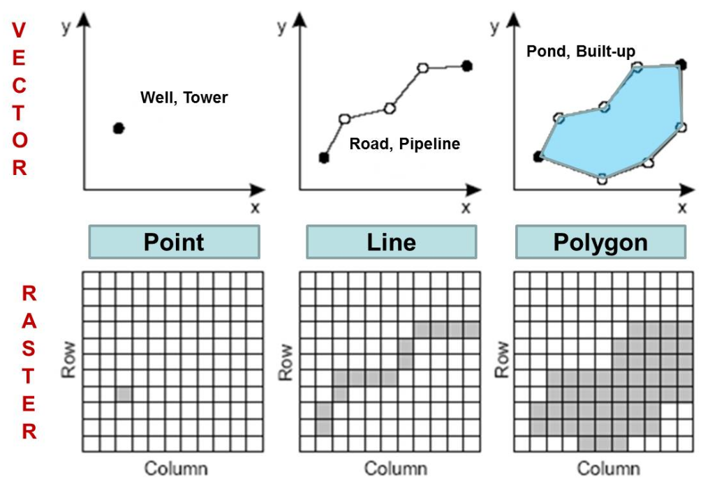
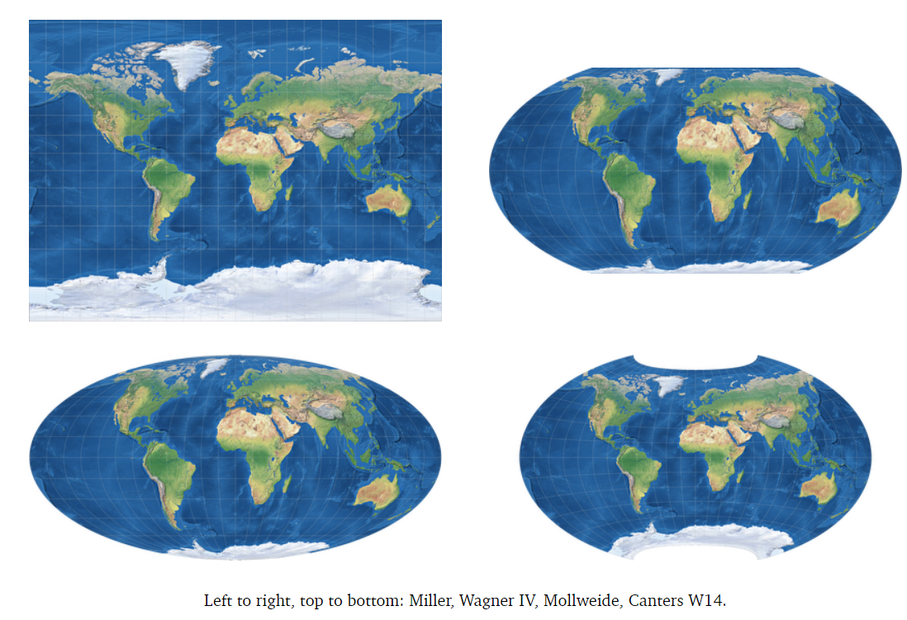
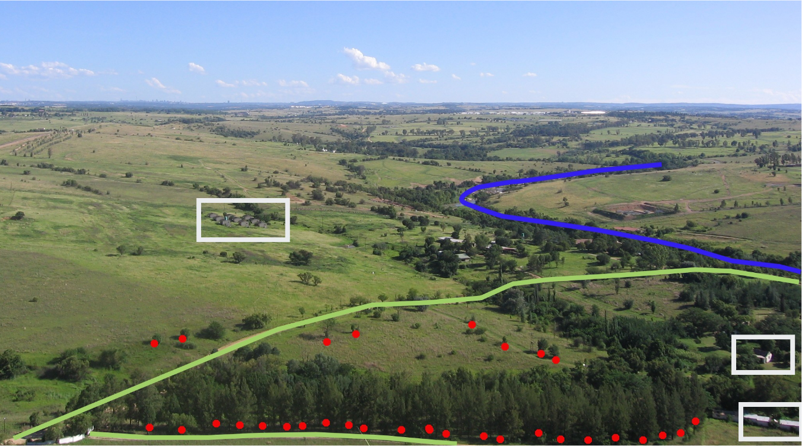

```{r setup, include=FALSE}
knitr::opts_chunk$set(echo = TRUE, warning = FALSE, message = FALSE)
```

# Spatial Mapping in R

*Tiziana Gelmi Candusso and Mark Jordan* June 2024

## Learning objectives

1.  Describe different data types and projections used in spatial data analysis
2.  Import and process spatial data (vector and raster)
3.  Display spatial data in customizable maps
4.  Prepare spatial data for downstream analysis

## Workshop overview

During the workshop we will work with converting our camera trap data to spatial layers, map them, and extract spatial information within each sampling site's buffer area.
For this we will import, manipulate and extract spatial data in both vector (points, lines, and polygons) and raster form.
Our output will be a table with all camera trap records and the corresponding environmental variables, ready to build models using your detection data.
This case study shows how integrating your spatial analysis into R allows you to perform a complete analysis in one setting instead of bouncing back and forth between GIS and R.

Let's start.

# Spatial data

Spatial data is any type of data that directly or indirectly references a specific geographical area or location.
These can be, for example, geographic features on the landscape or environmental properties of an area such as temperature or air quality.
Spatial data can be continuous or discrete just like regular data, and in both cases it can be represented as a **vector** or a **raster**.
Vector data uses points, lines, or polygons to represent spatial data, while raster data represents data in a grid of pixels where each pixel/cell represents a specific geographic location and the information therein.
Raster data will be heavily influenced by the size of the pixels/cells, i.e. resolution.

{width="60%"}

## Projections and Spatial Reference Systems (SRS)

Both vector and raster data are planar representations of the world, a 3-dimensional sphere, and as such are not perfect copies.
Depending on how the planar representation is created it will distort more or less certain areas of the world.
Therefore many representations exist.
These are called projections, as the representations project the 3-dimensional spheric image into a planar, 2-dimensional image.
Maps with different projections are not comparable and cannot be overlaid.
Therefore, we need to make sure we always work on the same projection when using spatial data.

{width="60%"}

To locate geographic features on a map, you also need a system of coordinates that define the x-y coordinates for every point on the map.
The system of latitude and longitude is the most familiar.
These coordinate systems can be used to extract area and distance information from maps.
A combination of a projection and a set of coordinates is known as a **Spatial Reference System (SRS)**.
Your choice of SRS will depend on the source of your data and your spatial analysis needs.
In general, there is a trade-off between the extent of an SRS and its accuracy for measurement.
For example, the WGS84 system of latitude and longitude covers the entire earth, but it is not useful for measurement because degrees of longitude become closer together the closer you are to the poles.
Systems based in UTM or State Plane coordinates are much more accurate for measuring distances and areas, but they are only useful for covering specific regions.

To describe SRS systems around the world, every system is given a specific "EPSG code." For example, the familiar system of latitude / longitude has the EPSG code 4326, which is the one we will use today.
All GIS software, including spatial mapping functions in R, allow users to transform spatial data between different SRSs using these EPSG codes.

Throughout the workshop we will work with one projection "EPSG:4326".
We will project and re-project layers, i.e. to estimate distances using a metric coordinate system, however, we'll always re-project to that one chosen projection for our final spatial output at each stage.
This will facilitate the extraction of covariates for each camera site since we will have to overlay layers.

In summary, every spatial data set comes with two primary considerations:

-   Is it in vector or raster format?
-   What SRS is it in?

## Setting up to work with spatial data in R

### Packages

There are several packages to work with spatial data.
Currently, the two most common are `sf` and `terra`.
`sf` can be used for vector data and `terra` can be used for both vector and raster data.
The functions to work with vector data are different between the packages, but objects can be converted easily into one another.
To go from a Spatvector (`terra`) to Spatial dataframe (`sf`) we use `sf::st_as_sf()` and vice-versa we use `terra::vect()`.
In most cases, it really doesn't matter which one we use.
`sf` is better for cross-compatibility with other GIS platforms, it can be faster, and it has [some other advantages described here](https://r.geocompx.org/spatial-class#intro-sf).
`terra` can generate multilayer objects and works with the `leaflet` package for interactive views.
We will work with `sf` here and convert the objects to `terra` when we need to.

-   [Cheatsheet for sf](https://github.com/rstudio/cheatsheets/blob/main/sf.pdf)
-   [All the functions available in `terra`](https://rdrr.io/github/rspatial/terra/man/terra-package.html)
-   [Tables to convert between the two](https://www.r-bloggers.com/2023/06/upcoming-changes-to-popular-r-packages-for-spatial-data-what-you-need-to-do/)

We will also use three packages from the tidyverse (`dplyr`, `tidyr`, and `ggplot2`) as well as three other mapping packages:

-   `rosm` - plotting from Open Street Map
-   `tmap` - enhanced mapping features
-   `leaflet` - interactive web maps

```{r load packages, echo=TRUE, message = FALSE}
library(dplyr)
library(tidyr)
library(ggplot2)

library(sf)
library(terra)

library(rosm)
library(tmap)
library(leaflet)
```

If you haven't already installed some of these packages, where is a fancy function to both install and load them at the same time.

```{r eval = FALSE}
packages_needed <-c("dplyr", "tidyr","tidyterra","sf","terra","ggplot2","tmap","leaflet","rosm")

for (i in packages_needed){
     if(!(i %in% installed.packages())){
         install.packages(i, dependencies = TRUE)
     }
     require(i)
}
```

# Vector data

In this section we will read and manipulate vector data in R.

-   Vector data represents real world features within the GIS environment. A feature is anything you can see on the landscape.
-   Vector data is commonly stored as a shapefile and can contain point, line, or polygon data.
-   Vector data contains information attached to each feature, which we call attributes.

Features can be points (red) representing specific x,y locations, such as a trees or camera sites; polygons (white) representing areas, such as forests or residential areas; and lines (yellow/green and blue) representing continuous linear features, such as roads or rivers

{width="80%"}

## Vector data: points

When translating camera trap data into a spatial object in R, each capture would have one x,y coordinate, corresponding to their respective camera trap site, hence these would be become point vector data.
We will start our workshop with point vector data by loading, preparing and plotting our camera trap sites and the corresponding capture data.

In this section, you will learn the following methods for working with point data

1.  Importing spatial data that is stored in a CSV file
2.  Converting these data to a spatial format
3.  Plotting points on a map

Point data can be obtained directly from a shapefile or a csv file where each row is a feature.
In this case study, the camera trap sites here are located in Seattle, and have captured coyote and raccoon presence and absence from the 2019 spring season to the 2021 winter season.
The data is stored as a data frame in a csv called `captures.csv`.
The next two lines read the data and show the top few lines.

```{r, eval=TRUE}
captures.table <- read.csv("data/captures.csv")
head(captures.table) 
```

Although the data you imported has Latitude and Longitude columns, R does not recognize it as "spatial" data.
Those two columns could be any numbers, and they just happen to have names that we recognize as referring to geography.
Our first job will be to **save these data as a "spatial features data frame."** This is a special type of data frame that has a column in a format that any GIS software will recognize as geographic.
This will allow us to observe these points in the map and extract environmental information based on their location.
We will use the `st_as_sf()` function from the `sf` package, and we will specify the projection (crs).

```{r, eval=TRUE}
captures.spatial <- st_as_sf(captures.table,
                     coords = c("longitude","latitude"), 
                     crs = 4326)
head(captures.spatial)
```

Vector data reads as a data frame would.
Each row is a feature and each column is an attribute, and it contains a geometry column where the xy coordinates for the shapes are stored.
Let's break down how we converted these data and what the ouput means.

### Arguments

The `st_as_sf()` function has three arguments:

1.  our data frame "captures.table",
2.  `coords`: the names of the columns that hold our coordinates. Note that Longitude comes before latitude. This is because the pattern is x,y, and Longitude is the Earth's x-axis.
3.  `crs`: the Coordinate Reference System.

Because the data are in lat/lon format, they are in the WGS 84 projection, and the EPSG code for this projection is 4326.
With other sources of point data, you may need to ask your data provider for the CRS before working with it.

### METADATA of spatial object

With a spatial data frame, you get the same data frame as before.
Each row has attribute data (species, a location ID, and the capture date of that species).

However, you also get two new things.

1.  Five lines above your data that describe the spatial components of the data frame. Notice the `Geodetic CRS` row that confirms our data are in WGS84 format.
2.  A new column at the end called `geometry`. This is the column that has converted the Latitude and Longitude columns into spatial data we can use in calculations. Notice that it is in `POINT` format.

\newpage

### Plotting point data

Let's observe the spatial distribution of the points by plotting them using the `ggplot2` package.
The `geom_sf()` function will allow us to plot the spatial data frame object.

```{r, eval=TRUE}
ggplot(captures.spatial) + geom_sf()
```

The plot shows the two transects, but they are out of context, there is no spatial reference to guide the viewer.
There is no basemap in this plot.

\newpage

If we want to add a reference so we can easily distinguish between locations, we will move out of our ggcomfort zone and use the `tmap` function, which has a similar syntax as `ggplot` but is specifically made for drawing maps and adds a basemap automatically when used interactively.

**This map won't display in the Markdown version of the tutorial, but you should have an interactive map in the Plot window of RStudio when you run these next lines.**

```{r eval = FALSE}
#now we plot, and we'll make it interactive that will add a basemap automatically
tmap_mode(mode = c("view")) #to return to static use "plot" 

tm_shape(captures.spatial) +
  tm_dots(size = 0.1, col="black")
```

A static view of the map is useful when exporting maps, and is a quicker visualization of the whole area.
To access the static view, we change the mode parameter of the `tmap_mode()` function to "plot".

In static mode we need to add a basemap, and the easiest and quickest way to do that is by using the `osm.raster()` function from the `rosm` package, which loads the OpenStreetMap basemap for our study area, using directly the bounding box of the spatial data we are working with.

```{r}
#download background file from OpenStreetMap using the extent of the captue data
bg = rosm::osm.raster(st_bbox(captures.spatial)) #get background from OSM using our layer's extent/bbox
bg[bg[]>255]=255 #little trick to make sure the reprojection doesn't mess up with the rgb values.
bg[bg[]<0]=0
 
#Now we plot in static mode
tmap_mode(mode = c("plot"))
 
#we add the background basemap 
tm_shape(bg) +
   tm_rgb() + #background is an rgb file
   tm_shape(captures.spatial) + #overlays over the camera trap data points
   tm_dots(size = 0.1, col="black")
 
```

Notice how we are adding layers to the map using the `tmap` syntax, which should feel familiar to users of `ggplot`.
We add the background first with `tm_shape()`, specify details for that layer with the function relevant to that type of map, in this case a raster map so `tm_rgb()`, then add another layer with another `tm_shape()` function for our points vector layer.
Finally, because our captures are a point vector map, we use the `tm_dots()` function with the specifications inside.

\newpage

### Plotting coyote detections on a map

Now let's plot on a map the coyotes captured at each of the camera trap sites.
We will filter the data based on species name, using the `dplyr` package, and count detections at each site.
We will then plot using the function seen above, but setting point size based on the number of detections at each site, inside the specification function for the captures layers.

Notice that besides specifying the variable "detections" in the size parameter of `tm_dots`, we are also adding a few extra layers to our map here: we are adding a scale, a compass, and some credits.
Each of these layers is a function added to our tmap syntax.

```{r, echo=TRUE}
# Filter for coyote detections and count the number at each location
coyotes <- filter(captures.spatial, speciesname == "Canis latrans") %>%
  group_by(locationid) %>%
  summarize(detections = n())

# Draw the map
tm_shape(bg) +
  tm_rgb() + #background is an rgb file
  tm_shape(coyotes) + #overlays the camera trap data points
  tm_dots(size = "detections", col="black", #determine size will change with detection freq.
          sizes.legend = seq(100,500, by=100), #define break interval
          title.size = "frequency")+        #chnge title for the size variable
  tm_layout(title = "Coyote detections")  + #plot title
  tm_compass(position = c("right", "top")) + #add compass
  tm_scale_bar() +                          #add scale 
  tm_credits("Author, 2024")                #add credits
```

### Try it yourself

See if you can make the same map, but for raccoons.
(Solution is hidden below or on the next page in the PDF.)

```{r}
#Insert code here


#End
```

\newpage

<details closed>

<summary>Solution</a></summary>

```         
  raccoons <- filter(captures.spatial, speciesname == "Procyon lotor") %>%
        group_by(locationid) %>%
        summarize(detections = n())

  tm_shape(bg) +
        tm_rgb() + #background is an rgb file
        tm_shape(raccoons) + 
        tm_dots(size = "detections", col="black", 
            sizes.legend = seq(100,500, by=100),
            title.size = "frequency")+
            tm_layout(title = "Raccoon detections")  +
            tm_compass(position = c("right", "top")) + 
            tm_scale_bar() + 
            tm_credits("Myself, 2024")    
```

</details>

```{r echo = FALSE}
raccoons <- filter(captures.spatial, speciesname == "Procyon lotor") %>%
  group_by(locationid) %>%
  summarize(detections = n())

tm_shape(bg) +
  tm_rgb() + #background is an rgb file
  tm_shape(raccoons) + 
  tm_dots(size = "detections", col="black", 
          sizes.legend = seq(100,500, by=100),
          title.size = "frequency")+
  tm_layout(title = "Raccoon detections")  +
  tm_compass(position = c("right", "top")) + 
  tm_scale_bar() + 
  tm_credits("Myself, 2024")    
```

\newpage

### Buffering point data

We will first generate a buffer polygon for each camera site, with radius 500m from the camera trap location.
We need all the unique camera site locations, which we'll extract from our `camera.spatial` dataset.
Then we'll buffer those unique locations with the `st_buffer()` function.

Notice that although the WGS84 CRS is widely used, we are going to convert our data to a different CRS for any function that involves distance calculations.
The CRS we will use is the Universal Transverse Mercator (UTM) for Zone 10, which covers a strip from the equator to the north pole, including the state of Washington.
Its CRS code is 26910.
It has two primary advantages over WGS84:

1.  It allows more precise calculations over short distances
2.  Its units are in meters.

We will re-project to the WGS84 right after making the buffers to keep consistency.

```{r}
# Make a data frame with just the locations, one row for each
all_locations <- captures.spatial %>% 
  select(locationid) %>% 
  distinct() %>%
  st_transform(crs="EPSG:26910")

# Buffer then re-project
camera_buff <- st_buffer(all_locations, dist=500)%>%
  st_transform(crs="EPSG:4326")

# Draw the map
tm_shape(bg)+
  tm_rgb()+
  tm_shape(camera_buff)+
  tm_borders()+
  tm_scale_bar()
```

Now that we have the buffers of our camera trap sites, it's time to move on to lines.

\newpage

## Vector data: lines

For our case study, we'll use line vector data to get the road density within our camera sites' buffer and the distance to nearest road from each camera trap site.
This can be done with any line data such as waterways.

In this section, you will learn the following methods for working with line data.

1.  Import line data that is stored in a shapefile
2.  Clip a layer to a smaller region
3.  Transform data to a different projection
4.  Calculate the length of a linear feature and linear feature density
5.  Calculate the distance to linear feature from a point.

We will look into vector data in the form of lines using the TIGER database for Washington, composed of primary and secondary roads.
The spatial object will be read in the same way as we did the points, but in this case we will load directly the shapefile containing the features, downloaded from [here](https://catalog.data.gov/dataset/tiger-line-shapefile-2019-state-washington-primary-and-secondary-roads-state-based-shapefile)

The dataset contains 6 attributes (fields) for each feature.
Because the data are already in a spatial format, we use the `st_read()` function from the `sf` package to import the data.

```{r message=FALSE}
roads <- st_read("maps/roads/tl_2019_53_prisecroads.shp")
```

\newpage

### Plotting line data

Let's plot the dataset to see how it looks.
If you use `plot()` from base R, you will have to specify the attribute you want to use with `plot(roads[,1])` or it will plot one map for each attribute.
With `tmap`, you don't have to specify the attribute.
If you plot a Spatvector (the native format with `terra`) with `plot()`, you also don't need to specify the attribute.

```{r}
tm_shape(roads)+
  tm_lines()+
  tm_scale_bar()
```

\newpage

### Cropping line data

As you can see from the map and the scale bar, our road layer covers the entire state.
We would like to narrow it down to our study area.
We have coordinates for the boundaries of our study area from the previous section but the coordinate systems don't match in terms of projection, so we first need to **transform** one of the two layers.
This is an essential step in nearly any spatial analysis.
Layers always need to have matching projections when working together, so you will become very familiar with the `st_transform()` function.

We can transform either the boundaries or the roads layer.
It is usually faster to transform the simplest layer you have, in this case the boundary coordinates (a.k.a bounding box).
We'll convert those boundaries to a bounding box (or Spatextent in terra) and transform, like we normally would a spatial layer.

```{r}
seattle_bb <- st_bbox(captures.spatial) %>%
  st_as_sfc() %>% #for sf bbox we need to convert them to a spatial object before transforming
  st_transform(crs = crs(roads)) %>%
  st_bbox() #and then again convert to a bounding box

#Note:in terra we'd use ext() instead of st_bbox() and project() denoting the crs from which the spatextent comes from, captures.spatial, to the layer crs we want, roads.
#seattle_bb <- terra::project(ext(captures.spatial), captures.spatial, roads)
```

We crop to the same dimensions as the bounding box from the previous section with `st_crop()`.

```{r}
roads.clip <- st_crop(roads, seattle_bb)
tm_shape(bg)+
  tm_rgb()+
  tm_shape(roads.clip)+
  tm_lines(col="black")+ #define line color 
  tm_scale_bar()+
  #overlaying the camera site locations
  tm_shape(all_locations)+
  tm_dots(size=0.1) #define point size
```

Now we have the spatial layer for roads ready for our study site.

We want to calculate the road density within each camera site's buffer area and the distance from each camera site to nearest road.

We are measuring distance, so we will transform to the projection we are using for distances, the Universal Transverse Mercator (UTM) for Zone 10.
Our camera site locations ("all_locations") were already in that projection.

```{r}
camera_buff_UTM <- st_transform(camera_buff, crs="EPSG:26910")
roads_UTM <- st_transform(roads.clip, crs="EPSG:26910")
```

### Estimating road density around camera sites

Road density is defined by the total length of length of roads divided by the total area.
In our case our measurements are specific to the buffer areas of each camera site, so we only want the length for those roads that intersect with each buffer.
We do this with the **`st_intersect()`** function to find those road sections: **`Syntax: st_intersect(roads, buffer_areas)`**

To estimate length we use the **`st_length()`** function on the intersecting roads object, making a new column with the length information.
With that we can sum the lengths of road sections within each buffer site using the **`aggregate()`** function.
**`Syntax: aggregate(length ~ bufferid, data=your_object, FUN="sum")`**.

To estimate area we use the `st_area()` function, and we can add the results directly to a column in the buffer object using the regular syntax **`buffer_object$area <- st_area(buffer_object)`**.

Finally, you can join two data frames in a variety of ways.
Our buffer layer is the base, spatial layer, and it has all the locations.
The length data frame is not spatial -- it just contains the locationids and the lengths.
It only has rows for locations whose buffers intersect with roads.
Because not all locations will have a length, we need to use a **`left_join()`** to include every location so you get NAs where any roads are missing.

With the length an area columns do the math like you normally would between columns of one data frame, and [add the results to your buffer object 'camera_buff_UTM" as a new column 'road_density'.]{.underline}

#### Use the information provided above to estimate road density yourself

```{r}

#Insert code here


#End

```

\newpage

<details closed>

<summary>Solution</a></summary>

```         
roads_buff <- sf::st_intersection(roads_UTM, camera_buff_UTM)  # Find the intersections
roads_buff$length = sf::st_length(roads_buff) #estimate length of each road sections that intersect buffer areas.

#sum all road section lengths for each camera site area.
road_buff_lengths <- aggregate(length ~ locationid, data=roads_buff, FUN="sum")

#estimate areas for each camera site buffer
camera_buff_UTM$area <- st_area(camera_buff_UTM)

#join road lengths estimates and the camera buffer object
camera_buff_UTM <- left_join(camera_buff_UTM, road_buff_lengths, by = "locationid")

#calculate road density
camera_buff_UTM$road_density <- camera_buff_UTM$length/camera_buff_UTM$area
```

</details>

#### Results:

```{r, echo=FALSE}
roads_buff <- sf::st_intersection(roads_UTM, camera_buff_UTM)  # Find the intersections
roads_buff$length = sf::st_length(roads_buff) #estimate length of each road sections that intersect buffer areas.

#sum all road section lengths for each camera site area.
road_buff_lengths <- aggregate(length ~ locationid, data=roads_buff, FUN="sum")

#estimate areas for each camera site buffer
camera_buff_UTM$area <- st_area(camera_buff_UTM)

#join road lengths estimates and the camera buffer object
camera_buff_UTM <- left_join(camera_buff_UTM, road_buff_lengths, by = "locationid")

#calculate road density
camera_buff_UTM$road_density <- camera_buff_UTM$length/camera_buff_UTM$area

print(camera_buff_UTM$road_density)

```

Notice that the unit `[1/m]` is printed in the column.
We can convert to numeric if we don't want the unit directly in the column using `as.numeric()`

```{r echo=FALSE}
camera_buff_UTM$road_density <- as.numeric(camera_buff_UTM$road_density)
```

We will add this new information to the camera site objects "all_locations", mainly to keep all the extracted spatial variables together.
We extract the two columns we need from the camera_buff object, clean it a bit to avoid noise when we join, convert it to a dataframe to avoid crs incompatibilities, and left_join() it to the spatial data frame "all locations".

```{r}
camera_buff_UTM_df <- camera_buff_UTM %>% as.data.frame %>% select(-"geometry")

all_locations <- left_join(all_locations, camera_buff_UTM_df, by="locationid")
```

### Distance to primary roads

All the roads in this layer are primary roads, mainly highways, which is why most camera sites do not have any of the roads around them.

Instead of road density, we can estimate distance to closest linear feature using the **`st_distance()`** function and finding the minimum value for each camera site.
Our camera sites are in the ["`all_locations`"]{.underline} object, already in UTM, and the roads object in UTM is the ["`roads_UTM`"]{.underline}.
**`syntax st_distance(points, lines)`**

This will give a matrix of all distances between all lines and all points, so you need to find the minimum value from each camera site, using different methods.
We will suggest using **`apply()`** for each row **`apply(dist_roads, 1, FUN = min)`**

[Do the math and add it as a new column to the camera sites object "all_locations".]{.underline}

```{r}
#Insert code here


#End
```

\newpage

<details closed>

<summary>Solution</a></summary>

```         
  dist_roads <- st_distance(all_locations, roads_UTM)
  all_locations$dist_to_road <- apply(dist_roads, 1, FUN = min)
```

</details>

```{r, echo=FALSE}
dist_roads <- st_distance(all_locations, roads_UTM)
all_locations$dist_to_road <- apply(dist_roads, 1, FUN = min)
print(all_locations)
```

Now our `all_locations` object has the distance to the nearest road and the road density.
We are moving on to the next section of this workshop, polygon vector data.

\newpage

## Vector data: polygons

For our case study, we'll use polygon vector data of forest areas to get the total surface area of forested areas within each buffer zone.

In this section, you will learn the following methods for working with polygon data

1.  Import polygon data that is stored in a shapefile
2.  Transform data to a different projection
3.  Calculate the area of a polygon feature

Polygon data are data that delimit an area.
The shape of this area might represent specific physical features, such as buildings, or it might delimit an area with similar characteristics, for example residential areas, parks, or forest.

Just like with lines, we use `st_read` to import a shapefile.
We will import a layer of forest cover across the study area.
This layer was originally downloaded from Open Street Map and has been filtered for forest layers and cropped to the study area extent.

```{r}
forest_sf <- st_read("maps/Seattle_forest.shp")

#terra equivalent is vect().
```

\newpage

We use again the tmap syntax here, with `tm_borders()` for drawing the polygons, and `tm_fill()` for coloring them.
You can also use `tm_borders()` for outlines only without fill.

```{r}
tm_shape(bg)+
  tm_rgb()+
  tm_shape(forest_sf)+
  tm_borders() + 
  tm_fill(col="darkgreen")
```

Let's see what CRS these data are plotted in.
Look for the row with `"EPSG"` in it.

```{r}
sf::st_crs(forest_sf)
```

We want total forest surface area within each camera site's buffer area.
The forest layer is currently in WGS 84 / EPSG:4326, so we need to transform it to UTM EPSG:26910 to calculate area.

Fix the line below to include the information of the crs you need to transform to in the parameters of the `st_transform()` function.

```{r eval=FALSE}
forest_UTM <- sf::st_transform(forest_sf,crs="") #project() in terra
```

```{r, echo=FALSE}
forest_UTM <- sf::st_transform(forest_sf,crs="EPSG:26910") #project() in terra
```

<details closed>

<summary>Solution</a></summary>

```         
  forest_UTM <- sf::st_transform(forest_sf,crs="EPSG:26910")
```

</details>

As we did for the road density estimate, we need to intersect the forest layer with the **`st_intersect()`** function.
Then instead of length, we estimate the area of each intersecting forest patch with **`st_area()`**, adding the result as a column to our intersection object.
Name this column **'forest_area'**.
Then as we did with road density, we sum the values of all intersecting forest patches for each camera site buffer using the **`aggregate()`** function, and save it as a new object.
Add the results to the camera site object "`all_locations`" using the [**`left_join()`**]{.underline} function with the new object your created.

[You can do this, give it a go.]{.underline}

```{r}
# Insert code here


# End
```

\newpage

<details closed>

<summary>Solution</a></summary>

```         
  # Find the intersections
  forest_buff <- sf::st_intersection(forest_UTM, camera_buff_UTM)  
  
  #estimate area of each forest sections that intersect buffer areas.
  forest_buff$forest_area = sf::st_area(forest_buff) 

  #sum all forest section areas for each camera site area.
  forest_buff_area <- aggregate(forest_area ~ locationid, data=forest_buff, FUN="sum")

  #join forest area estimates to the camera site object
  all_locations <- left_join(all_locations, forest_buff_area, by = "locationid")
  
```

</details>

```{r, echo=FALSE}

# Find the intersections
forest_buff <- sf::st_intersection(forest_UTM, camera_buff_UTM)  #intersect() in terra
      
#estimate area of each forest sections that intersect buffer areas.
forest_buff$forest_area = sf::st_area(forest_buff)  #expanse() in terra

#sum all forest section areas for each camera site area.
forest_buff_area <- aggregate(forest_area ~ locationid, data=forest_buff, FUN="sum")

#join forest area estimates to the camera site object
all_locations <- left_join(all_locations, forest_buff_area, by = "locationid")

print(all_locations)
```

Now our `all_locations` object also has the variable 'forest_area', let's move on to the raster data we have to extract.

# Raster data

For our analysis, we want to get the mean building density and mean vegetation density in our buffer areas, these come as global raster layers.

We pre-downloaded the global building density layer from the Global Human Settlement project [GHSL](https://human-settlement.emergency.copernicus.eu/download.php) and the Normalized Vegetation density index (NDVI), from [EarthExplorer](https://earthexplorer.usgs.gov/), and cropped it to a a manageable size.

In this section, you will learn the following methods for working with raster data

1.  Import raster data and re-project it
2.  Crop a raster based on another spatial data layer
3.  Combine multiple rasters into one stack, a raster brick
4.  Plot rasters as a map ready for publication.

To load the rasters we use the `rast()` function from the `terra` package.

```{r}
NDVI <-rast("maps/NDVI_WA.tif")
BUILT <- rast("maps/BUILT_WA.tif")
```

## Cropping Rasters

We will crop the rasters to our study site using a bounding box of our study site, like we did when creating our seattle_bb object.
However our study site bounding box and the rasters, again are not in the same projection, so we need to transform our data.

Once again, we will convert our bounding box projection to the raster's projections, it is easier, faster, and more accurate.

```{r}
seattle_bb_NDVI <- st_bbox(captures.spatial) %>%
  st_as_sfc() %>% 
  st_transform(crs = crs(NDVI)) %>%
  st_bbox() 

NDVI <- crop(NDVI, seattle_bb_NDVI)
```

Now since the NDVI layer is already at the size we want, we can use it directly to project the BUILT layer onto it, which will come in handy when stacking.

`project(x,y)`crops and transforms the **x** object to the **y** object.
[Use this function to project the BUILT layer to the NDVI layer, name the new object BUILT]{.underline}

```{r}
#Insert code here


#End
```

```{r, echo=FALSE}
BUILT <- project(BUILT, NDVI)
```

<details closed>

<summary>Solution</a></summary>

```         
  BUILT <- project(BUILT, NDVI)
  
```

</details>

### Compiling Raster bricks

When we are dealing with many rasters, we can stack them together as a **raster brick** and apply functions directly to all of them.
Layers in a raster brick have to perfectly match in terms of extent.
Because we already re-projected one into the other, we are set.

Stacking rasters is not necessary, but it comes in handy when dealing with many rasters.
It will allow us, for example, to save one more rasters in one ".tif" file, apply functions or operations across layers, use different rasters as if they were columns of a data frame, etc.

```{r}
raster_brick <- c(NDVI, BUILT)
plot(raster_brick) #plot will plot them both
```

Let's change the name of the layers to more user-friendly names.

```{r}
names(raster_brick) <- c("NDVI", "BUILT")
raster_brick
```

Note each raster is now a column in the Spatraster.
We can call for them using either the \$ or the [] syntax.
This comes in handy in loops.

```{r}
raster_brick$NDVI
raster_brick["NDVI"]
```

### Plotting Rasters into publication-ready maps

Using `tmap` with a raster brick will plot all rasters automatically in a grid, but the function will assume they all are in the same scale.
This works when using time series, or even the same variable across cities, but here we have stacked two rasters with different variables, so we will plot them separately and `tm_arrange()` them together.

Notice the several customizations of the map we included.

```{r}
tmN <- tm_shape(raster_brick$NDVI)+
  tm_raster(style="cont", #setting value to continuous, use "cat" for categorical rasters
            legend.is.portrait = FALSE)+ #horizontal legend
  tm_layout(main.title = "Vegetation density", #define a main title
            main.title.size=1,                # set size
            legend.outside=TRUE,               # put legend outside
            legend.outside.position=c("bottom"), # where to put the legend outside
            legend.outside.size = 0.2)+         # set the size of the legen
  tm_compass(position=c("right", "top")) +      # add north arrow in a specific location
  tm_scale_bar()                               # add scale bar 

tmB <- tm_shape(raster_brick$BUILT)+
  tm_raster(style="cont",  
            legend.is.portrait = FALSE) +
  tm_layout(main.title = "Building density",
            main.title.size=1,
            legend.outside=TRUE,  
            legend.outside.position=c("bottom"),
            legend.outside.size = 0.2)+
  tm_compass(position=c("right", "top")) + 
  tm_scale_bar()

tmNB <- tmap_arrange(tmN, tmB, ncol = 2, nrow = 1,
             asp=1)

tmNB
```

We can save any map made with tmap, including `tm_arrange()` maps, using the `save_tmap()` function

```{r eval = FALSE}

tmap_save(tmNB, "NDVI_BUILT_map.png", width=1920, height=1080)

```

### Further raster manipulation

-   Raster math: We can do math between numeric rasters across the whole landscape of the study area with simple operations such as NDVI + BUILT.
-   Reclassification: we can reclassify rasters using the `classify()` function and a two column or three column matrix, where values or ranges of values are provided in the first one or two columns and the new value is provided in the third column. We won't go into further detail on this here but know that this is another useful tool for working with rasters.

### Extracting data from rasters

For our case study we want to extract the mean value of building density and vegetation density within each of our buffer polygons.

Note: Negative NDVI values, usually represent water, so we will change NDVI values \<0 to NA, as these will bias our estimates for buffer areas near the shore.
We also need to create a temporary SpatVector from `camera_buff` to `terra` can work with both sets of data.
The results of the `extract()` function are vectors in the same order as the `locationid` column, so we will make a new data frame with these results then join it with `camera_buff`.

Notice what happens when we run the functions on the raster brick.

```{r}

#convert negative values to zero in all raster layers included in the raster brick.
raster_brick <- ifel(raster_brick<0, NA, raster_brick)

#transform to our common projection
raster_brick <- project(raster_brick, "EPSG: 4326")

#convert camera_buff to a spatvector
camera_buff_sv <- vect(camera_buff)

#extract raster values, directly from the raster brick.
mean_values <- extract(raster_brick, camera_buff_sv, fun='mean', na.rm=TRUE)

#the results table doesn't have the location ids, but the index is the same as the camera_buff_sv object, so we will add those directly as the locationid column.
mean_values$locationid <- camera_buff_sv$locationid

#now we add the values to the camera trap sites object "all_locations".
all_locations <- left_join(all_locations, mean_values, by = "locationid")

print(all_locations)
```

Now you will try to extract data related to areas identified as wildlife habitat patches in Seattle.
Here is is a binary raster, cells containing wildlife habitat have a 1, the rest are NA.

```{r}
habitat <- rast("maps/wildlife_habitat.tif")
plot(habitat)
```

Using a similar syntax as above, extract the sum of cells within each buffer, containing wildlife habitat.
You will use the **`project()`** function to transform our buffer spatvector object 'camera_buff_sv' to the wildlife habitat layer 'habitat', so we are not retransforming our 1/0 cells, that may lead to transformation changes in the cell values.
You will use the **`extract()`** function, with the sum function instead, removing NA values, generating a new object,rename the results' column with the name **'habitat_area'.** Then **`left_join()`** the new object to our 'all_locations' object, don't forget to add the locationid column before left_joining.

```{r}
#Insert code here


#End
```

<details closed>

<summary>Solution</a></summary>

```         
#transform to our common projection
camera_buff_sv_H <- project(camera_buff_sv, habitat)

#extract raster values, directly from the raster brick.
habitat_area <- extract(habitat, camera_buff_sv_H, fun='sum',                             na.rm=TRUE)
habitat_area$habitat_area <- habitat_area$layer

        #the results table doesn't have the location ids, but the index is the same as the camera_buff_sv object, so we will add those directly as the locationid column.
  
  habitat_area$locationid <- camera_buff_sv_H$locationid
  
  #now we add the values to the camera trap sites object "all_locations".
  
  all_locations <- left_join(all_locations, habitat_area, by = "locationid")
```

</details>

```{r, echo=FALSE}
#transform to our common projection
camera_buff_sv_H <- project(camera_buff_sv, habitat)

#extract raster values, directly from the raster brick.
habitat_area <- extract(habitat, camera_buff_sv_H, fun='sum', na.rm=TRUE)
habitat_area$habitat_area <- habitat_area$layer 
#the results table doesn't have the location ids, but the index is the same as the camera_buff_sv object, so we will add those directly as the locationid column.
habitat_area$locationid <- camera_buff_sv_H$locationid

#now we add the values to the camera trap sites object "all_locations".
all_locations <- left_join(all_locations, habitat_area, by = "locationid")

```

# Use your spatial data in downstream analysis

The object `all_locations'` now has all the landscape variables we need across camera sites to eventually run an occupancy analysis.
Because occupancy modeling is beyond the scope of this tutorial, we'll demonstrate with linear models comparing environmental variables to the number of detections to show how sf objects (and spatvectors) can be directly use in statistical analyses as with any other data frame in R.

Let's prepare our data for the analysis by joining our dataset containing our environmental variables per camera site, to our capture data using the left_join().
Notice left_join works when binding a spatial dataframe with a dataframe, but not two spatial data frames, and you cannot left_join spatial data frame with different projections.
So we will convert the coyotes spatial data frame to a data.frame using the as.data.frame() function as we left_join().

```{r}
#we had already filtered coyote captures, we could use directly that object, but to refresh our memories, here is the code for that. 
coyotes <- filter(captures.spatial, speciesname == "Canis latrans") %>%
  group_by(locationid) %>%
  summarize(detections = n()) 

#left_join site-specific environmnetal factors and coyote detection number
coyotes_complete <- left_join(all_locations, as.data.frame(coyotes), by="locationid")

#replace NA detections and other NA values to 0
coyotes_complete <- replace(coyotes_complete, is.na(coyotes_complete), 0)
```

We can run stats directly with the sf object, but first let's check we meet a few assumptions and scale our variables.
We'll do all this directly on the sf object.

```{r}
#plot histogram of detections
hist(coyotes_complete$detections) #not gaussian at all
#convert detections to log
hist(log(coyotes_complete$detections)) #not gaussian at all
coyotes_complete$detections_log <- log(coyotes_complete$detections)
#replace -Inf to zero
coyotes_complete <- coyotes_complete %>% mutate(detections_log_c = ifelse(detections_log <0, 0, detections_log))

#scale variables
coyotes_complete$BUILT <- scale(coyotes_complete$BUILT)
coyotes_complete$NDVI <- scale(coyotes_complete$NDVI)
coyotes_complete$forest_area <- scale(as.numeric(coyotes_complete$forest_area))
coyotes_complete$dist_to_road <- scale(as.numeric(coyotes_complete$dist_to_road))
coyotes_complete$road_density <- scale(as.numeric(coyotes_complete$road_density))
coyotes_complete$habitat_area <- scale(coyotes_complete$habitat_area)

```

We can now run a simple linear model with our log response variable and our scaled landscape variables.

```{r}
#run a model with some of those variables
summary(glm(detections_log_c ~ BUILT + NDVI + dist_to_road + forest_area, data=coyotes_complete))

```

[You can do the same for raccoons (Procyon lotor), try it out.]{.underline}

```{r}
#Insert code here


#End
```

\newpage

<details closed>

<summary>Solution</a></summary>

```         
  #filter raccoon detections
  raccoons <- filter(captures.spatial, speciesname == "Procyon lotor") %>% group_by(locationid) %>% summarize(detections = n())
  
  #left_join site-specific environmnetal factors and raccoon detection number
  raccoons_complete <- left_join(all_locations, as.data.frame(raccoons), by="locationid")
  #replace NA detections to 0
  raccoons_complete <- replace(raccoons_complete, is.na(raccoons_complete), 0)
  
  #plot histogram of detections
  hist(raccoons_complete$detections) #not gaussian at all
  
  #convert detections to log
  hist(log(raccoons_complete$detections)) #not gaussian at all
  raccoons_complete$detections_log <- log(raccoons_complete$detections)
  
  #replace -Inf to zero
  raccoons_complete <- raccoons_complete %>% mutate(detections_log_c = ifelse(detections_log <0, 0, detections_log))
  
  #scale variables
  raccoons_complete$BUILT <- scale(raccoons_complete$BUILT)
  raccoons_complete$NDVI <- scale(raccoons_complete$NDVI)
  raccoons_complete$forest_area <- scale(as.numeric(raccoons_complete$forest_area))
  raccoons_complete$dist_to_road <- scale(as.numeric(raccoons_complete$dist_to_road))
  raccoons_complete$road_density <- scale(as.numeric(raccoons_complete$road_density))
  
  #run a model with some of those variables
  summary(glm(detections_log_c ~ BUILT + NDVI + dist_to_road + forest_area, data=raccoons_complete))
  
```

</details>

```{r, echo=FALSE}
#filter raccoon detections
raccoons <- filter(captures.spatial, speciesname == "Procyon lotor") %>%
  group_by(locationid) %>%
  summarize(detections = n()) 

#left_join site-specific environmnetal factors and raccoon detection number
raccoons_complete <- left_join(all_locations, as.data.frame(raccoons), by="locationid")

#replace NA detections to 0
raccoons_complete <- replace(raccoons_complete, is.na(raccoons_complete), 0)

#plot histogram of detections
hist(raccoons_complete$detections) #not gaussian at all
#convert detections to log
hist(log(raccoons_complete$detections)) #not gaussian at all
raccoons_complete$detections_log <- log(raccoons_complete$detections)
#replace -Inf to zero
raccoons_complete <- raccoons_complete %>% mutate(detections_log_c = ifelse(detections_log <0, 0, detections_log))

#scale variables
raccoons_complete$BUILT <- scale(raccoons_complete$BUILT)
raccoons_complete$NDVI <- scale(raccoons_complete$NDVI)
raccoons_complete$forest_area <- scale(as.numeric(raccoons_complete$forest_area))
raccoons_complete$dist_to_road <- scale(as.numeric(raccoons_complete$dist_to_road))
raccoons_complete$road_density <- scale(as.numeric(raccoons_complete$road_density))

#run a model with some of those variables
summary(glm(detections_log_c ~ BUILT + NDVI + dist_to_road + forest_area, data=raccoons_complete))


```

There you go, you went from raw data to spatial analysis all in R!
