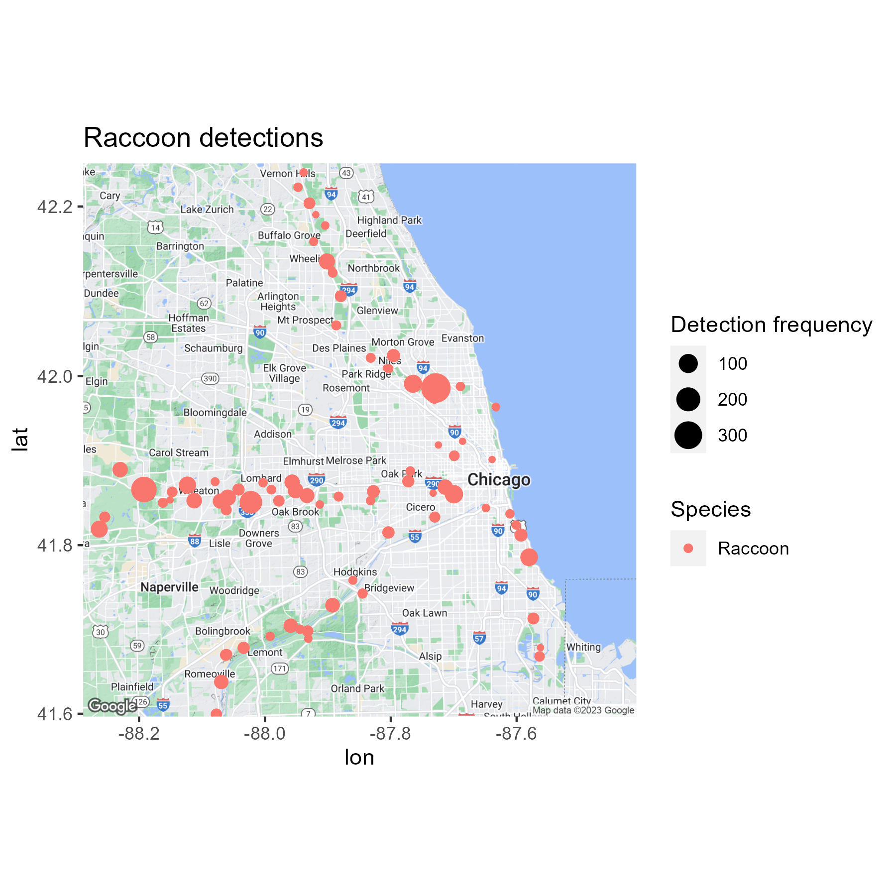
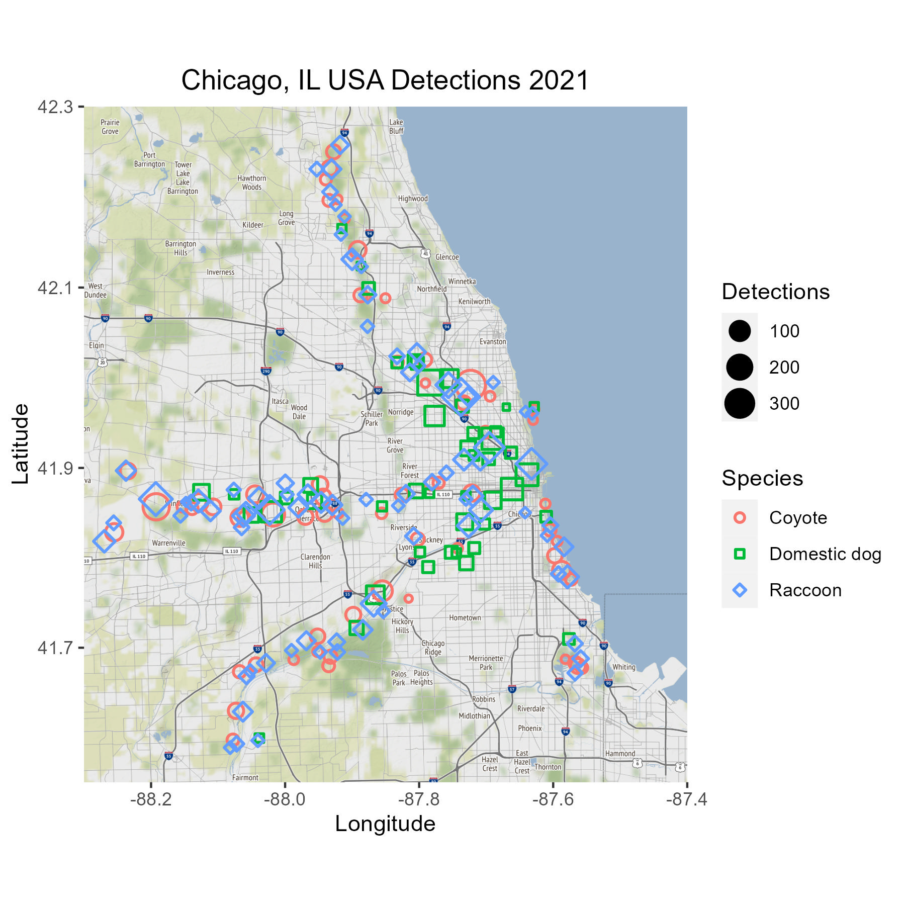

# UWIN Tutorial: Spatial Mapping - Detections
*Created by Kimberly Rivera - last updated July 2023 by Kimberly Rivera*

This tutorial is aimed at folks interested and new to spatial mapping, or as refesher for those already familiar. 

### Some helpful references:
1. [Species occurrence and density maps](https://ourcodingclub.github.io/tutorials/seecc_1/index.html#Flickr) - Coding Club, Gergana, John, Francesca, Sandra and Isla
2. [Elegant Graphics for Data Analysis](https://ggplot2-book.org/maps.html) -  Hadley Wickham, Danielle Navarro, and Thomas Lin Pedersen

### Tutorial Aims:

#### <a href="#spatial"> 1. Why do we need spatial data?</a>

#### <a href="#formatting"> 2. Processing and formatting data</a>

#### <a href="#plots"> 3. Plotting spatial data</a>


<a name="spatial"></a>

## 1.  Why do we need spatial data?
The study of species habitat, or where species are found in space and time, is a key component in understanding and managing wildlife. Thus, being able to collect, process, and manipulate spatial data is cruciual to this field. Though spatial information is increadibly useful to informing hypotheses and statistical analyses, it is also a powerful tool for visualizing data and storytelling via mapping. Traditionally, ecologists have relied on geospatial softwares like ArcGIS or QGIS to unpack and map spatial data. Though these are still important and useful tools, they can be expensive and may require high computational demands. R has increasingly become a complementary tool for analyzing and mapping spatial data via new packages and software development. This tutorial will cover some basic R spatial tools to build simple but effective maps on species occurence. Concepts exemplified here can be templates for more complex map making.  

<a name="formatting"></a>

## 2. Processing and formatting data
Some reasons spatial data can be complicated to work with is that is can come in many data types (shapefiles, goesptial images, etc.) with varying information extents (affilited metadata, resolution, coordinate systems, etc.). In this tutorial we will work with two different raster datasets from [Stamen maps](http://maps.stamen.com/#watercolor/12/37.7707/-122.3783), accessed via `ggmap()` and GeoTIFF files from [ESA's WorldCover data](https://esa-worldcover.org/en). We will also use sample data from UWIN Chicago.

```R
setwd()

# load in libraries
library(readr)
library(tidyr)
library(dplyr)
library(ggplot2)
library(maps)
library(RColorBrewer)

# read in example data
sp_data <- read_csv("CHIL_Detections.csv")

```
We will continue to practice manipulating data in R and subset relevant data columns in the appropriate format. We have a full UWIN sampling dataset from 2021 (four seasons of sampling) and a partial dataset from 2022. We will use 2021 data to build species distribution and alpha diversity (number of species) maps. 

```R
# to subsample data by year, we will add a new column 'year'
sp_data <- sp_data %>% 
  mutate(year = if_else(photoDateTime > '2021-12-31 11:59:59', 2022, 2021))

# we can use this column to subset our data to year 2021
sp_data_2021 <- sp_data %>% filter(year == 2021)
```

We will need to use the `group_by` function to count the number of detections for each species

```R
# we can pratice using group_by functions to count all detections for 2021 by species
sp_det <- sp_data_2021 %>% 
  group_by(commonName) %>% 
  summarise(detections = n())

# we can see this list matches the number of unquie species in 2021
unique(sp_data_2021$commonName)
```

Let's simplify this task by focusing on mapping one species across all of our camera sites

```R
# subset detections to raccoons
raccoon_det_2021 <- sp_data_2021 %>% 
  filter(commonName == "Raccoon")

# count raccoon detections by location
raccoon_sum <- raccoon_det_2021 %>% 
  group_by(locationAbbr) %>% # this groups detections by location
  mutate(detections = n()) %>% # this function counts the detections
  ungroup() %>% 
  distinct(commonName, detections, locationAbbr, DD_Long, DD_Lat) # allows us to retain site level data
```

Great! Now we have all the data we need in one place. We have all the information we need to plot and map raccoon detections. 

<a name="plots"></a>

## 3. Plotting spatial data
### Using ggmap
There are many packages and base maps we can use to display this data. We will be using a package called `ggmap` which allows us to use public mapping data sources like Google Maps and Stamen Maps to plot our detection data (or any point data!). 

```R
# install libraries
devtools::install_github("dkahle/ggmap", ref = "tidyup") # this allows us to use Stamen maps
library(ggmap)

# use package function to extract relevant mapping data using a bounding box
chicago <- get_stamenmap(bbox = c(left = -88.3, bottom = 41.55, 
                                  right = -87.4, top = 42.3), 
                         zoom = 11)
```

The `ggmap` package allows us to plot over maps using the ggplot format we have learned in previous tutorials. Though we are plotting our data using latitude and longitude, it is really just like plotting any other xy data (x = longitude, y = latitude). To visualize differences in detections across camera trapping locations, we can use the command `size = detections`. 

```R
ggmap::ggmap(chicago) +
  geom_point(aes(x = DD_Long, y = DD_Lat, colour = commonName, size = detections), data = raccoon_sum)
```

<p float="left">
  
</p>

Try this again for coyote detections. Make this plot using another color. 

<details closed><summary>Solution</a></summary>

```R
# subset detections of coyotes
coyote_det_2021 <- sp_data_2021 %>% 
  filter(commonName == "Coyote")

# count detections by location
coyote_sum <- coyote_det_2021 %>% 
  group_by(locationAbbr) %>% 
  mutate(detections = n()) %>% 
  ungroup() %>% 
  distinct(commonName, detections, locationAbbr, DD_Long, DD_Lat)

# map coyote detections with a different color
ggmap::ggmap(chicago) +
  geom_point(aes(x = DD_Long, y = DD_Lat, colour = commonName, size = detections), data = coyote_sum, color = "purple")

# if you want to save your ggplot locally
ggsave("coyote_map.jpg", width = 6, height = 6) # run this function after your desired plot
```
 <p float="left">
  
</p>

</details>

We can also map multiple species at once. Since plotting multiple species may become crowded or overwhelming to interpret as a viewer, it's helpful to know why and for who you are making these maps. Depending on your desired 'story' you may want to map certain groups of species together or separatly.

Perhaps we are interested in the co-occurence of domestic dogs with raccoon and coyote. We hypothesize that dogs are more likley to co-occur with raccoons then with coyotes based on previous research. We will certainly want to explore this hypothesis with statical models, such as a multi-species occupancy model, but we may also want to visualize our data to inform our hypotheses or supplement our findings in reports or manuscripts. Let's plot these three species together: raccoon, coyote, and dogs.

```R
carnivore_det_2021 <- sp_data_2021 %>% 
  filter(commonName == "Raccoon" | commonName == "Coyote" | commonName == "Domestic dog")

# count detections by location
carnivore_sum <- carnivore_det_2021 %>% 
  group_by(locationAbbr) %>% 
  mutate(detections = n()) %>% 
  ungroup() %>% 
  distinct(commonName, detections, locationAbbr, DD_Long, DD_Lat) 

# map species these together
ggmap::ggmap(chicago) +
  geom_point(aes(x = DD_Long, y = DD_Lat, colour = commonName, size = detections), 
             stroke = 1, data = carnivore_sum, shape = 21)
ggsave("carn_map.jpg", width = 6, height = 6)
```
 <p float="left">
  
</p>

If we look closely at our map, we can see that all the raccoon detections appear to be visable but, by referencing the last map, it seems we are missing coyote detections. These data are not actually missing, but raccoon detections are overlapping the other species detections and overwritting them as those detections are plotted last.

We can fix this by changing the plotting shapes and by adding a bit of randomness to their locations using the `jitter()` function. We can also tidy up our map using a few additional ggplot commands.

```R
ggmap::ggmap(chicago) +
  geom_point(aes(x = DD_Long, y = DD_Lat, colour = commonName, size = detections, 
                 shape = commonName), stroke = 1, data = carnivore_sum, 
             position=position_jitter(h=0.01,w=0.01)) + # moved points to be slightly off-center
  scale_shape_manual(values= c(21, 22, 23))+ # assigns each species a unique shape
  ggtitle("Chicago, IL USA Detections 2021")+
  theme(plot.title = element_text(hjust = 0.5))+ # this will center your title
  xlab("Longitude")+
  ylab("Latitude")+
  labs(color = "Species")+ # to edit labels on color/shape legend title
  labs(shape = "Species")+
  labs(size = "Detections") # to edit label on detections legend title
ggsave("species_map_final.jpg", width = 6, height = 6)
```
 <p float="left">
  
</p>

If we want to instead focus our attention on a specific area, we can adjust the bounding box and map level zoom.

```R
# set new extend with a new name
lincoln_park <- get_stamenmap(bbox = c(left = -87.7, bottom = 41.9, 
                                  right = -87.6, top = 42.0), 
                         zoom = 12)

# create map with new extent
ggmap::ggmap(lincoln_park) +
  geom_point(aes(x = DD_Long, y = DD_Lat, colour = commonName, size = detections, 
                 shape = commonName), stroke = 1, data = carnivore_sum, 
             position=position_jitter(h=0.0025,w=0.0025)) +
  scale_shape_manual(values= c(21, 22, 23))+
  ggtitle("Lincoln Park, IL USA Detections 2021")+
  theme(plot.title = element_text(hjust = 0.5))+ # this will center your title
  xlab("Longitude")+
  ylab("Latitude")+
  labs(color = "Species")+ # to edit labels on color/shape legend title
  labs(shape = "Species")+
  labs(size = "Detections") # to edit label on detections legend title
```
 <p float="left">
  
</p>

We can zoom in even further. Note that we need to adjust the 'zoom' every time we focus on a smaller area to increase clarity of the map image. We also need to decrease the 'jitter' so we can tell what detections are reletive to what sites

```R
montrose <- get_stamenmap(bbox = c(left = -87.652, bottom = 41.950, 
                                       right = -87.620, top = 41.975), 
                              zoom = 14)

ggmap::ggmap(montrose) +
  geom_point(aes(x = DD_Long, y = DD_Lat, colour = commonName, size = detections, 
                 shape = commonName), stroke = 1, data = carnivore_sum, 
             position=position_jitter(h=0.001,w=0.001)) +
  scale_shape_manual(values= c(21, 22, 23))+
  ggtitle("Montrose, IL USA Detections 2021")+
  theme(plot.title = element_text(hjust = 0.5))+ # this will center your title
  xlab("Longitude")+
  ylab("Latitude")+
  labs(color = "Species")+ # to edit labels on color/shape legend title
  labs(shape = "Species")+
  labs(size = "Detections") # to edit label on detections legend title
```
<p float="left">
  
</p>

It can be diffcult to visualize many species at once so we can also consider mapping alpha diversity, or species richness (number of species), in a given wildlife community. Let's do this for all species detected in Chicago.

```R
# summarize detections for all wildlife
sp_rich <- sp_data_2021 %>% 
  group_by(locationAbbr) %>% # group by location to summarise all species detections
  mutate(detections = n()) %>% # count the number of detectionsat each site
  ungroup() %>% # ungroup data to retain additional information like lat/long
  distinct(detections, locationAbbr, DD_Long, DD_Lat) # define the column to keep 

# mapping alpha diversity
ggmap::ggmap(chicago) +
  geom_point(aes(x = DD_Long, y = DD_Lat, size = detections), stroke = 1, data = sp_rich, 
             position=position_jitter(h=0.01,w=0.01)) +
 # scale_shape_manual(values= c(21, 22, 23))+
  ggtitle("Chicago, IL USA Alpha Diversity 2021")+
  theme(plot.title = element_text(hjust = 0.5))+ # this will center your title
  xlab("Longitude")+
  ylab("Latitude")+
  labs(size = "Detections") # to edit label on detections legend title
```
<p float="left">
  
</p>

### Using other raster layers
We can also build these plots with other geospatial layers. Let's use the [European Space Agency's global landcover layer](https://worldcover2020.esa.int/) as our example. This is a great mapping layer as it is a free, fine-scale (10m resolution), dataset which covers landcover globally across 10 classes: "Tree cover", "Shrubland", "Grassland", "Cropland", "Built-up", "Bare / sparse vegetation”, “Snow and Ice”, “Permanent water bodies”, “Herbaceous Wetland”, “Mangrove” and “Moss and lichen". See [ESA's product details document](chrome-extension://efaidnbmnnnibpcajpcglclefindmkaj/https://worldcover2020.esa.int/data/docs/WorldCover_PUM_V1.1.pdf) for more information.

```R
# load in libraries
library(sf)
library(terra)
library(rgdal)
library(tidyterra)
library(devtools)

# convert latitude/longitude data into spatial data by assigning the appropriate crs
sites = sf::st_as_sf(     #sf = spatial tool
  sp_data,
  coords = c("DD_Long", "DD_Lat"), # note these labels coordinate with labeling in your csv
  crs = 4326)                          # if you used lat/long in your .csv, use that here.                       
```

Above we are telling R that sp_data contains spatial data in DD_long and DD_lat. Making these data spatial will allow us to set our mapping layer to the appropriate CRS, or coordinator reference system to further manipulate the map. This is helpful if you are reading in a large map that needs to be cropped to a specific region. 

```R
# read in raster layer
my_map = rast("/Chicago_merged.tif") #path to where raster layer is

# Transform your site data into data which is cohesive with the ESA raster
dat <- sf::st_transform(
  sites,
  crs = crs(my_map)
)

# Crop map around buffer area of sites
crop <- crop(my_map, ext(sf::st_bbox(dat)[c("xmin","xmax","ymin","ymax")] +
                              c(-.05,.05,-.05,.05)))

# Plot cropped map and points
plot(crop)
points(sf::st_coordinates(dat), pch = 19)

```

We will continue to use `ggplot` to visualize our data with a few adaptations to the previous code. Unlike the standard `plot` function, `ggplot` requires specific data-types which can be in the form of a *data.frame* or *SpatRaster*. Though we could simply convert our map, `crop`, using `as.data.frame()`, it would take a very long time to process and will likley fail to plot depending on your computers local storage. Rather, we can use the ggplot function `geom_spatraster(data = crop)` by installing the package `tidyterra` which was developed by Diego Hernangómez (more on tidyterra [here](https://dieghernan.github.io/tidyterra/)). 

```R
ggplot() +
  geom_spatraster(data = crop, aes(fill = Chicago_merged))+
  ggtitle("Chicago, IL USA Land cover")
```
