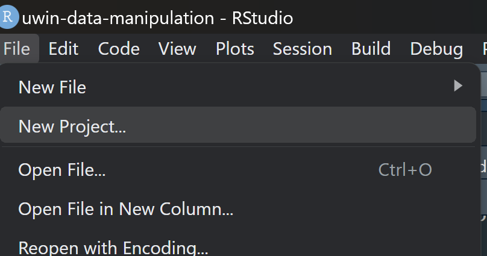
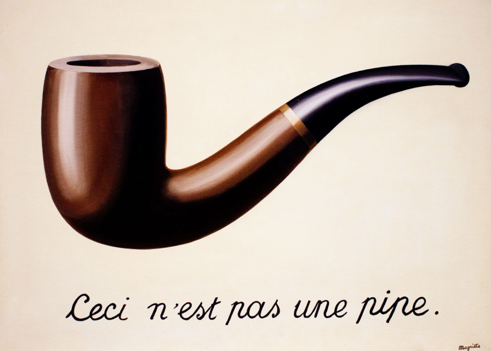
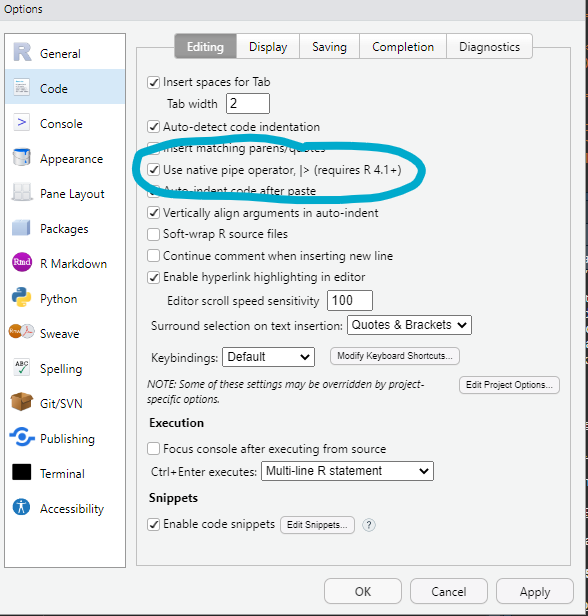

# Introduction to Data Manipulation in R using the Tidyverse

*Authors: Gabriela Palomo & Hannah Griebling*

## Learning objectives

-   After today's lecture, you'll be able to:

    -   Understand the structure of tidy data
    -   Understand the main tidy verbs in dplyr to help tidy data
    -   Organize and clean data downloaded from UWIN to run a single species single season occupancy analysis

## Packages

These are the packages that we are going to be working with for this tutorial.

```{r}
library(dplyr) # grammar of data manipulation using set of verbs; tidyverse 
library(tidyr) # tidy data; tidyverse
library(readr) # reads csv files; tidyverse
library(magrittr) # has the original pipe operator %>%
library(janitor)
```

## Organize the project and directory

Perhaps you are used to starting by setting your directory using `setwd()`. However, I highly recommend you use RStudio Projects. RStudio projects make it straightforward to divide your work into multiple contexts, each with their own working directory, workspace, history, and source documents.

We are going to start by creating a Project in RStudio. A Project is essentially a directory which will contain all the files you need for a specific project. It will have a `*.RProj` file associated with it to begin with.

Go to RStudio and click on File \> New Project.

<p float="center">
  

</p>

Now you see three options:

-   **New directory**: choose this option if you want to create a folder that will contain all the subdirectories and files of this particular project.
-   **Existing directory**: use this option if you already created a folder which will contain all the subdirectories and files for this particular project. Choose that folder here.
-   **Version Control**: choose this option if you are going to work with a repository already stored in GitHub.

For our own project, let's go ahead and choose 'New Directory' and let's name our project: '2024-data-manipulation-UWIN'

### Other files inside the main directory

You will have a series of directories inside your project, depending on the type of work that you'll be working on. Some people recommend following the same structure that you would use if creating an r package. However, I think that at a minimum, you could have the following structure:

<p float="center">
  

</p>


-   **Data** is a directory that has all your original .csv files with the data that you will use in your analysis.
-   **Functions** is a directory that houses all the functions you create and that you will be using throughout your analysis. Some people include this directory as a subdirectory of R.
-   **Plots** is a directory in which you will put all the graphs you create as part of your analysis.
-   **R** is a directory that will have all the scripts needed for your analysis.
-   **Results** is a directory that you may or may not need. The idea is to include all the resulting .csv or .rds files in here and keep them separate from your original files.
-   You may need other directories, especially if you are working with spatial data, for example, shapefiles, rasters, maps, etc.

## Naming files

Now we should discuss a very important topic which is **naming files**.\
1. File names should be **machine readable**: avoid spaces, symbols, and special characters. Don't rely on case sensitivity to distinguish files.\
2. File names should be **human readable**: use file names to describe what's in the file.\
3. File names should play well with default ordering: start file names with numbers so that alphabetical sorting puts them in the order they get used.

Here are a few examples of **bad names**:

-   `Document 1.docx`
-   `manuscript_final.docx`
-   `final_document_final.qmd`
-   `data.csv`

Here are a few examples of **good names**:

-   `2024_05_03_manuscript_name.R`
-   `01_data_cleaning.R`
-   `02_model.R`
-   `fig-01.png`
-   `exercise-uwin-workshop.qmd`

Why are these **good names**? Well because if you have several of those, you can arrange them by date (descending or ascending), or by order of fig-01, fig-02.

### Warning!

It's important to note that `fig-01.png` is not the same as `fig-1.png` because your computer will read the following files in this order: `fig1.png`, `fig10.png`, `fig11.png`, `fig2.png`.

## Let's talk about pipes

-   At the beginning there was only one [pipe operator](https://magrittr.tidyverse.org/reference/pipe.html), `%>%`, which is from the `magrittr` package.

-   The idea is to have a way to pipe an object forward into a function or call expression.

-   It should be read as 'then'. For example: The following code is read as follows: start with object df THEN select col1.

```{r, echo=TRUE, eval = FALSE}
df %>% select(col1)
```
<p float="center">
  

</p>

## Native pipe in base R

-   Now, base R has it's own pipe called native pipe, `|>`, which is also read as 'then'.

-   You can activate this native pipe by going to Tools \> Global options \> Code and selecting that option.

<p float="center">
  

</p>

-   You can read more about the differences between both pipes [here](https://www.tidyverse.org/blog/2023/04/base-vs-magrittr-pipe/).

## `dplyr` verbs: data transformation

-   `dplyr` is a package based on a grammar of data manipulation, providing a consistent set of verbs that help you solve the most common data manipulation challenges:

    -   `mutate()` adds new variables that are functions of existing variables
    -   `select()` picks variables based on their names
    -   `filter()` picks cases based on their values
    -   `summarise()` reduces multiple values down to a single summary
    -   `arrange()` changes the ordering of the rows
    -   `group_by()` groups variables for you to perform operations on the grouped data. Always remember to `ungroup()` once you are finished

-   These can be linked together by pipes `|>` or `%>%`

-   Cool [cheatsheet for dplyr](https://github.com/rstudio/cheatsheets/blob/main/data-transformation.pdf)

## `tidyr` for tidying data

-   The `tidyr` package has a series of functions that are named after verbs that will help you tidy and clean data.

-   The goal of `tidyr` is to help you create **tidy data**. Tidy data is data where:

    -   Each variable is a column; each column is a variable

    -   Each observation is a row; each row is an observation

    -   Each value is a cell; each cell is a single value

-   Cool [cheatsheet for tidyr](https://github.com/rstudio/cheatsheets/blob/main/tidyr.pdf)

## Data organization for an occupancy analysis!

First things first, let's see the data that we are going to be working with. To do so, let's use a super handy package called `readr` which is part of the `tidyverse`, specifically a function called `read_csv()`. The data we want is a `.csv` document and is conveniently stored in a folder called `data`.

### Important!

However, there is something we need to be aware of before we read in the file. The report that the UWIN database generates has this information at the top of the document on the first 3 rows. We will need this information later but not for the main data set, so we are going to create two data frames, one with the information on the top rows and one with the info starting on row 4:

<p float="center">
  

</p>

```{r}
occ.data <- readr::read_csv(file = './data/OccupancyReport.csv', 
                               # Skip row 1-3
                               skip = 3,
                               # identify how not available data are coded, you can use c('NA', 'N/A')
                               na = 'NA', 
                               # define column types, readr guesses the ones we don't specify
                               col_types = c('f', 'd', 'c', 'd', 'd'))

# With glimpse we can see the name of each column, type, and the first rows 
dplyr::glimpse(occ.data)
```

Now let's extract the Start and End dates, we may need them later on.

```{r}
occ.info <- read_csv(file = './data/OccupancyReport.csv', 
                        n_max = 1) |> 
  select('Start Date', 'End Date')
  
glimpse(occ.info)

```

### Note!

Let's look at the column names. They start with a capital letter and are separated by an underscore `_`. Let's review the current name conventions:

<p float="center">
  

</p>

This is important to remember so that you (and your team) can always stick to a name convention to make things easier for everyone. Whichever you use, DO NOT USE A SPACE TO SEPARATE WORDS.

-   These are ok for the name of a column: 'day01', 'Day_1', 'day1', 'day-01', 'day-1'
-   This is not ok: 'day 1'

You can leave the column names as is, but I want to show you a super handy function in package `janitor` that can help us rename all the columns to fit one naming convention. The options for `case` are 'snake', 'lower_camel', 'title', 'upper_camel'.

```{r}
occ.data <- janitor::clean_names(dat = occ.data, 
                                 case = 'snake')
glimpse(occ.data)
```

Have you noticed that we have two species in our data?

```{r}
unique(occ.data$species)
```

## Dividing data into occasions

Imagine we want to perform an occupancy analysis with our data.

We begin by dividing our data into occasions. In this case we have 36 days of sampling so now we want each occasion to have 7 days.

```{r}
# Separate only the days 
days_oc <- occ.data |> 
  filter(species == 'Coyote')|> 
  select(contains('day_')) 
  
# Calculate number of weeks or occasions based on 7 day groups 
n_weeks <- ceiling(ncol(days_oc)/7)
# Create a vector where you assign the number of week to the day
week_groups <- rep(1:n_weeks, each = 7)[1:ncol(days_oc)]

# and write a function that keeps each occasion with all NA's as such and those with all 0's as 0, and those with at least 1 detection, as 1
combine_days <- function(y, groups){
  ans <- rep(NA, max(groups))
  for(i in 1:length(groups)){
    tmp <- as.numeric(y[groups == i])
    if(all(is.na(tmp))){
      next
    } else {
      ans[i] <- as.numeric(sum(tmp, na.rm = TRUE)>0)
    }
  }
  return(ans)
}

# Apply this function across rows (in groups of 6)
data.weeks <- t( # this transposes our matrix
  apply(
    days_oc, 
    1, # 1 is for rows
    combine_days,
    groups = week_groups
  )
)

# Rename columns to match number of week 
data.wk <- data.weeks |> 
  as.data.frame() |> 
  rename_with(~paste0('week_', 1:n_weeks))

# Now we can combine the species, season, site, latitude, longitude from coyote.data to our occasions.
data.occ <- occ.data |> 
  filter(species == 'Coyote')|> 
  select(species, season, site, latitude, longitude) |> 
  cbind(data.wk)

```

### Let's review what we have so far!

Let's review what we just did. We have 36 days, so we collapsed them all into 7-day occasions. In total, we have 6 columns or occasions (weeks) but our 6th week only has 1 day worth of data. We will delete it for the sake of the exercise, but make sure that you consider the ecological implications for your species of the length of your occasions.

## Dashboard of our data so far

```{r}

library(ggplot2)

occ_long <- data.occ |> 
  pivot_longer(cols = starts_with('week_'), 
               names_to = 'week', 
               values_to = 'values') |> 
  mutate(values = factor(values))

ggplot(occ_long, aes(x = week, y = site, fill = values))+
  geom_tile( 
            color = 'white', 
            lwd = 1, 
            linetype = 1)+
  coord_equal()+
  labs(title = paste0('Weekly detections by site'))+
  scale_fill_manual(values = c('#6F9CDE', '#FC8955'), 
                    na.value = '#A9A9A9') +
  theme(legend.position = 'left', 
        axis.text.x = element_text(angle = 90), 
        legend.title = element_blank(), 
        axis.title = element_blank(), 
        plot.title = element_text(hjust=0, face = 'bold', size = 16)) -> tile.plot 

tab <- as.data.frame(
  c(Start = occ.info$`Start Date`, 
    End = occ.info$`End Date`, 
    Sites = nrow(data.occ), 
    Species = as.character(occ_long$species[[1]]), 
    Occassions = n_weeks, 
    'Days per occassion' = 7)
)

library(gridExtra)
p_tab <- tableGrob(unname(tab), theme = ttheme_minimal(core=list(fg_params=list(hjust=0, x=0)),
                                                       rowhead=list(fg_params=list(hjust=0, x=0, 
                                                                                   col = 'black'))))
grid.arrange(tile.plot, p_tab, ncol = 2, padding = unit(0, 'cm'))

```

## Let's tidy the spatial covariates

These are covariates that vary at the site level.

```{r}
# read in the file with covariates 
covariates <- read_csv('./data/covariates.csv')

# make sure column names follow snake convention 
covariates <- janitor::clean_names(covariates, 
                                   "snake")
glimpse(covariates)
```

First thing we should do is scale our covariates so we can compare across them.

```{r}
covariates.sc <- covariates |> 
  # Select only the columns you wish to scale
  select(forest:dist_water) |>
  # mutate across all the columsn you wish to scale 
  mutate(across(forest:dist_water, 
                ~as.vector(scale(.x)))) |> 
  # rename the columns you selected and add _scaled at the end of each one
  rename_with(~paste0(.x, '_scaled')) |> 
  # combine all the columns here and with the file covariates
  cbind(covariates) |> 
  # reorganize the columns in the order you want
  relocate(site, latitude, longitude, forest, ag, dist_water, forest_scaled, ag_scaled, dist_water_scaled)

glimpse(covariates.sc)

```

## Let's tidy the observational covariates

These are covariates that vary by occasions or within sites.

```{r}
temp_covs <- read_csv('./data/temp_covs.csv') |> 
  select(!Site)

# We have to summarize it for each occasion, remember you only have 6 occasions 
library(purrr)
row_means <- function(data) {
  map(seq(1, ncol(data), by = 7),
      ~rowMeans(select(data, .x:min(.x + 6, ncol(data))), na.rm = TRUE)) |> 
       set_names(paste0("week_", seq(1, 6, by = 1))) |> 
       tibble::as_tibble()
}


# Apply the function and coerce the object to be a matrix 
temp_avg <-  row_means(temp_covs)

```

## Now we are ready to create our `unmarkedFrameOccu()` to begin an occupancy model.

```{r}
library(unmarked)

# Detection data must only include the columns with the occasions
y <- data.occ |> 
  select(week_1:week_6)

# Site covariates must only be the columns with the scaled covariates   
siteCovs <- covariates.sc |> 
  select(forest_scaled:dist_water_scaled)

# You need a list of matrices for the observation covariates, 
# And each matrix must be named 
obsCovs <- list(temp_avg=temp_avg)

occu.df <- unmarkedFrameOccu(y = y, 
                             siteCovs = siteCovs, 
                             obsCovs = obsCovs)
```

## END
