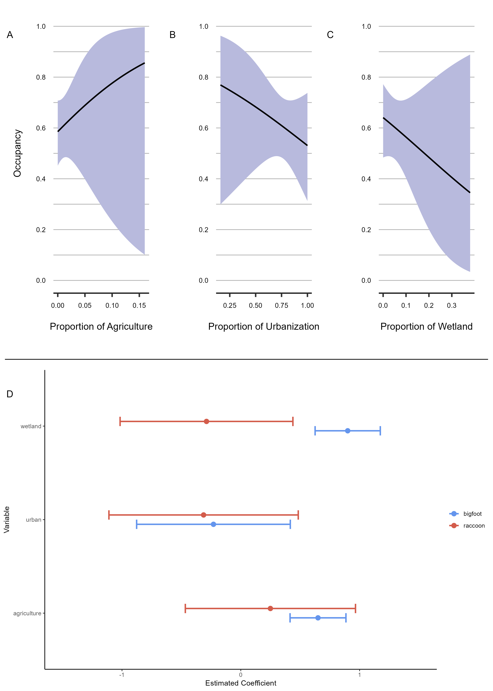

```{r setup, include=FALSE}
knitr::opts_chunk$set(echo = TRUE, 
                      message=FALSE, 
                      warning=FALSE)
```

## Learning objectives 

  1. Learn the basics of ggplot2 grammar and syntax.
  2. Create two graphs that will help you understand your covariates and the relationship between them prior to visualizing your occupancy results. 
  3. Create two graphs that will help you visualize the results of an occupancy analysis. 
  4. Customize the `theme()` of your graphs. 
  5. Export graphs as .jpg, .png, .pdf, using `ggsave()`

> You will find that we are using the native pipe operator `|>`. This native pipe is part of base R and has been available since R version 4.1.0 (May 2021). You can choose which pipe to use, either the native pipe `|>` or the magrittr pipe `%>%` by going to Tools > Global options > Code.

## Introduction 

We are going to use the package `ggplot2` to create publication ready graphs in r. To begin, we are going to go over a presentation linked below to learn the basic components of `ggplot2` and the grammar of graphics. Once we have covered the basics, then we will proceed to the tutorial. 

## Presentation 

Here's a link to the [presentation](https://gabspalomo.github.io/slides/uwin_ggplot2/ppt/uwin_intro_ggplot2.html#/title-slide)

## Tutorial: Data visualization for an occupancy analysis. 

*Warning: We pack a lot of information about `ggplot` into the first graph and it can be overwhelming. The graphs that follow will be easier since you will already be familiar with many of the concepts and we won't need to explain them as thoroughly.*

Let's begin by loading the packages and data that we are going to be working with. We will load the packages using the `pacman` package, which will automatically download any libraries used in this tutorial that aren't already downloaded on your computer. Just make sure to install the `pacman` package if you haven't already!

```{r, packages}
#install.packages("pacman")
pacman::p_load(ggplot2, #flexible and professional graphics
               dplyr, #data manipulation
               tidyr, #data manipulation
               ggdist, #visualize distributions
               ggridges, #visualize distributions
               ggcorrplot, #visualize correlation 
               colorspace, #provides a range of color palettes
               cowplot) #allows us to arrange plots 
```

Now let's load the data that we will be working with. 

```{r, data}
#| warning: false
#| message: false

# Covariates 
land_cover <- readr::read_csv('./data/Chicago_NLCD_landcover.csv')
```

```{r}
#| echo: false 

library(gt)

land_cover |> 
  gt_preview() |> 
  fmt_number(
    columns = everything(), 
    decimals = 2
  ) |> 
  tab_header(
    title = md("**Landcover Covariates**"), 
    subtitle = "NLCD landcover classes" 
  ) 


```


### Pre-analysis data visualization: graph 1

First, let's prepare the data. We want to explore the shape of the data for all our covariates. It's highly recommended that you do this at first because it will help you understand the way your data is distributed (e.g., if it's centered around a value, or if there are a lot of zeros (0), etc.) 

```{r}
covariates <- land_cover |> 
  # select the following columns 
  select(sites, wetland, ag, urban) |>
  # scale the columns 'wetland', 'ag', 'urban' 
  # mutate() let's us change existing columns or create new ones 
  # across() is a helper function to include several columns to apply the scale() function to
  mutate(across(c('wetland', 'ag', 'urban'), scale)) |> 
  # mutate_if is a conditional mutate to only transform as vectors all the columns that are numeric
  mutate_if(is.numeric, as.vector) |> 
  # pivot_longer to go from wide data to long data 
  pivot_longer(cols = c(wetland, ag, urban), # the columns we wish to transform from wide to long
               names_to = 'covariate', # the name of the column that will contain wetland, ag, urban 
               values_to = 'value') |> # the name of column that will have the cell values for each category
  # mutate let's us transform the column covariate to a factor 
  mutate(covariate = factor(covariate))

head(covariates)
```

```{r, echo=FALSE, eval=FALSE}
covariates |> 
  group_by(covariate) |> 
  summarise(min= min(value), 
            max = max(value), 
            mean = mean(value))

```

Now that our data are prepared, we can graph the covariates that we are interested in (wetland, agriculture, and urbanization) and see how the data are distributed. Remember that we scaled the covariates in the previous step so it makes sense that we can now compare them graphically. 

```{r}
ggplot(data = covariates, #specify our data source
       aes(y = covariate, #specify aesthetic mapping by stating we want our covariate categories to be on the y axis
           x = value)) #specify we want the covariate value to be on the x axis
```


You probably noticed that this chunk of code didn't actually plot any of our data. That's because the `ggplot(data,aes)` argument tells R how to structure our plot and where to look for data, but it doesn't actually plot any data. This will always be the first line of code when you make a new graph. 

To actually plot the data, we need to specify a geom, which tells R how to present the data we specified earlier. *Note that while we separate arguments within parentheses using commas, we use a plus sign (+) to join together different pieces of code like geoms, themes, etc.*

To see the distribution of our data values, we're going to use `geom_density_ridges2`, which tells R to show us our data as a density estimate.

```{r}
ggplot(data = covariates, #specify our data source
       aes(y = covariate, #specify aesthetic mapping by stating we want our covariate categories to be on the y axis
           x = value))+ #specify we want the covariate value to be on the x axis
  geom_density_ridges2()
```


Did you notice that we included parentheses after `geom_density_ridges2` but we didn't put anything inside the parentheses? We can put additional arguments inside the parentheses that control the aesthetics of the plot type. For example, we can scale the height of these density plots to make sure they don't overlap one another using the `scale` argument inside the `geom_density_ridges2` function.

```{r}
ggplot(data = covariates, #specify our data source
       aes(y = covariate, #specify aesthetic mapping by stating we want our covariate categories to be on the y axis
           x = value))+ #specify we want the covariate value to be on the x axis
  geom_density_ridges2(scale = 0.7) #reduce the height of each density plot to 70% of its original height
```

While it's helpful to see the distribution of our variables, it can be difficult to tell what our mean value is for each variable. We can add the `quantile` argument to tell R to draw the 25%, 50%, and 75% quantiles to our plot. Alternatively we could use specify different quantiles, such as 2.5% and 97.5%, by using the `probs` argument: `quantile(probs = c(0.025,0.975))`

```{r}
ggplot(data = covariates, #specify our data source
       aes(y = covariate, #specify aesthetic mapping by stating we want our covariate categories to be on the y axis
           x = value))+ #specify we want the covariate value to be on the x axis
  geom_density_ridges2(scale = 0.7, #reduce the height of each density plot to 70% of its original height
                       quantile_lines = TRUE) #adds quantile lines (default are 25%, 50%, and 75%) 
```

Something important to consider is that the density plots are smoothed estimations. That is, we don't actually have data points for every location depicted in the plot. To provide a more complete visualization of our data, we can add the actual data points to the plot using the `jittered_points` argument. If used alone, this plots the points within the density plot itself. We can place the points beneath the density plots using the `position` argument.

```{r}
ggplot(data = covariates, #specify our data source
       aes(y = covariate, #specify aesthetic mapping by stating we want our covariate categories to be on the y axis
           x = value))+ #specify we want the covariate value to be on the x axis
  geom_density_ridges2(scale = 0.7, #reduce the height of each density plot to 70% of its original height
                       quantile_lines = TRUE, #adds quantile lines (default are 25%, 50%, and 75%)
                       jittered_points = TRUE, #adds data points to the plot in a scattered pattern so they don't overlap each other 
                       position = "raincloud") #positions the data points below the density plots
```

Even when the points are spread out (aka jittered), they still overlap and blend to form a blob in areas of high point density. We can overcome this by adjusting the opacity of our graphic components using the `alpha` argument, where a value of 1 is completely opaque and a value of 0 is completely transparent.

```{r}
ggplot(data = covariates, #specify our data source
       aes(y = covariate, #specify aesthetic mapping by stating we want our covariate categories to be on the y axis
           x = value))+ #specify we want the covariate value to be on the x axis
  geom_density_ridges2(scale = 0.7, #reduce the height of each density plot to 70% of its original height
                       quantile_lines = TRUE, #adds quantile lines (default are 25%, 50%, and 75%)
                       jittered_points = TRUE, #adds data points to the plot in a scattered pattern so they don't overlap each other 
                       position = "raincloud", #positions the data points below the density plots
                       alpha = .5) #adjust opacity of figure components
```

Let's add some color to our plot! There are actually two main color arguments: `color` and `fill`. We use `fill` to define the color of the inside of an object, such as our density plots. Whereas `color` changes the color of points and lines, such as the outline of our density plots or the data points plotted below. 

```{r}
ggplot(data = covariates, #specify our data source
       aes(y = covariate, #specify aesthetic mapping by stating we want our covariate categories to be on the y axis
           x = value))+ #specify we want the covariate value to be on the x axis
  geom_density_ridges2(scale = 0.7, #reduce the height of each density plot to 70% of its original height
                       quantile_lines = TRUE, #adds quantile lines (default are 25%, 50%, and 75%)
                       jittered_points = TRUE, #adds data points to the plot in a scattered pattern so they don't overlap each other 
                       position = "raincloud", #positions the data points below the density plots
                       alpha = .5, #adjust opacity of figure components
                       color = "orange", #control color of lines and points
                       fill = "blue") #control color of polygons
```


In the last plot, we put both the `color` and `fill` arguments within `geom_density_ridges2`. That told R to use the same `color` and `fill` for all three of our variables. If we want to use separate colors for each variable, we have to tell R upfront. To do this, we include `color` and `fill` as arguments inside the aesthetic mapping argument (`aes()`) of our initiating argument (`ggplot()`). *Note that when we include these arguments within* `ggplot(aes())`*, we specify the name of the column that R should use to assign the `color` and `fill` values that will be provided later. This is NOT where you specify the color you wish to use.*

```{r}
ggplot(data = covariates, #specify our data source
       aes(y = covariate, #specify aesthetic mapping by stating we want our covariate categories to be on the y axis
           x = value, #specify we want the covariate value to be
           color = covariate, #specify the column on which to base coloration
           fill = covariate))+ #specify the column on which to base coloration
  geom_density_ridges2(scale = 0.7, #reduce the height of each density plot to 70% of its original height
                       quantile_lines = TRUE, #adds quantile lines (default are 25%, 50%, and 75%)
                       jittered_points = TRUE, #adds data points to the plot in a scattered pattern so they don't overlap each other 
                       position = "raincloud", #positions the data points below the density plots
                       alpha = .5) #adjust opacity of figure components

```


The colors in the previous plot are part of R's default color palette. This is fine for quick visualizations, but you'll probably want to choose your own colors. To do this, we use one of the `scale` commands. Let's say I want to use the colors of the rainbow. An easy way to do this would be through the `scale_fill_manual` and `scale_color_manual` commands, which allow you to set the colors you will use manually.

```{r}
ggplot(data = covariates, #specify our data source
       aes(y = covariate, #specify aesthetic mapping by stating we want our covariate categories to be on the y axis
           x = value, #specify we want the covariate value to be
           color = covariate, #specify the column on which to base coloration
           fill = covariate))+ #specify the column on which to base coloration
  geom_density_ridges2(scale = 0.7, #reduce the height of each density plot to 70% of its original height
                       quantile_lines = TRUE, #adds quantile lines (default are 25%, 50%, and 75%)
                       jittered_points = TRUE, #adds data points to the plot in a scattered pattern so they don't overlap each other 
                       position = "raincloud", #positions the data points below the density plots
                       alpha = .5)+ #adjust opacity of figure components
  scale_fill_manual(values = c("red","orange","yellow"))+
  scale_color_manual(values = c("green","blue","purple"))

```

<br>
While `scale_fill_manual` and `scale_color_manual` offer a lot of flexibility in color choice, it can be irritating (and messy) to have to add this to every graph you make. This becomes especially problematic if you need to alter your color scheme, requiring you to go back and change the code for every single graph. Thankfully, we can avoid this headache altogether by saving our own color palette! 

When building a color palette, it's helpful to know a little bit about color theory. However, it's not necessary information to complete this tutorial. If you'd like a quick lesson, expand the section below. If not, feel free to skip it!

<br>

<details>
<summary style="font-size: 5rem; color: #2A7B9B">Quick lesson in color theory</summary>

<br>

**What is color theory?**

Color theory is the study of how different colors work together, and how the use of specific colors and color combinations affect the emotions and perceptions of viewers. As researchers, much of our focus is on collecting and analyzing data. But effective selection of color palettes can be just as important as the story we are trying to tell with our data. Understanding the fundamentals of color theory can quickly and painlessly take your data visualization to the next level.

```{r, eval=TRUE,echo=FALSE}
library(ggplot2)
library(cowplot)
library(grid) #drawing vectors in graphs
library(tigris) #spatial data
library(sf) #spatial data processing

colors.vect <- c("#C70039","#FF5733","#FF8D1A","#FFC300","#EDDD53",
                 "#ADD45C","#57C785","#00BAAD","#2A7B9B","#3D3D6B",
                 "#511849","#900C3F")

colors.df <- data.frame(group = c("a","b","c","d","e","f","g","h","i","j","k","l"),
                        value = 1)


base.color.wheel <- ggplot(data = colors.df, aes(y = value, fill = group))+
  geom_bar()+
  scale_fill_manual(values = colors.vect)+
  coord_polar()+
  theme_void()+theme(legend.position = "none")

overlay.analogous <- ggplot(data = colors.df, aes(y = value, fill = group))+
  geom_bar(alpha= .9)+
  scale_fill_manual(values = c("#C70039",
                               "#FF5733",
                               "white",
                               "white",
                               "white",
                               "white",
                               "white",
                               "white",
                               "white",
                               "white",
                               "white",
                               "#900C3F"))+
  coord_polar()+
  theme_void()+theme(legend.position = "none")

overlay.complement <- ggplot(data = colors.df, aes(y = value, fill = group))+
  geom_bar(alpha= .9)+
  scale_fill_manual(values = c("#C70039",
                               "white",
                               "white",
                               "white",
                               "white",
                               "white",
                               "#57C785",
                               "white",
                               "white",
                               "white",
                               "white",
                               "white"))+
  coord_polar()+
  theme_void()+theme(legend.position = "none")

overlay.triadic <- ggplot(data = colors.df, aes(y = value, fill = group))+
  geom_bar(alpha= .9)+
  scale_fill_manual(values = c("#C70039",
                               "white",
                               "white",
                               "white",
                               "#EDDD53",
                               "white",
                               "white",
                               "white",
                               "#2A7B9B",
                               "white",
                               "white",
                               "white"))+
  coord_polar()+
  theme_void()+theme(legend.position = "none")

overlay.tetrad <- ggplot(data = colors.df, aes(y = value, fill = group))+
  geom_bar(alpha= .9)+
  scale_fill_manual(values = c("#C70039",
                               "#FF5733",
                               "white",
                               "white",
                               "white",
                               "white",
                               "#57C785",
                               "#00BAAD",
                               "white",
                               "white",
                               "white",
                               "white"))+
  coord_polar()+
  theme_void()+theme(legend.position = "none")

overlay.split.comp <- ggplot(data = colors.df, aes(y = value, fill = group))+
  geom_bar(alpha= .9)+
  scale_fill_manual(values = c("#C70039",
                               "white",
                               "white",
                               "white",
                               "white",
                               "#ADD45C",
                               "white",
                               "#00BAAD",
                               "white",
                               "white",
                               "white",
                               "white"))+
  coord_polar()+
  theme_void()+theme(legend.position = "none")

scheme.complementary <- ggdraw()+
  draw_plot(base.color.wheel)+
  draw_plot(overlay.complement)

scheme.analogous <- ggdraw()+
  draw_plot(base.color.wheel)+
  draw_plot(overlay.analogous)

scheme.triadic <- ggdraw()+
  draw_plot(base.color.wheel)+
  draw_plot(overlay.triadic)

scheme.tetradic <- ggdraw()+
  draw_plot(base.color.wheel)+
  draw_plot(overlay.tetrad)

scheme.split.complement <- ggdraw()+
  draw_plot(base.color.wheel)+
  draw_plot(overlay.split.comp)

color.schemes <- ggdraw()+
  draw_plot(plot = scheme.complementary,
            x = 0.33,
            y = .75,
            height = .4,
            width = .4,
            hjust = 0.5,
            vjust = 0.5)+
  draw_text(text = "Complementary",
            x = 0.33,
            y = .515,
            hjust = 0.5,
            vjust = 0.5)+
  draw_plot(plot = scheme.analogous,
            x = 0.66,
            y = .75,
            height = .4,
            width = .4,
            hjust = 0.5,
            vjust = 0.5)+
  draw_text(text = "Analogous",
            x = 0.66,
            y = .515,
            hjust = 0.5,
            vjust = 0.5)+
  draw_plot(plot = scheme.split.complement,
            x = 0.25,
            y = 0.25,
            height = .4,
            width = .4,
            hjust = 0.5,
            vjust = 0.5)+
  draw_text(text = "Split Complementary",
            x = 0.25,
            y = 0.021,
            hjust = 0.5,
            vjust = 0.5)+
  draw_plot(plot = scheme.triadic,
            x = 0.5,
            y = 0.25,
            height = .4,
            width = .4,
            hjust = 0.5,
            vjust = 0.5)+
  draw_text(text = "Triadic",
            x = 0.5,
            y = 0.021,
            hjust = 0.5,
            vjust = 0.5)+
  draw_plot(plot = scheme.tetradic,
            x = 0.75,
            y = 0.25,
            height = .4,
            width = .4,
            hjust = 0.5,
            vjust = 0.5)+
  draw_text(text = "Tetradic",
            x = 0.75,
            y = 0.021,
            hjust = 0.5,
            vjust = 0.5)


inner.tint <- circleGrob(x = .5,
                         y = .5,
                         r = .1,
                         gp = gpar(fill = "white",
                                   col = "transparent",
                                   alpha = .3))

middle.tint <- circleGrob(x = .5,
                          y = .5,
                          r = .2,
                          gp = gpar(fill = "white",
                                    col = "transparent",
                                    alpha = .3))

outter.tint <- circleGrob(x = .5,
                          y = .5,
                          r = .3,
                          gp = gpar(fill = "white",
                                    col = "transparent",
                                    alpha = .3))

tint.plot <- ggdraw()+
  draw_plot(plot = base.color.wheel,
            x = 0,
            y= 0,
            height = 1,
            width = 1,
            hjust = 0,
            vjust = 0)+
  draw_grob(grob = inner.tint)+
  draw_grob(grob = middle.tint)+
  draw_grob(grob = outter.tint)


inner.shade <- circleGrob(x = .5,
                          y = .5,
                          r = .1,
                          gp = gpar(fill = "black",
                                    col = "transparent",
                                    alpha = .3))

middle.shade <- circleGrob(x = .5,
                           y = .5,
                           r = .2,
                           gp = gpar(fill = "black",
                                     col = "transparent",
                                     alpha = .3))

outter.shade <- circleGrob(x = .5,
                           y = .5,
                           r = .3,
                           gp = gpar(fill = "black",
                                     col = "transparent",
                                     alpha = .3))

shade.plot <- ggdraw()+
  draw_plot(plot = base.color.wheel,
            x = 0,
            y= 0,
            height = 1,
            width = 1,
            hjust = 0,
            vjust = 0)+
  draw_grob(grob = inner.shade)+
  draw_grob(grob = middle.shade)+
  draw_grob(grob = outter.shade)

inner.tone <- circleGrob(x = .5,
                         y = .5,
                         r = .1,
                         gp = gpar(fill = "darkgrey",
                                   col = "transparent",
                                   alpha = .4))

middle.tone <- circleGrob(x = .5,
                          y = .5,
                          r = .2,
                          gp = gpar(fill = "darkgrey",
                                    col = "transparent",
                                    alpha = .4))

outter.tone <- circleGrob(x = .5,
                          y = .5,
                          r = .3,
                          gp = gpar(fill = "darkgrey",
                                    col = "transparent",
                                    alpha = .4))

tone.plot <- ggdraw()+
  draw_plot(plot = base.color.wheel,
            x = 0,
            y= 0,
            height = 1,
            width = 1,
            hjust = 0,
            vjust = 0)+
  draw_grob(grob = inner.tone)+
  draw_grob(grob = middle.tone)+
  draw_grob(grob = outter.tone)

color.wheels <- ggdraw()+
  draw_plot(plot = tint.plot,
            x = 0,
            y = 0,
            height = 1,
            width = .33)+
  draw_text(text = "Tint",
            x = 0.165,
            y = 0.1,
            hjust = 0.5,
            vjust = 0,
            size=18)+
  draw_plot(plot = tone.plot,
            x = 0.33,
            y = 0,
            height = 1,
            width = .33)+
  draw_text(text = "Tone",
            x = 0.5,
            y = 0.1,
            hjust = 0.5,
            vjust = 0,
            size = 18)+
  draw_plot(plot = shade.plot,
            x = 0.66,
            y = 0,
            height = 1,
            width = .33)+
  draw_text(text = "Shade",
            x = 0.835,
            y = 0.1,
            hjust = 0.5,
            vjust = 0,
            size = 18)


colors.analag <- colorRampPalette(colors = c("#00BAAD","#2A7B9B","#3D3D6B"))
colors.analag <- colors.analag(4)
colors.tetradic <- c("#2A7B9B","#C70039","#FF8D1A","#c9c7c7")

data.compare <- data.frame(group = c("a","b","c","d"),
                           val = c(6,3,11,9))

plot.bar.analagous <- ggplot(data = data.compare, aes(x = as.factor(group), y = val))+
  geom_col(fill = colors.analag)+
  theme_classic()+
  theme(axis.text = element_blank(),
        axis.title = element_blank(),
        axis.ticks = element_blank(),
        legend.position = "none")
plot.bar.tetradic <- ggplot(data = data.compare, aes(x = as.factor(group), y = val))+
  geom_col(fill = colors.tetradic)+
  theme_classic()+
  theme(axis.text = element_blank(),
        axis.title = element_blank(),
        axis.ticks = element_blank(),
        legend.position = "none")

data.compare.line <- data.frame(group = c("a","a","a","a","a",
                                          "b","b","b","b","b",
                                          "c","c","c","c","c",
                                          "d","d","d","d","d"),
                                value = c(1,2,4,5,4.5,
                                          2,3,2.8,4,4,
                                          1.5,2.5,4.5,4.5,5.75,
                                          .5,1,3,3.6,6),
                                time = c(1,2,3,4,5,
                                         1,2,3,4,5,
                                         1,2,3,4,5,
                                         1,2,3,4,5))


plot.line.analagous <- ggplot(data = data.compare.line, aes(x = time, y = value, group = group, color= group))+
  geom_line(size = 1)+
  scale_color_manual(values = colors.analag)+
  theme_classic()+
  theme(axis.text = element_blank(),
        axis.title = element_blank(),
        axis.ticks = element_blank(),
        legend.position = "none")
plot.line.tetradic <- ggplot(data = data.compare.line, aes(x = time, y = value, group = group, color= group))+
  geom_line(size = 1)+
  scale_color_manual(values = colors.tetradic)+
  theme_classic()+
  theme(axis.text = element_blank(),
        axis.title = element_blank(),
        axis.ticks = element_blank(),
        legend.position = "none")

plot.pie.tetradic <- ggplot(data = data.compare, aes(x = "", y = val, fill = group))+
  geom_col(fill = colors.tetradic)+
  coord_polar(theta = "y")+
  theme_void()
plot.pie.analagous <- ggplot(data = data.compare, aes(x = "", y = val, fill = group))+
  geom_col(fill = colors.analag)+
  coord_polar(theta = "y")+
  theme_void()

poly.data <- counties(progress_bar=FALSE)
poly.data <- poly.data[which(poly.data$STATEFP ==51 ),] #subset to Virginia
poly.data$plot.stat <- poly.data$ALAND/max(poly.data$ALAND)
poly.data$plot.stat <- ifelse(poly.data$plot.stat <= 0.25,"a",
                              ifelse(poly.data$plot.stat > 0.25 & poly.data$plot.stat <= 0.5,"b",
                                     ifelse(poly.data$plot.stat > 0.5 & poly.data$plot.stat <= 0.75,"c","d")))

plot.map.analagous <- ggplot(data = poly.data)+
  geom_sf(aes(fill = plot.stat),
          color = "transparent")+
  scale_fill_manual(values = colors.analag)+
  theme_void()+
  theme(legend.position = "none")
plot.map.tetradic <- ggplot(data = poly.data)+
  geom_sf(aes(fill = plot.stat),
          color = "transparent")+
  scale_fill_manual(values = colors.tetradic)+
  theme_void()+
  theme(legend.position = "none")

data.likert <- data.frame(rank = c(1,2,3,4,5,6,7),
                          n = c(5,18,25,30,14,9,4),
                          group =c("a","a","a","a","a","a","a"))
new.analag <- colorRampPalette(colors = c("#00BAAD","#2A7B9B","#3D3D6B"))
new.analag <- new.analag(7)
new.tetradic <- c("#2A7B9B","#C70039","#FF8D1A","#c9c7c7",
                  "#40bced","#800024", "#b36110")

plot.likert.tetradic <- ggplot(data = data.likert, aes(y = group, x = n, fill = n))+
  geom_bar(position = "stack",
           stat = "identity",
           fill = new.tetradic)+
  theme_void()
plot.likert.analag <- ggplot(data = data.likert, aes(y = group, x = n, fill = n))+
  geom_bar(position = "stack",
           stat = "identity",
           fill = new.analag)+
  theme_void()

qual.plots <- ggdraw()+
  draw_plot(plot = plot.line.tetradic,
            x = 0,
            y = 0.45,
            height = 0.45,
            width = 0.5)+
  draw_plot(plot = plot.bar.tetradic,
            x = 0.5,
            y = 0.45,
            height = 0.45,
            width = 0.5)+
  draw_plot(plot = plot.pie.tetradic,
            x = 0,
            y = 0.05,
            height = 0.45,
            width = 0.5)+
  draw_plot(plot = plot.map.tetradic,
            x = 0.5,
            y = 0.05,
            height = 0.45,
            width = 0.5)+
  draw_plot(plot = plot.likert.tetradic,
            x = 0,
            y = 0,
            height = .1,
            width = 1)+
  draw_text(text = "Qualitative Color Palette",
            x = 0.5,
            y = 0.95)

quant.plots <- ggdraw()+
  draw_plot(plot = plot.line.analagous,
            x = 0,
            y = 0.45,
            height = 0.45,
            width = 0.5)+
  draw_plot(plot = plot.bar.analagous,
            x = 0.5,
            y = 0.45,
            height = 0.45,
            width = 0.5)+
  draw_plot(plot = plot.pie.analagous,
            x = 0,
            y = 0.05,
            height = 0.45,
            width = 0.5)+
  draw_plot(plot = plot.map.analagous,
            x = 0.5,
            y = 0.05,
            height = 0.45,
            width = 0.5)+
  draw_plot(plot = plot.likert.analag,
            x = 0,
            y = 0,
            height = .1,
            width = 1)+
  draw_text(text = "Quantitative Color Palette",
            x = 0.5,
            y = 0.95)

combined.color.palletes <- ggdraw()+
  draw_plot(plot = quant.plots,
            x = 0,
            y = 0,
            width = 0.5,
            height = 1)+
  draw_plot(plot = qual.plots,
            x = 0.5,
            y = 0,
            width = 0.5,
            height = 1)+
  draw_line(x = c(.5,.5),
            y = c(.02,.98))


plot.line.emphasize <- ggplot(data = data.compare.line, aes(x = time, y = value, group = group, color= group))+
  geom_line(size = 1)+
  scale_color_manual(values = c("#d4d4d4","#a8a8a8","#C70039","#8a8a8a"))+
  theme_classic()+
  theme(axis.text = element_blank(),
        axis.title = element_blank(),
        axis.ticks = element_blank(),
        legend.position = "none")

data.compare.further <- data.frame(group = c("a.1","a.2","a.3",
                                             "b.1","b.2",
                                             "c.1","c.2","c.3","c.4",
                                             "d.1","d.2"),
                                   val = c(2,1,3,
                                           2,1,
                                           3,2,4,2,
                                           6,3))
plot.pie.further <- ggplot(data = data.compare.further, aes(x = "", y = val, fill = group))+
  geom_col(fill = c("#194A5D","#5495AF","#94BDCD",
                    "#8C0028","#D84C74",
                    "#99540F","#E67F17","#FFA448","#FFC68C",
                    "#8D8C8C", "#DFDEDE"))+
  coord_polar(theta = "y")+
  theme_void()

plot.pie.subcategories <- ggdraw()+
  draw_plot(plot = plot.pie.further,
            x = 0.5,
            y = 0.5,
            height = 1,
            width = 1,
            hjust = 0.5,
            vjust = 0.5)+
  draw_plot(plot = plot.pie.tetradic,
            x = 0.5,
            y = 0.5,
            height = .9,
            width = .9,
            hjust = 0.5,
            vjust = 0.5)
```

<br>
Before we talk about how to pick the best color palette for your data, let's cover some basic principles of color. When we think of a color, we are often thinking of a *hue*. Conceptually, hues are raw colors without any alterations. The color wheel below shows twelve familiar hues arranged across the warm-cool spectrum.

```{r, echo=FALSE}
base.color.wheel
```

<br>
Of course, we can make slightly different colors by "mixing" white, grey, or black with each hue. The new colors are called tints, tones, or shades, respectively. 
```{r, echo=FALSE}
color.wheels
```

<br>
For the rest of this mini-lesson, I'm going to primarily use hues. But be aware that we often rely on tints, tones, and shades to build pleasing and effective color palettes.

While the color wheel's organization may seem coincidental, it is actually built to allow us to quickly select colors that work well with each other based on their position in the wheel. Depending on what you are trying to communicate, each of these methods of selecting colors has strengths and weaknesses.

```{r ,echo = FALSE}
color.schemes
```

<br>
Ultimately it is up to you to determine which type of color palette best suits your needs. However, we can broadly lump palettes into two categories: qualitative and quantitative. 

<br>
**Qualitative and Quantitative Palettes**

While most of our data will be inherently quantitative, that does not mean our color palettes should be! A quantitative color palette implies meaning from the colors themselves, and especially from the distance (aka similarity) between two colors. Thus, analogous color palettes tend to be used in cases where the color of the data itself is meant to communicate meaning. Non-analogous palettes, on the other hand, simply imply that datapoints (or features, or objects, etc.) are distinct from one another. In other words, qualitative color palettes are primarily aesthetic while quantitative palettes have inherent meaning. Consider the plots below. Without knowing what the plots are depicting, can you intuit the story that is being told? Do the stories differ based on the color palette that is used?

```{r, echo=FALSE}
combined.color.palletes
```

Let's work our way around the plot clockwise starting with the line graph.

**1. Line graphs:** Both color palettes work for this figure, but the qualitative palette works better since none of the colors blend with the others. In other words, your eye can easily track all of the lines seperately, whereas they blend together when using the quantitative palette.

**2. Bar graphs:** Again, both work (and are aethetically pleasing) in this case. Be careful, however. If you present this at a conference using the quantitative palette and someone asks you "what's going on with the blue bar?" would you know which bar they were talking about? If you used the qualitative palette, you would know which bar they were refering to with complete certainty.

**3. Maps:** These two maps show the counties of Virginia. The colors indicate the area of the county. In the quantitative palette, you can correctly see that counties in the middle of the state (dark) are the largest, while the counties in northeastern portion of the state (light) are smaller. Our brains tend to assume that dark is equal to heavy and large when it comes to data, while light is equal to small. In this case, the colors corroborate that assumption and we can easily (and correctly) read this map. The map using qualitative colors, however, draw your eye to that northeastern pocket and obscure our central counties. More importantly, we have no idea what the relative difference is between each county because the color scale is not continuous. In short, it is much easier to read a trend when the quantitative palette is used rather than the qualitative palette.

**4. Likert plots:** The Likert scale runs from one to seven and asks people to rank how much they agree with a statement. Likert scores, as well as any other ranking system, yield data with an inherent order. As a result, the qualitative palette is once again more intuitive than the qualitative palette. 

**5. Pie charts:** In general, it's best practice not to use a pie chart to visualize your data since humans have a difficult time discerning area of circles. Here, the pie charts use the exact same data as the bar graphs. It is generally easier for people to see the difference between the larger two bars in the graph than it is for people to see the difference between the larger two slices of pie. Regardless, this is an instance where qualitative colors do a better job than quantitative colors since pie charts break data up by categories. There is (presumably) no inherent relationship beween categories, and thus our use of color is primarily to differentiate categories rather than imply a relationship between them.

<br>
**Mixing Qualitative and Quantitative Palettes**

There are some instance where using both types of palettes makes sense. In the last section, we discussed how the colors in a pie chart are mean to primarily separate data groups rather than imply a relationship between them. However, if you have sub-categories of data, you may wish to use colors to imply that each of those subcategories has a relationship to the larger category. In this instance, you can use a qualitative palette for the major categories, but quantitative palettes based off the qualitative colors to further separate data. For instance, the example below shows three subgroups in the blue category, two in the red, etc.
```{r, echo=FALSE}
plot.pie.subcategories
```

<br>
You may also want to use color to highlight one particular aspect of your data. In that case, you can use a subtle quantitative palette to mute the background data, while pulling an accent color from a qualitative palette to highlight your main finding.
```{r, echo=FALSE}
plot.line.emphasize
```

<br>
In the end, relying on color theory can help you make effective visualizations that correctly communicate your findings. But remember, these are just suggestions. Sometimes it's okay to bend the rules! Also, if you don't have time to create your own custom palette using color theory, feel free to use one of the tried-and-true pre-made palettes available in packages like `viridis` or `colorspace`.

</details>

<br>

We are going to be using color to differentiate categories so we will create a qualitative color palette. You could also use a predefined color palette from packages like `viridis` or `colorspace`.

Previously, we simply used the name of a color in quotes. R recognizes 657 color names, so we're not short on color choices. But we retain more control of our color choices if we use A HEX code instead. HEX codes are simply special codes for a specific color. This approach gives us a lot more flexibility than simply writing "blue." If you need help translating a color into a HEX code, [Google has a built in color picker](https://www.google.com/search?q=google+color+picker) that allows you to select a color from a map and copy the HEX code.

```{r}
my_colors <- c('#222f5b', '#5d5d5d', '#946b2d', '#4f3b3b') #create a vector containing our specified colors
```

Now instead of typing out a vector of colors, we simply provide our named color vector to `scale_fill_manual` or `scale_color_manual`.

```{r}
ggplot(data = covariates, #specify our data source
       aes(y = covariate, #specify aesthetic mapping by stating we want our covariate categories to be on the y axis
           x = value, #specify we want the covariate value to be
           color = covariate, #specify the column on which to base coloration
           fill = covariate))+ #specify the column on which to base coloration
  geom_density_ridges2(scale = 0.7, #reduce the height of each density plot to 70% of its original height
                       quantile_lines = TRUE, #adds quantile lines (default are 25%, 50%, and 75%)
                       jittered_points = TRUE, #adds data points to the plot in a scattered pattern so they don't overlap each other 
                       position = "raincloud", #positions the data points below the density plots
                       alpha = .5)+ #adjust opacity of figure components
  scale_fill_manual(values = my_colors)+ #feed R our custom color palette
  scale_color_manual(values = my_colors) #feed R our custom color palette
```


You might have noticed that all of our plots so far have included a grey background with a white grid. You may have also noticed a legend that, although not incorrect, is probably not something you would want to include in a publication. 

To remove the background, we will use the `theme` command, which has a number of arguments that specify how the non-data components of the plot are drawn. We could spend an entire day going over all the components you can adjust via `theme`. Instead, we'll cover a few and let you [explore the rest on your own.](https://ggplot2.tidyverse.org/reference/theme.html) There are also [several pre-set themes](https://ggplot2.tidyverse.org/reference/ggtheme.html) that you can use and/or tweak. We'll be building off of `theme_classic` for our plot.

To change the legend, we use the `key_glyph` argument inside of our `geom`. There are also [many variations](https://ggplot2.tidyverse.org/reference/draw_key.html) we could discuss here. Instead, we're just going to show one.

```{r}
ggplot(data = covariates, #specify our data source
       aes(y = covariate, #specify aesthetic mapping by stating we want our covariate categories to be on the y axis
           x = value, #specify we want the covariate value to be
           color = covariate, #specify the column on which to base coloration
           fill = covariate))+ #specify the column on which to base coloration
  geom_density_ridges2(scale = 0.7, #reduce the height of each density plot to 70% of its original height
                       quantile_lines = TRUE, #adds quantile lines (default are 25%, 50%, and 75%)
                       jittered_points = TRUE, #adds data points to the plot in a scattered pattern so they don't overlap each other 
                       position = "raincloud", #positions the data points below the density plots
                       alpha = .5, #adjust opacity of figure components
                       key_glyph = draw_key_polygon
  )+ #changes the legend symbol to simply a polygon (box) of color
  scale_fill_manual(values = my_colors)+ #feed R our custom color palette
  scale_color_manual(values = my_colors)+ #feed R our custom color palette
  theme_classic()+ # we are modifying some of the elements of theme_classic. Note that you do not include additional arguments within the parentheses of a pre-set theme!
  theme(
    panel.background = element_rect(fill = 'white'), #change the background from grey to white (you could also use fill = "transparent")
    legend.position = 'bottom', #tells R to put out legend at the bottom of the plot (you could also use legend.position = "none" to remove the legend)
    legend.title = element_blank(), #element_blank tells R to ignore this component of the graph.
    axis.title.x = element_text(face = 'bold', #makes text of our x axis title bold
                                size = 14, #adjust size of x axis title
                                hjust = 0.5, #adjust the horizontal position of x axis title (places it in the middle, or half (.5) way)
                                margin = margin(t=0.5, #adjust space around text
                                                unit = 'cm')), #specify unit of value provided above
    axis.title.y = element_text(face = 'bold', #makes text of our y axis title bold
                                size = 14, #adjust size of y axis title
                                hjust = 0.5, #adjust the horizontal position of x axis title (places it in the middle, or half (.5) way)
                                angle = 90, #orients y axis title at a 90 degree angle so it runs paralell to the axis
                                margin =  margin(r=0.5, #adjust space around text
                                                 unit = 'cm')),#specify unit of value provided above
    axis.text = element_text(size = 12),  #adjust size of text of actual values (covariates and numbers)
    plot.margin = margin(0.5, 0.5, 0.5, 0.5, unit = 'cm'), #adjust white space around the plot
    legend.text = element_text(size = 12) #adjust text size of the legend (aka key)
  )
```

### Correlation plot: graph 2

Now that we know the distribution of our covariates, we also have to know if any of them are correlated. 
Let's create a plot that visualizes the Pearson correlation coefficients.


First, we'll create a correlation matrix using the `cor` function. 

```{r}
cor_mat <- cor(land_cover[,c("ag", "urban", "wetland")]) #create correlation matrix for our three variables

cor_mat <- round(x = cor_mat,
                 digits = 2) #round values to 2 decimal places

cor_mat
```


Now let's create our correlation plot. For this graph, we will be using an auxilary package that uses `ggplot2` but has its own commands for plotting correlation plot called `ggcorrplot`.

```{r}
#Note that we type "ggcorrplot::" before the command so R knows that our command is from a specific package. This is not always needed, but good practice.
ggcorrplot::ggcorrplot(cor_mat) #feed our correlation matrix to the plot
```


Since we only specified our data, but not any additional arguments, the above plot used the default settings for this type of plot. Under the default settings, we can see that warmer colors indicate strong positive correlation between variables (correlation coeficients closer to 1), whereas cooler colors indicate strong negative correlation between variables (correlation coeficients closer to -1). White indicates no correlation exists between two variables. 

Generally when we are looking into correlation we want to flag any pair of variables with a correlation coefficient above a pre-determined threshold (usually 0.7). Unfortunately most of us aren't able to exactly match the color of a square to its position in the legend. Instead, we can add labels to the plot so our eyes quickly can scan for colors that indicate we are approaching our threshold, then read the exact correlation coefficients for those pairs of covariates. 

```{r}
ggcorrplot::ggcorrplot(cor_mat,#specify our data
                       lab = TRUE, #tell R to include the correlation coefficient (as a label)
                       lab_col = "black", #specify the color of our labels
                       lab_size = 6) #specify the text size of our labels
```


You may have noticed that the upper left half of the plot is exactly the same as the lower right half of the plot. That's because our variables are arranged in the exact same way on both the x and y axes. 

In truth, you will probably never try to publish a correlation plot so if this format works for you, great! But it seeing duplicated information is overwhelming, we can add `type = "lower"` to reorder the x and y axes. In doing so, we remove the diagonal of perfect correlation, and erase the mirrored halves. Again, this isn't necessary but can help make interpreting the plot easier.

```{r}
ggcorrplot::ggcorrplot(cor_mat,#specify our data
                       lab = TRUE, #tell R to include the correlation coefficient (as a label)
                       lab_col = "black", #specify the color of our labels
                       lab_size = 6, #specify the text size of our labels
                       type = "lower")#re-order x and y axes and remove duplicated information
```

Again, since you will never try to publish this plot, the default colors are probably sufficient. But for the sake of learning, let's change our color palette.

Several packages offer pre-defined palettes, such as, `viridis`,`paletteer`, `RColorBrewer`, and `colorspace`. For this example we're going to work with `RColorBrewer`. You can explore the 97 palettes offered by `colorspace` by expanding the section below, or you can trust we're picking a good palette!

<br>

<details>
<summary style="font-size: 5rem; color: #2A7B9B">Pre-set color palettes</summary>

```{r, echo = FALSE, fig.width=30,fig.height=80}
#find palette names
palette.vector <- colorspace::hcl_palettes(plot=FALSE)
palette.vector <- as.vector(rownames(palette.vector))

#create data frame to fill
color.df <- data.frame(row = seq(from=1, 
                                 to=97, 
                                 by=1),
                       palette = NA,
                       col1 = NA,
                       col2 = NA,
                       col3 = NA,
                       col4 = NA,
                       col5 = NA)

for(i in 1:length(palette.vector)){ #begin looping through rows
  
  #save palelle name
  color.df[i,"palette"] <- palette.vector[i]
  
  #save colors
  if(i <= 9){
    local.colors <- colorspace::qualitative_hcl(palette = palette.vector[i], n=5)
    color.df[i,"col1"] <- local.colors[1]
    color.df[i,"col2"] <- local.colors[2]
    color.df[i,"col3"] <- local.colors[3]
    color.df[i,"col4"] <- local.colors[4]
    color.df[i,"col5"] <- local.colors[5]
  }
  if(i >= 10 & i <= 79){
    local.colors <- colorspace::sequential_hcl(palette = palette.vector[i], n=5)
    color.df[i,"col1"] <- local.colors[1]
    color.df[i,"col2"] <- local.colors[2]
    color.df[i,"col3"] <- local.colors[3]
    color.df[i,"col4"] <- local.colors[4]
    color.df[i,"col5"] <- local.colors[5]
  }
  if(i >= 80){
    local.colors <- colorspace::diverging_hcl(palette = palette.vector[i], n=5)
    color.df[i,"col1"] <- local.colors[1]
    color.df[i,"col2"] <- local.colors[2]
    color.df[i,"col3"] <- local.colors[3]
    color.df[i,"col4"] <- local.colors[4]
    color.df[i,"col5"] <- local.colors[5]
  }
  
} #end looping through rows

col.1.df <- color.df[,c("palette","col1","row")]
col.1.df$column <- 1
names(col.1.df) <- c("palette","color","row","column")
col.2.df <- color.df[,c("palette","col2","row")]
col.2.df$column <- 2
names(col.2.df) <- c("palette","color","row","column")
col.3.df <- color.df[,c("palette","col3","row")]
col.3.df$column <- 3
names(col.3.df) <- c("palette","color","row","column")
col.4.df <- color.df[,c("palette","col4","row")]
col.4.df$column <- 4
names(col.4.df) <- c("palette","color","row","column")
col.5.df <- color.df[,c("palette","col5","row")]
col.5.df$column <- 5
names(col.5.df) <- c("palette","color","row","column")

new.colors <- rbind(col.1.df,
                    col.2.df,
                    col.3.df,
                    col.4.df,
                    col.5.df)
label.df <- new.colors[,c("palette","row","column")]
label.df$column <- -0.1


ggplot(data = new.colors, aes(x = column, y = row, fill =  color))+
  geom_raster(fill = as.vector(new.colors$color))+
  geom_text(inherit.aes = FALSE,
            data = new.colors,
            aes(x = 0, y = row,
                label = palette),
            hjust = 1,
            size=12)+
  theme_void()+
  xlim(c(-5,7))
theme(legend.position = "none",
      aspect.ratio = 97/12)
```
</details>

<br>

In this case, we need to use a sequential palette or a diverging palette because we want to highlight extreme values and bring less attention to smaller values.

For this example, we'll use the diverging color palette 'Vik' because it is a standard divergent color palette. This means our correlation plot will have white for values close to 0 (aka non-correlated) and increase in color intensity as correlation increases. 

```{r}

ggcorrplot::ggcorrplot(cor_mat,#specify our data
                       lab = TRUE, #tell R to include the correlation coefficient (as a label)
                       lab_col = "black", #specify the color of our labels
                       lab_size = 6, #specify the text size of our labels
                       type = "lower")+#re-order x and y axes and remove duplicated information
  scale_fill_continuous_diverging(palette = "Vik") #specify color palette from colorspace on a continuous gradient

```


Alternatively, we could build our own color palette creating a named vector of colors which represent our extreme, low, and opposite extreme values.

```{r}
my_ramp <- c('#bf0d3e', 'white' , '#16537e')

ggcorrplot::ggcorrplot(cor_mat,#specify our data
                       lab = TRUE, #tell R to include the correlation coefficient (as a label)
                       lab_col = "black", #specify the color of our labels
                       lab_size = 6, #specify the text size of our labels
                       type = "lower",#re-order x and y axes and remove duplicated information
                       col = my_ramp) #feed R my custom palette
```

Finally, let's change a few components of the theme just for practice

```{r}
ggcorrplot::ggcorrplot(cor_mat,#specify our data
                       lab = TRUE, #tell R to include the correlation coefficient (as a label)
                       lab_col = "black", #specify the color of our labels
                       lab_size = 6, #specify the text size of our labels
                       type = "lower",#re-order x and y axes and remove duplicated information
                       col = my_ramp)+ #feed R my custom palette
  theme(legend.title = element_text(face = 'bold', #Bold the legend title
                                    
                                    hjust = 0.5),  #Center legend title: 0=left, 1=right
        axis.text.x = element_text(face = 'bold', #Bold the axis text (variable names)
                                   
                                   angle = 0,  # Control the angle of the x-axis labels so they aren't angled
                                   
                                   hjust = 0.5, #Center the x-axis labels: 0=left, 1=right      
                                   
                                   size = 12, #Font size for x-axis labels  
                                   
                                   color = "black"), #Color for x-axis labels  
        axis.text.y = element_text(face='bold',
                                   size = 12,
                                   color = 'black'), 
        
        plot.margin = margin(1, 1, 1, 1, unit = 'cm'))+ #Margins around the plot, order is top, right, bottom, left, remember 'trouble'
  
  guides(fill = guide_legend(title = 'Correlation')) #With guides, you can modify the legend title, or else it automatically takes the name of the column 'value'
```


```{r, echo=FALSE}
## Let's fit an occupancy model in unmarked 
library(unmarked)

# Load the occupancy data 
raccoon <- read.csv("./data/chicago_raccoon.csv", head = TRUE, skip = 3) 

# Let's collapse our data into 6-day sampling occasions. Let's grab all the columns that start with day...
day_cols <- raccoon[,grep("^Day_",colnames(raccoon))]

# split them into six day groups...
n_weeks <- ceiling(ncol(day_cols)/6)
week_groups <- rep(1:n_weeks, each = 6)[1:ncol(day_cols)]

# and write a function that keeps each occasion with all NA's as such and those with all 0's as 0, and those with at least 1 detection, as 1

combine_days <- function(y, groups){
  ans <- rep(NA, max(groups))
  for(i in 1:length(groups)){
    tmp <- as.numeric(y[groups == i])
    if(all(is.na(tmp))){
      next
    } else {
      ans[i] <- as.numeric(sum(tmp, na.rm = TRUE)>0)
    }
  }
  return(ans)
}

# Apply this function across rows (in groups of 6)
week_summary <- t( # this transposes our matrix
  apply(
    day_cols, 
    1, # 1 is for rows
    combine_days,
    groups = week_groups
  )
)

# Now update names
colnames(week_summary) <- paste0("Week_",1:n_weeks)

# drop visits
raccoon_wk <- raccoon[,-grep("^Day_", colnames(raccoon))]

# and add occasions
raccoon_wk <- cbind(raccoon_wk, week_summary)

raccoon_wk <- raccoon_wk %>% 
  select(-Week_6)

# we'll go ahead and rename 'sites' to 'Site' in the 'landcover' dataset
landcover <- rename(land_cover, Site = sites)

# Now we can join our datasets and drop NA's. 
raccoon_wk <- left_join(raccoon_wk, landcover, by = 'Site') %>% 
  na.omit(.)


y <- raccoon_wk %>% 
  select(Week_1:Week_5)

siteCovs <- raccoon_wk %>% 
  select(c(ag, urban, wetland))

# scale covariates
siteCovs <- siteCovs %>% 
  mutate(ag_scale = as.vector(scale(ag)), 
         urban_scale = as.vector(scale(urban)), 
         wetland_scale = as.vector(scale(wetland))) 

siteCovs_df <- data.frame(siteCovs)

# Now we can make our unmarkedFrameOccu() dataframe
raccoon_occ <- unmarkedFrameOccu(y = y, siteCovs = siteCovs_df)

m1 <- occu(~1 # detection
           ~ ag_scale + urban_scale + wetland_scale, # occupancy
           data = raccoon_occ)


```

### Post-analysis data visualization: prediction plots graph 3

Graphs 1 and 2 were visualizations of raw data that are common to evaluate before fitting a model. Graphs 3 and 4 will now teach you how to visualize the results of your model. For consistency's sake, we will be using the output from the first occupancy tutorial. We won't go over or show the code here. Rather, we're assuming you have the output handy.

We will begin by plotting a response plot, which shows the relationship between the dependent variable and an independent variable. To build this plot, we need to create a prediction data frame that tells us what our dependent variable's value is over a range of possible independent variable values. Make sure your columns have the same names as the ones you included in your model. 

First, let's explore the range of our covariates, both scaled and non-scaled. 

```{r, echo=FALSE}
range_covs <- siteCovs_df |> 
  summarise(across(where(is.numeric), 
                   list(min = min, 
                        max = max), 
                   na.rm = TRUE)) |>  
  pivot_longer(cols = everything(), 
               names_to = 'covariate', 
               values_to = 'value') |> 
  mutate(estimator = stringr::str_extract(covariate, 
                                          pattern = '(?<=_)[^_]+$'), 
         covariates = stringr::str_extract(covariate, 
                                           pattern = '.*(?=_)')) |> 
  select(covariates, estimator, value) |> 
  pivot_wider(names_from = estimator, 
              values_from = value)

library(kableExtra)
kable(range_covs, digits = 2, format = 'html') |> 
  kable_styling(full_width=FALSE) |> 
  row_spec(row= 0, bold = TRUE)


```

Now, we want to use our real values (unscaled) to make to create a sequence of (scaled) values that we can use to make predictions on. 
```{r}
#Specify the range of each our variables (See table above)
ag_range <- c(0, 0.16)
urban_range <- c(0.16, 1)
wetland_range <- c(0, 0.38)

new_df <- data.frame( #Create a prediction data frame
  ag_scale = seq(ag_range[1], ag_range[2], length.out = 100), #create 100 agriculture values that range between the smallest and largest values found in our dataset
  urban_scale = 0, #Because we are only evaluating the effect of one variable at a time, hold this at zero for all 100 values
  wetland_scale = 0 #Because we are only evaluating the effect of one variable at a time, hold this at zero for all 100 values
)

dat_pred <- new_df #Rename our data frame
dat_pred$ag_scale <- (dat_pred$ag_scale - mean(siteCovs_df$ag)) / sd(siteCovs_df$ag) #Scale agriculture values by mean-centering and dividing by the standard deviation

```

Now we are ready to start making predictions with one of our covariates while the other ones remain at 0.

```{r}
# using the function predict in package unmarked we put our model m1 and 
# specify type as state for occupancy. We would use 'det' for detection, 
pred_ag <- unmarked::predict(m1, type = 'state', newdata = dat_pred) 

# Now with our predicted data frame we will create a new column called ag which 
# will have the scaled covariate we want to make predictions with
# then we simply relocate that column to be the first column 
pred_ag <- pred_ag |> 
  mutate(ag = new_df$ag_scale) |> 
  relocate(ag)
head(pred_ag)
```

Let's start making plots! We'll start with plotting the effect of agriculture.

```{r}
ggplot(pred_ag, #Specify data
       aes(x = ag, y = Predicted))+ #Specify aesthetic mapping
  geom_line(linewidth = 1, #Specify the width of the line
            color = 'black') #Specify the color of the line
```

We're off to a good start! Notice that we used a new geom here: `geom_line()`. While this geom shows us our predicted outcome using a point estimate, it doesn't show us uncertainty. To add our 95% confidence intervals, we use `geom_ribbon()`, which is similar to `geom_line()` but adds a polygon to the plot around the line.

```{r}
ggplot(pred_ag, #Specify data
       aes(x = ag, y = Predicted))+ #Specify aesthetic mapping
  geom_line(linewidth = 1, #Specify the width of the line
            color = 'black')+ #Specify the color of the line
  geom_ribbon(aes(ymin = lower, #Specify the column that holds the lower estimate of our 95%CI
                  ymax = upper), #Specify the column that holds the upper estimate of our 95%CI
              fill = '#B8BADD')
```


Uh oh...when we added our confidence interval it covered up our line. That's because order matters *for graphical objects only.* That means we could specify the theme in the first line of code or the last line of code and it wouldn't make a difference. But when it comes to objects being plotted within the graph, the first object listed in the code is the first object plotted in the graph. In the last graph, we plotted the line before the ribbon. As a result, the ribbon was placed on top of the line. We can switch this around by re-ordering our code to make the ribbon come first and the line come second.

```{r}
ggplot(pred_ag, #Specify data
       aes(x = ag, y = Predicted))+ #Specify aesthetic mapping
  geom_ribbon(aes(ymin = lower, #Specify the column that holds the lower estimate of our 95%CI
                  ymax = upper), #Specify the column that holds the upper estimate of our 95%CI
              fill = '#B8BADD')+
  geom_line(linewidth = 1, #Specify the width of the line
            color = 'black') #Specify the color of the line
```

Now that looks better! Now that our graphic objects look good, let's adjust the axes.

```{r}
ggplot(pred_ag, #Specify data
       aes(x = ag, y = Predicted))+ #Specify aesthetic mapping
  geom_ribbon(aes(ymin = lower, #Specify the column that holds the lower estimate of our 95%CI
                  ymax = upper), #Specify the column that holds the upper estimate of our 95%CI
              fill = '#B8BADD')+
  geom_line(linewidth = 1, #Specify the width of the line
            color = 'black')+ #Specify the color of the line
  
  xlab('Proportion of Agriculture')+ #xlab changes the x-axis title 
  ylab('Occupancy')+ #ylab changes the x-axis title 
  scale_y_continuous(limits= c(0,1), #set the y axis to go between zero and one
                     breaks = seq(0, 1, by =0.2)) #set the y axis to show an axis tick in increments of 0.2
```

Lastly, let's adjust our theme. Particularly, let's get rid of the grey background and add some horizontal lines that will help us see changes on the y axis a bit easier.
```{r}
ag_plot <- ggplot(pred_ag, #Specify data
                  aes(x = ag, y = Predicted))+ #Specify aesthetic mapping
  geom_ribbon(aes(ymin = lower, #Specify the column that holds the lower estimate of our 95%CI
                  ymax = upper), #Specify the column that holds the upper estimate of our 95%CI
              fill = '#B8BADD')+
  geom_line(linewidth = 1, #Specify the width of the line
            color = 'black')+ #Specify the color of the line
  
  xlab('Proportion of Agriculture')+ #xlab changes the x-axis title 
  ylab('Occupancy')+ #ylab changes the x-axis title 
  scale_y_continuous(limits= c(0,1), #set the y axis to go between zero and one
                     breaks = seq(0, 1, by =0.2))+ #set the y axis to show an axis tick in increments of 0.2
  theme_classic()+ #Let's modify a few elements of theme_classic 
  theme(
    panel.grid.minor.y = element_line(color = 'gray70', #Change the color of the horizontal grid lines on y axis
                                      size = 0.5), #Control the width of the line 
    panel.grid.major.y = element_line(color = 'gray70', #Change the color of the horizontal grid lines on y axis
                                      size = 0.5), #Control the width of the line 
    axis.ticks.x = element_line(size = 1), #Change the size (width) of each tick on x-axis (ticks are the small segments on the axis that denote changes in the axis value)
    axis.ticks.length.x = unit(0.2, 'cm'), #Change the length of the ticks on x-axis 
    axis.ticks.y = element_blank(), #Use element_blank to remove tick lines on y-axis 
    axis.line.x = element_line(size=0.75),  #Size (line width) of the x-axis line above the ticks
    axis.line.y = element_blank(), #Use element_blank to remove the y-axis line 
    axis.text.x = element_text(color = 'black', #Control the color of all text (numbers) on the x axis
                               size = 10, #Control the font size of text on the x axis (note that this does not directly equate to 10-point font in a word processor)
                               margin = margin(t=0.3, #Use margin(t=) for the x-axis text to change the distance above numbers 
                                               unit='cm')), #specify the unit for the above-listed margin size
    axis.text.y = element_text(color = 'black', #See comments for x axis
                               size = 10, margin = margin(r=0.3, 
                                                          unit='cm')), 
    axis.title.x = element_text(size = 14, #Adjust font size of x axis title
                                margin = margin(t=0.7, unit='cm')), #Change white space around the x axis title
    axis.title.y = element_text(size = 14, #Adjust font size of y axis title
                                margin = margin(r=0.7, unit='cm')), #Change white space around the y axis title
    plot.caption = element_text(face = 'italic', #Set text in plot caption to be italicized
                                size = 10, #Set font size
                                margin = margin(t=1, unit = 'cm')), #Control surrounding white space
    # change the outer margin of the plot
    plot.margin = margin(0.7,0.7,0.7,0.7, unit='cm') #Control white space around the entire plot
  )

ag_plot
```

This looks great! A quick note on the horizontal lines behind the plot: `theme_classic()` removes all gridlines and colored background panels. In this case, we opted to add them back in by using the `panel.grid.minor.y` and `panel.grid.major.y`arguments. If you scroll up to look at the grey background in our plot before we adjusted the theme, you'll notice that the horizontal lines consist of alternating thicker and thinner lines. The difference is subtle, but the thicker lines are the major lines, while the thinner lines are the minor lines. By using the `size` argument in both `panel.grid.minor.y` and `panel.grid.major.y`, we removed this difference and effectively made both types of lines into the same type of line (aesthetically). Despite looking the same, the code requires that we handle them separately. 

You may have noticed that we started our code slightly differently this time. Instead of simply writing the code for a plot, we created a named object using the assignment operator. That is, instead of this:

```{r, eval=FALSE}
ggplot(data,aes)+
  geom()+
  theme()
```

we did this:

```{r, eval=FALSE}
graph_name <- ggplot(data,aes)+
  geom()+
  theme()
```

Naming our plot allows us to save it in our environment for later use. One advantage of this is that we can create several plots, then put them together by calling them by name.

For instance, our occupancy model has three variables, but we only made a graph for one of them and called it `ag_plot`. To show how we would put several plots together, we'll work with plots for the other two variables called `wetland_plot` and `urban_plot`. 

To put these three plots together we will use the `cowplot` package, which allows us to treat the plotting space as a canvas, and each of our graphical objects as components of a collage. 

```{r, echo=FALSE, fig.show='hide'}
## Urban plot 
ag_range <- c(0, 0.16)
urban_range <- c(0.16, 1)
wetland_range <- c(0, 0.38)

new_df <- data.frame(
  urban_scale = seq(urban_range[1], urban_range[2], length.out = 100), 
  ag_scale = 0, 
  wetland_scale = 0
)

dat_pred <- new_df
dat_pred$urban_scale <- (dat_pred$urban_scale - mean(siteCovs_df$urban)) / sd(siteCovs_df$urban)

pred_urban <- predict(m1, type = 'state', newdata = dat_pred)
pred_urban <- pred_urban |> 
  mutate(urban = new_df$urban_scale) |> 
  relocate(urban)

urban_plot <- ggplot(pred_urban, 
                     aes(x = urban, y = Predicted))+
  geom_ribbon(aes(ymin = lower, 
                  ymax = upper), 
              # Transparency, the closer to 1 the less transparent
              fill = '#B8BADD')+
  geom_line(linewidth = 1, 
            color = 'black')+
  # include additional aes for the ribbon for the lower and upper 95%CI
  # labs helps you define a caption and title
  # xlab changes the x-axis title 
  xlab('Proportion of Urbanization')+
  # y-axis title
  ylab('')+
  # Change the values in the y-axis and the intervals 
  scale_y_continuous(limits = c(0,1), breaks = seq(0, 1, by =0.2))+
  # theme_classic is our base theme
  theme_classic()+
  # let's modify a few elements of theme_classic 
  theme(
    # grid lines on y axis, size controls the width of the line 
    panel.grid.minor.y = element_line(color = 'gray70', size = 0.5), 
    # grid lines on x axis, size controls the width of the line 
    panel.grid.major.y = element_line(color = 'gray70', size = 0.5), 
    # change the size (width) of each tick on x-axis 
    axis.ticks.x = element_line(size = 1),
    # change the length of the ticks on x-axis 
    axis.ticks.length.x = unit(0.2, 'cm'),
    # use element_blank to remove tick lines on y-axis 
    axis.ticks.y = element_blank(),
    # size (line width) of the x-axis line above the ticks
    axis.line.x = element_line(size=0.75), 
    # use element_blank to remove the y-axis line 
    axis.line.y = element_blank(),
    # control the color, size and position of the numbers on x or y axis 
    # use margin(t=) for the x-axis text to change the distance above numbers 
    axis.text.x = element_text(color = 'black', size = 10, margin = margin(t=0.3, unit='cm')), 
    axis.text.y = element_text(color = 'black', size = 10, margin = margin(r=0.3, unit='cm')), 
    axis.title.x = element_text(size = 14, margin = margin(t=0.7, unit='cm')),
    axis.title.y = element_text(size = 14, margin = margin(r=0.7, unit='cm')), 
    plot.caption = element_text(face = 'italic', size = 10, margin = margin(t=1, unit = 'cm')),
    # change the outer margin of the plot
    plot.margin = margin(0.7,0.7,0.7,0.7, unit='cm')
  ) 

urban_plot
```

```{r, echo=FALSE, fig.show='hide'}
## Wetland plot 
ag_range <- c(0, 0.16)
urban_range <- c(0.16, 1)
wetland_range <- c(0, 0.38)

new_df <- data.frame(
  wetland_scale = seq(wetland_range[1], wetland_range[2], length.out = 100), 
  ag_scale = 0, 
  urban_scale = 0
)

dat_pred <- new_df
dat_pred$wetland_scale <- (dat_pred$wetland_scale - mean(siteCovs_df$wetland)) / sd(siteCovs_df$wetland)

pred_wetland <- predict(m1, type = 'state', newdata = dat_pred)
pred_wetland <- pred_wetland |> 
  mutate(wetland = new_df$wetland_scale) |> 
  relocate(wetland)

wetland_plot <- ggplot(pred_wetland, 
                       aes(x = wetland, y = Predicted))+
  geom_ribbon(aes(ymin = lower, 
                  ymax = upper), 
              # Transparency, the closer to 1 the less transparent
              fill = '#B8BADD')+
  geom_line(linewidth = 1, 
            color = 'black')+
  # include additional aes for the ribbon for the lower and upper 95%CI
  # xlab changes the x-axis title 
  xlab('Proportion of Wetland')+
  # y-axis title
  ylab(' ')+
  # Change the values in the y-axis and the intervals 
  scale_y_continuous(limits = c(0,1), breaks = seq(0, 1, by =0.2))+
  # theme_classic is our base theme
  theme_classic()+
  # let's modify a few elements of theme_classic 
  theme(
    # grid lines on y axis, size controls the width of the line 
    panel.grid.minor.y = element_line(color = 'gray70', size = 0.5), 
    # grid lines on x axis, size controls the width of the line 
    panel.grid.major.y = element_line(color = 'gray70', size = 0.5), 
    # change the size (width) of each tick on x-axis 
    axis.ticks.x = element_line(size = 1),
    # change the length of the ticks on x-axis 
    axis.ticks.length.x = unit(0.2, 'cm'),
    # use element_blank to remove tick lines on y-axis 
    axis.ticks.y = element_blank(),
    # size (line width) of the x-axis line above the ticks
    axis.line.x = element_line(size=0.75), 
    # use element_blank to remove the y-axis line 
    axis.line.y = element_blank(),
    # control the color, size and position of the numbers on x or y axis 
    # use margin(t=) for the x-axis text to change the distance above numbers 
    axis.text.x = element_text(color = 'black', size = 10, margin = margin(t=0.3, unit='cm')), 
    axis.text.y = element_text(color = 'black', size = 10, margin = margin(r=0.3, unit='cm')), 
    axis.title.x = element_text(size = 14, margin = margin(t=0.7, unit='cm')),
    axis.title.y = element_text(size = 14, margin = margin(r=0.7, unit='cm')), 
    plot.caption = element_text(face = 'italic', size = 10, margin = margin(t=1, unit = 'cm')),
    # change the outer margin of the plot
    plot.margin = margin(0.7,0.7,0.7,0.7, unit='cm')
  ) 

```

The easiest way to arrange plots is to use the `plot_grid` function, which arranges your plots automatically. 

```{r}
library(cowplot)

all.plots <- plot_grid(ag_plot, 
          urban_plot,
          wetland_plot, 
          labels = c('A.', 'B.', 'C.'), 
          nrow = 1)

all.plots
```

This plot looks terrible because it fits to the screen's dimensions without considering its own dimensions. Fortunately we can export it and make the resulting image file wider. 

```{r, eval=FALSE}
ggsave(plot = all.plots, #Specify the (named) plot that you wish to save
       filename = './images/all.plots_2.png', #Specify the file path that should be used to save this image (note that "./" is a shortcut that tells R to save the file to your current working directory.)
       dpi = 300, #Specify the resolution (dots per linear inch; 300 is the minimum for graphics you wish to publish)
       scale = 0.75,
       width = 16, #Specify the width of the image
       height = 8, #Specify the height of the image
       units = 'in') #Specify the units of the previous two arguments
```


### Post-analysis: coefficient plot graph 4

Now we are going to plot the coefficients of our model. For that, we need to extract the coefficient estimates of our model. This is a little tricky because we are dealing with S4 objects (a specific type of data in R) but in the end we will have a nice data frame with our coefficients that we can then put into a nice graph. 

```{r}
summary_m1 <- summary(m1) #Extract coefficient estimates from model m1

#Create a data frame with three columns (named 'names_', 'estimates' and 'se' where...
model_df <- data.frame(names_ = m1@estimates@estimates$state@estimates, #the names column is the stored name of each variable
                       estimates = summary_m1$state$Estimate, #the estimates column is the point estimate of each regression coefficient
                       se = summary_m1$state$SE) |> #the se column is the standard error estimated in the regression process
  
  
  tibble::rownames_to_column(var = 'names') |> #Move the rownames to a column 
  select(!names_) |> #We have the names duplicated, let's remove 'names_'
  # let's calculate lower and upper 95%CI 
  mutate(lower = estimates - (se*1.96), #Calculate 95% confidence intervals using the standard error
         upper = estimates + (se*1.96)) #Calculate 95% confidence intervals using the standard error

model_df
```

What a beautiful data frame! You'll notice that the first parameter shown is the model intercept. This is obviously an important term in our model, but we generally don't visualize the intercept unless there's a specific ecological rationale for doing so. That said, let's remove it from our data frame.

```{r}

model_df <- model_df[-(which(model_df$names %in% "(Intercept)")), ] #remove any rows whose value in the "names" column matches "(Intercept)"

model_df
```

Now that our data frame only contains our parameters of interest, let's make a nice plot with our point estimates! 

```{r}
ggplot(data = model_df, #Specify data
       aes(x = estimates, y = names))+ #Specify our aesthetic mapping (axes)
  geom_point(size = 3) #Tell R to plot a point for each estimate
```

This does a good job showing us how each of our estimates compare to eachother, but the information in this graph is pretty limited without also showing the uncertainty around each estimate. Let's overcome that by adding our 95% confidence intervals using `geom_errorbar()`.

```{r}
ggplot(data = model_df, #Specify data
       aes(x = estimates, y = names))+ #Specify our aesthetic mapping (axes)
  geom_point(size = 3)+ #Tell R to plot a point for each estimate
  geom_errorbar(aes(xmin = lower, #Use the value in the column named "lower" as the lower extreme for each error bar
                    xmax = upper), #Use the value in the column named "upper" as the upper extreme for each error bar
                linewidth = 1, #Set the thickness of the error bar line
                width = .2) #Set the height of the vertical ticks at the end of each error bar
```

Now let's tinker with our axis limits and theme to make this a little more polished.

```{r}
ggplot(data = model_df, #Specify data
       aes(x = estimates, y = names))+ #Specify our aesthetic mapping (axes)
  geom_point(size = 3)+ #Tell R to plot a point for each estimate
  geom_errorbar(aes(xmin = lower, #Use the value in the column named "lower" as the lower extreme for each error bar
                    xmax = upper), #Use the value in the column named "upper" as the upper extreme for each error bar
                linewidth = 1, #Set the thickness of the error bar line
                width = .2)+ #Set the height of the vertical ticks at the end of each error bar
  xlim(-1.5,1.5)+ #Set lower and upper limits of the x axis
  xlab("Estimated Coefficient")+ #Specify the x axis label
  ylab("Variable")+ #Specify the y axis label
  theme_classic() #specify our desired theme (no need to further adjust, you can simply use a pre-set theme as is if you'd like)
```

Nice! This gives us a much better understanding of our estiamtes!

As we think about color, it's worth noting that the color for our points and error bars are controlled seperately even though they look like the same object visually. That said, if you manually specify a `color`, be sure to inlude the argument within both `geom_point` and `geom_errorbar`.

Something else we should consider when thinking about color is what we intend each color to represent. Specifically, are we adding color to help us communicate our message, or to make it look pretty? We should always strive to meet an aesthetic standard when publishing a data visualization, but our message should always be more important than our aesthetics. A good excercise when thinking about color is to ask yourself "how does this help the viewer understand what I'm trying to say?"

With that in mind, although it is tempting to assign each variable a different color, does that add anything to our message? Consider that each variable is already plotted seperately from the others, and has a label. The seperation and label already communicate that each variable is distinct. Adding colors probably won't add to that message, and might actually detract as the reader tries to understand what the colors mean and how that is different than the seperation already shown by the labels. 

If you're thinking "but wait - the same logic applies to graph 1 but we used different colors there anyway" then you are absolutely right. We probably should have limited our use of color in that graph to reduce the viewer's mental load. We mostly used color there to illustrate how to assign colors in `ggplot2`. But have no fear, there are still a couple fun things we can do to make our plot look more appealing without detracting from our message. For instance, we can overlay an additional set of smaller white points on top of our existing plots to make our points look hollow.

```{r}
ggplot(data = model_df, #Specify data
       aes(x = estimates, y = names))+ #Specify our aesthetic mapping (axes)
  geom_point(size = 3.5)+ #Tell R to plot a point for each estimate
  geom_errorbar(aes(xmin = lower, #Use the value in the column named "lower" as the lower extreme for each error bar
                    xmax = upper), #Use the value in the column named "upper" as the upper extreme for each error bar
                linewidth = 1, #Set the thickness of the error bar line
                width = .2)+ #Set the height of the vertical ticks at the end of each error bar
  geom_point(size = 2 ,#Tell R to plot a point for each estimate, but make the size smaller than the original points
             color = "white")+ #Use a different color to differentiate this point from the origianl points 
  xlim(-1.5,1.5)+ #Set lower and upper limits of the x axis
  xlab("Estimated Coefficient")+ #Specify the x axis label
  ylab("Variable")+ #Specify the y axis label
  theme_classic() #specify our desired theme (no need to further adjust, you can simply use a pre-set theme as is if you'd like)
```

Alternatively, we could change the shape of our points by adding the `shape` argument to `geom_point()`.

```{r}
ggplot(data = model_df, #Specify data
       aes(x = estimates, y = names))+ #Specify our aesthetic mapping (axes)
  geom_point(size = 3.5, #Tell R to plot a point for each estimate
             shape = 17)+ #set point shape to a triangle 
  geom_errorbar(aes(xmin = lower, #Use the value in the column named "lower" as the lower extreme for each error bar
                    xmax = upper), #Use the value in the column named "upper" as the upper extreme for each error bar
                linewidth = 1, #Set the thickness of the error bar line
                width = .2)+ #Set the height of the vertical ticks at the end of each error bar
  xlim(-1.5,1.5)+ #Set lower and upper limits of the x axis
  xlab("Estimated Coefficient")+ #Specify the x axis label
  ylab("Variable")+ #Specify the y axis label
  theme_classic() #specify our desired theme (no need to further adjust, you can simply use a pre-set theme as is if you'd like)
```

Again, it wouldn't be super helpful to use a different shape for each variable. But it might be appropriate to do that in certain circumstances. For example, if we wanted to plot the results from two different species side by side, we could use a different shape to denote each species.

```{r}
model_df$species <- "raccoon" #specify the species we've been working with

#make up some new data
new.data <-  data.frame(names = c("ag_scale","urban_scale","wetland_scale"),
                        estimates = c(0.65,-0.23,0.9),
                        se = c(0.12,0.33,0.14))
new.data$lower <- new.data$estimates - (new.data$se*1.96)
new.data$upper <- new.data$estimates + (new.data$se*1.96)
new.data$species <- "bigfoot"

#combine existing data with new data
new.df <- rbind(model_df, new.data)

ggplot(data = new.df, #Specify data
       aes(x = estimates, y = names, #Specify our aesthetic mapping (axes)
           shape= factor(species)))+ 
  geom_point(size = 3)+ #Tell R to plot a point for each estimate
  geom_errorbar(aes(xmin = lower, #Use the value in the column named "lower" as the lower extreme for each error bar
                    xmax = upper), #Use the value in the column named "upper" as the upper extreme for each error bar
                linewidth = 1, #Set the thickness of the error bar line
                width = .2)+ #Set the height of the vertical ticks at the end of each error bar
  xlim(-1.5,1.5)+ #Set lower and upper limits of the x axis
  xlab("Estimated Coefficient")+ #Specify the x axis label
  ylab("Variable")+ #Specify the y axis label
  theme_classic() #specify our desired theme (no need to further adjust, you can simply use a pre-set theme as is if you'd like)
```

Whoops! In the previous plot we added `shape = factor(species)` to `aes()`, which tells R to change the shape based on the value in the "species" column. But because the variables are still the same between the two species, they are plotted along the same axis. As a result, our data are plotted on top of each other and we can't differentiate the 95% confidence intervals. Let's fix that by adjusting the position of the points and error bars via the `position` argument.


```{r}
ggplot(data = new.df, #Specify data
       aes(x = estimates, y = names, #Specify our aesthetic mapping (axes)
           shape= factor(species)))+ 
  geom_point(size = 3, #Tell R to plot a point for each estimate
             position = position_dodge(0.2))+ #Offset our points so they don't overlap
  geom_errorbar(aes(xmin = lower, #Use the value in the column named "lower" as the lower extreme for each error bar
                    xmax = upper), #Use the value in the column named "upper" as the upper extreme for each error bar
                linewidth = 1, #Set the thickness of the error bar line
                width = .2, #Set the height of the vertical ticks at the end of each error bar
                position = position_dodge(0.2))+ #Offset our error bars so they don't overlap
  xlim(-1.5,1.5)+ #Set lower and upper limits of the x axis
  xlab("Estimated Coefficient")+ #Specify the x axis label
  ylab("Variable")+ #Specify the y axis label
  theme_classic() #specify our desired theme (no need to further adjust, you can simply use a pre-set theme as is if you'd like)
```


Alternatively, we could use the same point shape for both species and change the color instead. If you're thinking "but you said not to do that," you're absolutely right. When we discussed varying the color earlier, the different colors carried no actual meaning. But in cases like this, different colors mean different species and are thus appropriate. Just note that we swap `aes(shape = factor(species))` for `aes(color = factor(species))`.

```{r}
ggplot(data = new.df, #Specify data
       aes(x = estimates, y = names, #Specify our aesthetic mapping (axes)
           color = factor(species)))+ 
  geom_point(size = 3, #Tell R to plot a point for each estimate
             position = position_dodge(0.2))+ #Offset our points so they don't overlap
  geom_errorbar(aes(xmin = lower, #Use the value in the column named "lower" as the lower extreme for each error bar
                    xmax = upper), #Use the value in the column named "upper" as the upper extreme for each error bar
                linewidth = 1, #Set the thickness of the error bar line
                width = .2, #Set the height of the vertical ticks at the end of each error bar
                position = position_dodge(0.2))+ #Offset our error bars so they don't overlap
  xlim(-1.5,1.5)+ #Set lower and upper limits of the x axis
  xlab("Estimated Coefficient")+ #Specify the x axis label
  ylab("Variable")+ #Specify the y axis label
  theme_classic() #specify our desired theme (no need to further adjust, you can simply use a pre-set theme as is if you'd like)
```


Just like before, R will use its default color palette unless you specify alternate colors. In our final plot, we'll specify the colors we want using `scale_color_manual`, give our variables more formal names using `scale_y_discrete`, and modify our theme to remove the legend title.

```{r}
point.est_plot <- ggplot(data = new.df, #Specify data
                         aes(x = estimates, y = names, #Specify our aesthetic mapping (axes)
                             color = factor(species)))+ 
  geom_point(size = 3, #Tell R to plot a point for each estimate
             position = position_dodge(0.2))+ #Offset our points so they don't overlap
  geom_errorbar(aes(xmin = lower, #Use the value in the column named "lower" as the lower extreme for each error bar
                    xmax = upper), #Use the value in the column named "upper" as the upper extreme for each error bar
                linewidth = 1, #Set the thickness of the error bar line
                width = .2, #Set the height of the vertical ticks at the end of each error bar
                position = position_dodge(0.2))+ #Offset our error bars so they don't overlap
  scale_color_manual(values = c("cornflowerblue", '#D35C4B'))+ #specify the colors we would like to use
  xlim(-1.5,1.5)+ #Set lower and upper limits of the x axis
  xlab("Estimated Coefficient")+ #Specify the x axis label
  ylab("Variable")+ #Specify the y axis label
    scale_y_discrete(labels = c("agriculture","urban","wetland")) + #Supply R with the names we would like to use instead of the column names
  theme_classic()+ #specify our desired theme
  theme(legend.title = element_blank(), 
        axis.title = element_text(face = 'bold', size = 14), 
        axis.text = element_text(size =12)) #element_blank tells R to ignore this component of the graph.)


point.est_plot
```

Do you remember how we used the `plot_grid()` function from the `cowplot` package earlier? That function is great for automatically arranging plots, but we can exercise more control by using the `ggdraw` function, which allows us to specify the location of each plot within the larger figure using the `draw_plot()` function.

Let's see how this works by manually combining our effect plots and the point estimate plot.

```{r}
# We already saved our initial plot as all.plots 
# now we want to combine all.plots with point.est_plot

# let's save point.est_plot as a plot_grid object to include a label D
d_panel <- plot_grid(
  point.est_plot, 
  labels = c('D')
)

# now let's combine all panels 
all_panels <- plot_grid(
  all.plots, 
  d_panel, 
  nrow = 2, # we want two rows 
  rel_heights = c(1,1) # both rows have the same height ratio 
)


all_panels
```

Once again, this plot doesn't look great since its components are being squeezed into our screen dimensions. We can fix this by saving the plot.

```{r, eval=FALSE}
ggsave(plot = all_panels, #Specify the (named) plot that you wish to save
       filename = './images/all_panels.png', #Specify the file path that should be used to save this image (note that "./" is a shortcut that tells R to save the file to your current working directory.)
       dpi = 300, #Specify the resolution (dots per linear inch; 300 is the minimum for graphics you wish to publish)
       scale = 0.65,
       width = 14, #Specify the width of the image
       height = 14, #Specify the height of the image
       units = 'in') #Specify the units of the previous two arguments
```



<br>

<p style="color: #D35C4B; font-size: 3rem;">Congratulations! You finished the tutorial! Hopefully you feel confident in your new found knowledge and abilities. Now go forth and make beautiful figures!</p>

