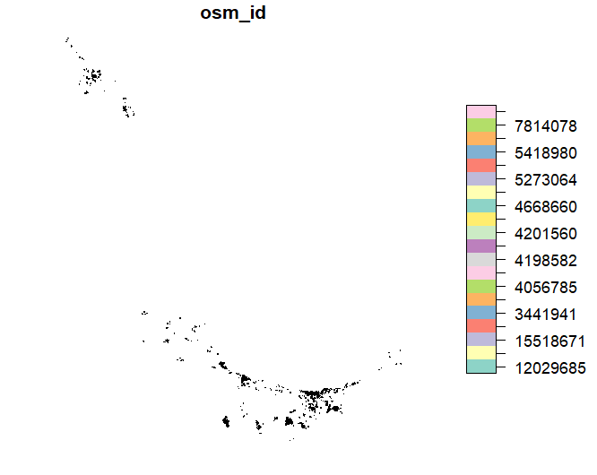

# UWIN Tutorial: Enhancing maps with OpenStreetMap Data
*Created by Kim Rivera and Tiziana Gelmi-Candusso - last updated December 2024*

This tutorial is aimed at those interested in (1) advancing their spatial mapping skills and (2) integrating OpenStreetMap and other data sources to enhance exisiting spatial datasets. 
This tutorial builds on work described in the manuscript, 
['Leveraging Open-Source Geographic Databases to Enhance the Representation of Landscape Heterogeneity in Ecological Models' (2024)](https://onlinelibrary.wiley.com/doi/full/10.1002/ece3.70402) by Gelmi-Candusso T., Rodriguez P., Fidino, M., Rivera, K., Lehrer, E.W., Magle, S., & Fortin M. 

### Some helpful references:
1. [Manuscript GitHub Repository](https://github.com/tgelmi-candusso/OSM_for_Ecology.git) - Tiziana Gelmi-Candusso 
2. [OpenStreetMap](https://www.openstreetmap.org/export#map=15/-41.15840/-71.31170)
3. [Open Buildings](https://sites.research.google/gr/open-buildings/)
4. [Introduction to spatial mapping](https://github.com/urbanwildlifeinstitute/UWIN_tutorials/blob/main/tutorials/week6_spatial_mapping/spatial-mapping.md) - Tiziana Gelmi-Candusso and Mark Jordan 

### Tutorial Aims:

#### <a href="#OpenStreetMaps"> 1. What is OpenStreetMap and why should we use these data?</a>

#### <a href="#pullingandformatting"> 2. Pulling and filtering data</a>

#### <a href="#building"> 3. Building landcover classes</a>

#### <a href="#integrating"> 4. Intgrating Maps</a>


<a name="OpenStreetMaps"></a>

## 1. What is OpenStreetMap and why should we use these data?
Wildlife ecology and behavior are strongly driven by landscape characteristics, especially in urban regions. Cities are among the world's most heterogeneous landscapes however, global land cover maps often represent urban areas as a single, homogeneous class therefore limiting our ability to build useful spatial ecological models over large scales. However, we can use community-based geographic databases, such as OpenStreetMap (OSM), to improve the quality and spatial resolution of urban land cover data. OSM is an open-source mapping platform storing landscape information in the form of geographic polygon features identified by a series of attributes. 

Take the below example of Chicago, Illinois (USA). On the left we see a relativley homogenous ladnscape of 'urban' land cover (in red) from the Commission for Environmental Cooperation Land Use Land Cover data. On the right we have the same dataset overlaid by spatial data collected from OSM. We can see OSM greatly improves our ability to asses heterogeneity in the urban landscape and therefore improve our understanding of urban wildlife ecology. 

<p float="center">
  

</p>

OSM data generated by community members are supplemented with information from governmental and non-governmental agencies around the globe and these data have been reliably used in diverse ecological research studies. Extracting a few features from the OSM database for small areas can be done directly online, however, extracting larger study areas, or extracting the full database is much more difficult. Therefore, we outline the framework to inetgrate OSM data as described in [Gelmi-Candusso et al., 2024](https://github.com/tgelmi-candusso/OSM_for_Ecology.git). 

<a name="OpenStreetMaps"></a>
## 2. Pulling and filtering data
We will be working through an example study area in northern Patagonia, Argentina. Collaborating UWIN partners here are based in the Centro Científico Tecnológico Consejo Nacional de Investigaciones Científicas y Técnicas (CONICET) in San Carlos de Bariloche in the province of Río Negro, Argentina. 

### Libraries
There are a handful of libraries we will want to install and load into our console, including `osmextract` which was specifically created to easily extract data from OpenStreetMaps. We will also be loaded in some custom functions which we will break down later in this tutorial. 

```R
# Load in libraries
library(osmextract)
library(tidyterra)
library(dplyr)
library(terra)
library(sf)
library(readr)
library(devtools)
library(ggplot2)
library(googledrive)
library(colourpicker)
library(tmap)
library(smoothr)
library(geos)

# Load in functions
source("OSM_to_LULC_functions_Bariloche.R") 
```
### OSM data
OSM data is made up of various features which include linear (e.g. a river or road) and polygon data (e.g. a building or lake). Additionally, features can be assigned **keys** and keys are assigned **values**. **Keys** are generally related to the classification of a landscape feature while **values** are further descriptors of a key. For example, there may be a feature called 'building', with the keys *building* and *parking*. Note a feature may have multiple keys. Then, each of these keys will also have an assigned value. The values may be described as a *school* or a simple *yes* (as in yes this is a building). See examples below.

| feature  | key | value | 
|---------|------|-------|
|Institutional|amenity|school|
|Building|building    |school, hospital, commerical|
|          |parking    |multi-storey| 
|Water          | natural    |spring| 
|          | landuse    |basin| 

We will load in common feature keys and values which have been organized and described in Gelmi-Candusso et al., 2024.  
```R
#table with the key-value pairs to be extracted 
osm_kv <- read_csv(
  "https://raw.githubusercontent.com/tgelmi-candusso/OSM_for_Ecology/main/urban_features/osm_key_values.csv"
) 
osm_kv <- osm_kv %>% 
  filter(!is.na(key))
keys <- unique(osm_kv$key)
```

<a name="pullingandformatting"></a>
## 2. Pulling and filtering data
Now, we will use `osmextract::oe_get` to extract OSM data limited to our keys and study area. We will want to limit our query to the smallest geofrabrik (OSM) data which includes our study area. Our first query pass may be the city level, state level or country level. To find your region (not all cities are able to be queried), it's helpful to is start by querying at the smallest level, e.g. city and see if it matches. If that query is unsuccessful, move on to state and if not available, then to the country. It is also possible to set a boundary, by clipping an extent, around your first query pass.

Let start by setting a larger query location for Argentina and subset to a smaller bounding box based on our unique study region. To find the best query for your data, you can try searching on: https://www.openstreetmap.org/

```R
# Set our first query
place <- "Argentina" 

# Narrow down our first query to a bounding box using latitude/longitude coordinates which wil help load data faster
study_area_bbox <- sf::st_bbox(c(xmin=-71.900000,ymin=-41.262600,xmax=-70.650000,ymax=-40.490000), 
                         crs = "epsg:4326") %>% 
  st_as_sfc() 

# Confirm the box is the correct coordinates for you study area 
plot(study_area_bbox, axes = TRUE)
```
<p float="center">
  

</p>

It helpful to check your grabbing the expected study area as a common mistake is mix up X and Y coordinates! Now we are ready to pull OSM data

```R
pol_feat <- osmextract::oe_get(place = "Argentina", # place we defined above
                               boundary = study_area_bbox, # more specific study area boundary (this helps speed up processing)
                               boundary_type = c("spat","clipsrc"),
                               provider ="geofabrik",
                               layer = "multipolygons",
                               stringsAsFactors = FALSE,
                               quiet = FALSE,
                               force_download = TRUE,
                               extra_tags=keys)
```
Great, we now have all the OSM data grabbed using our *keys* and outlined study area. Depending on your research questions or data available for your region, you may wish to limit OSM data to more specific areas within your region, such as local municipalities or urban landscapes.  Although OSM data is very powerful in more populated regions, it may do a poorer job describing natural landscapes around urban areas. Therefore, we want to limit our OSM extraction to the urban regions only and use CDS data to describe the surrounding natural landscape (more on this later). 

We can do this by cherry picking OSM polygons or boundaries using `filter()` on the `pol_feat` data using OSM boundaries such as *osm_id* or *admin_level*. For our purposes, we will isolate two cities, Villa La Angostura and San Carlos de Bariloche and join them in the same multi-polygon layer.

```R
# This filtering grabs the townships of our study area and any landcover class in our study area tagged as 'scrub'. We do this because Bariloche's boundary is outside
# the barriers we want to grab OSM data. Grabbing the smaller municipalities lets us limit our boundary to the city area more specifically. Then we will use 
# a national landcover map to fill in regions not covered well by OSM (e.g. non-urban areas)
study_area_boundary <- pol_feat %>% 
  filter((boundary == "administrative" & admin_level %in% c(8,9) # admin_level=* key describes the administrative level of a feature within a subdivision hierarchy
          & osm_id != 3405247) | natural == "scrub")

# Now we grab the larger Bariloche boundary so we can subset our study area just to Bariloche
bariloche_boundary <- pol_feat %>% 
  filter(osm_id == 3405247)

# Here we subset to our Bariloche boundary (excluding Villa La Angostura). This is so 
# we can apply a smoothing function in our next step. Ignore the warning message here.
sf_use_s2(FALSE)
bariloche <- study_area_boundary %>% 
  st_intersection(bariloche_boundary)
```
Though we have a fairly good buffer around the urban region of Bariloche, we can tidy the boundary up further using a smoothing function. We can play with varibles in this function to buffer more widely or smooth other gaps in the boundary. Then we can grab all the OSM data within our new buffered aread. See how the boundary changed before and after smoothing below.

```R
# notice that filtering to the townships of Bariloche misses some urban data nearby.
# By using a buffer and smoothing function, we can grab additional areas around 
# the small municipalities
sf_use_s2(TRUE)
bariloche_buffer <-
  st_geometry(bariloche) %>% 
  st_buffer(1) %>%  
  st_union() %>%
  as_geos_geometry() %>% 
  geos_concave_hull(ratio = .02) %>% 
  st_as_sfc() %>% 
  st_buffer(5) %>% 
  smoothr::smooth(method = "ksmooth", smoothness = 3) 

# Now we are ready to grab all OSM polygons which fall within our new 'bariloche buffer'
sf_use_s2(FALSE)
bariloche_poly <- pol_feat %>% 
  st_intersection(bariloche_buffer)
```

<p float="left">
  
   
</p>


We do not need to buffer or smooth Villa Angostura like we did for Bariloche as the OSM boundary captures the urban region quite well. Therefore we can just filter to the city's *osm_id* and convert our boundary data.frame to a multipolygon. If we wanted to buffer or smooth our data, we can use the same functions as above.

```R
angostura_boundary <- pol_feat %>%
  filter(osm_id == 3442889)

# convert to a multipolygon
sf_use_s2(TRUE)
angostura_buffer <- 
  st_geometry(angostura_boundary) %>% 
  as_geos_geometry() %>%
  st_as_sfc() 

# Grab all OSM polygons which fall within the Angostura polgygon
sf_use_s2(FALSE)
angostura_poly <- pol_feat %>% 
  st_intersection(angostura_buffer)
```
Now we are ready to join our datasets and pull OSM linear data. We will not filter linear features soley within our city boundaries as these data will be useful to overlay on the greater landcover map of Argentina.

```R
# Join our two cities into one data.frame of polygons
pol_feat_agg <- rbind(bariloche_poly, angostura_poly)

# We're ready to grab out linear data from our study area region

lin_feat <- osmextract::oe_get("Argentina",
                               layer = "lines", 
                               boundary = study_area_bbox,
                               boundary_type = 'clipsrc',
                               quiet = FALSE,
                               force_download = TRUE,
                               stringsAsFactors = FALSE, 
                               extra_tags=keys)
```
### Integrating Open Building Data
In addition to OSM data, we can incorperate other sources of relevant data, such as Open Buildings data from Google. These data contain outlines of buildings derived from high-resolution satellite imagery and primarily focus on the continent of Africa and the Global South at large. These data can further enhance our understanding of the urban landscape and anthropogenic impact on our study area.

Data can be downloaded directly from [Open Buildings](https://sites.research.google/gr/open-buildings/) as a `.csv.gz` file. Converting a `.csv.gz` to a geopackage can be computationally heavy, therefore, we will read in the coverted geopackage directly.

<details closed><summary> See code to convert data here </a></summary>
  
```R
# Read in building data downloaded from: https://sites.research.google/gr/open-buildings/
buildings <- read_csv("./global_landcover_maps/961_buildings.csv.gz")
head(buildings)

building_df = st_as_sf(buildings, crs = "EPSG:4326", wkt = "geometry") # convert to spatial object
write_sf(building_df, "./global_landcover_maps/Argentina_buildings.gpkg") # save as geopackage
```

</details>


```R
# read in as .gpkg file
build <- st_read("./global_landcover_maps/Argentina_buildings.gpkg")
```
Note that these data come with confidence probabilities of the building existence. For our example, we will limit our dataset to buildings with great than 80% confidence. We will also format the data to easily bind it with our existing polygon data e.g. `pol_data`.

```R
# filter to buildings with >80% confidence
build_80 <- build %>% 
  filter(confidence > .8)

# Crop buildings layers to extent of study area or pol_feat if limited to specific polygons
build_80 <- st_crop(build_80, study_area_bbox)

# transform to pol_feat CRS
build_80 <- st_transform(build_80, st_crs(pol_feat))

# format data to be cohesive with pol_feat dataset
build_80$building <-rep("yes", nrow(build_80))
build_80 <- rename(build_80, geometry = geom)
```

We can easily combine our data using `rbind`, however we need to match our columns for each dataset. We can do this by adding all missing columns to each dataset and populating them with NA's/
```R
# Step 1: Make sure columns in both data.frames are the same
all_columns <- union(names(build_80), names(pol_feat))  # Combine all unique columns from both

# Step 2: Add missing columns with NA in each data.frame
# Add missing columns to 'build'
missing_build <- setdiff(all_columns, names(build_80))  # Columns missing in 'build'
for (col in missing_build) {
  build_80[[col]] <- NA  # Add missing column with NA values
}

# Add missing columns to 'pol_feat'
missing_pol_feat <- setdiff(all_columns, names(pol_feat))  # Columns missing in 'pol_feat'
for (col in missing_pol_feat) {
  pol_feat[[col]] <- NA  # Add missing column with NA values
}
```
Now we are ready to row bind our datasets and save as a `sf` object.
```R
combined <- rbind(build_80, pol_feat)
combined <- st_as_sf(combined)
```


<a name="building"></a>
## 3. Building landcover classes
### Categorizing OSM features
Our next step is to Categorize OSM features using the `vlayers()` function. We will filter OSM features from Gelmi-Candusso et al., 2024 Table S4 and categorize them into classes. This function grabs each landcover elements based on the filtered polygon and linear OSM features (from our OSM keys) and creates landcover 'classes' or features and puts them into a list. These classes will represent the classes in our OSM-enhanced map.

```R
vlayers <- OSMtoLULC_vlayers(
  OSM_polygon_layer = pol_feat_agg, 
  OSM_line_layer = lin_feat
)

# plot a layer to see if this worked as expected
plot(vlayers[[14]][1]) # This is the building layer
```
<p float="center">
  

</p>

<details closed><summary> See the vlayers function</a></summary>

```R
OSMtoLULC_vlayers <- function(OSM_polygon_layer, OSM_line_layer){
  
  # Create list to hold vector layers
  classL1 <- list()
  
  #class_01 <- industrial  
  classL1[[1]] <- OSM_polygon_layer %>% filter(landuse %in% c("industrial", "fairground") |
                                                 industrial %in% c("factory") |
                                                 power %in% c("substation"))
  #class_02 <- commercial 
  classL1[[2]] <- OSM_polygon_layer %>% filter(landuse %in% c("commercial", "retail"))
  
  # class_03 <- institutional  
  classL1[[3]] <- OSM_polygon_layer %>% filter(landuse %in% c("institutional", "education", "religious", "military") |
                                                 amenity %in% c("school", "hospital", "university", "fast_food", "clinic", "theatre", "conference_center", "place_of_worship", "police") |
                                                 leisure %in% c("golf_course")|
                                                 healthcare %in% c("clinic", "hospital"))
  #class_04 <- residential
  classL1[[4]] <- OSM_polygon_layer %>% filter(landuse %in% c("residential"))
  
  #class_05 <- landuse_railway
  classL1[[5]] <- OSM_polygon_layer %>% filter(landuse %in% c("railway"))
  
  #class_06 <- open_green
  classL1[[6]] <- OSM_polygon_layer %>% filter(landuse %in% c("park", "grass", "cemetery", "greenfield", "recreation_ground", "winter_sports")|
                                                 (!is.na(golf) & !(golf %in% c("rough","bunker"))) |
                                                 amenity %in% c("park") |
                                                 leisure %in% c("park", "stadium", "playground", "pitch", "sports_centre", "stadium", "pitch", "picnic_table", "pitch", "dog_park", "playground")|
                                                 sport %in% c("soccer")|
                                                 power %in% c("substation")|
                                                 surface %in% c("grass"))
  # class_07 <- protected_area
  classL1[[7]] <- OSM_polygon_layer %>% filter(leisure	%in% c("nature_reserve")|
                                                 #boundary %in% c("protected_area","national_park")|
                                                 protected_area %in% c("nature")|
                                                 landuse %in% c("nature_reserve", "natural_reserve", "landscape_reserve"))
  # class_08 <- resourceful_area
 
   classL1[[8]] <- OSM_polygon_layer %>% filter(landuse %in% c("orchard","farmland", "landfill","vineyard", "farmyard", "allotments", "allotment", "farmland")|
                                                 leisure %in% c('garden')|
                                                 !is.na(allotments))
  # class_09 <- heterogenous_green 
  classL1[[9]] 	<- OSM_polygon_layer %>% filter(natural %in% c("garden", "scrub", "shrubbery", "tundra", "cliff", "shrub", "wetland", "grassland", "fell",
                                                               "heath","moor")|
                                                  landuse	%in% c("plant_nursery", "meadow", "flowerbed", "wetland")|
                                                  #!is.na("meadow")| # This part creates an error
                                                  golf %in% c("rough") | 
                                                  grassland %in% c("pairie"))
  
  #class_10 <- barren_soil 
  classL1[[10]] 	<- OSM_polygon_layer %>% filter(natural %in% c("mud", "dune", "sand","scree","sinkhole", "beach")|
                                                   landuse	%in% c("brownfield", "construction")|
                                                   golf	%in% c("bunker"))
  #class_11 <- dense_green
  classL1[[11]] <- OSM_polygon_layer %>% filter(landuse %in% c("forest")|
                                                  natural  %in% c("wood")|
                                                  boundary %in% c("forest", "forest_compartment"))
  #class_12 <- water 
  classL1[[12]]  <- OSM_polygon_layer %>% filter(landuse %in% c("basin")|
                                                   natural	 %in% c("water", "spring", "waterway")|
                                                   waterway	 %in% c("river", "stream", "tidal_channel", "canal", "drain", "ditch", "yest")|
                                                   (!is.na(water) & water != "intermittent")|
                                                   basin  %in% c("detention")|
                                                   intermittent != "yes"|
                                                   seasonal	!= "yes"|
                                                   tidal!= "yes")
  
  # class_13 <- parking_surface 
  classL1[[13]] <- OSM_polygon_layer %>% filter(parking	%in% c("surface")|
                                                  aeroway	%in% c("runway", "apron"))
  
  # class_14 <- building
  classL1[[14]] 	<- OSM_polygon_layer %>% filter( #!is.na("building")| # This part creates an error
    building %in% c("hospital", "parking", "industrial", "school", "commercial", "terrace", "detached", "semideatched_house", "house", "retail", "hotel", "apartments", "yes", "airport", "university")|
      parking	%in% c("multi-storey")|
      aeroway	%in% c("terminal"))
  
  # class_15 <- roads_very_high_traffic	
  classL1[[15]] <-  OSM_line_layer %>% filter(highway	%in% c("motorway",'motorway_link', "motorway_junction") &
                                                !grepl('/"bridge/"=>/"yes/"', OSM_line_layer$other_tags))
  
  # class_16 <- roads_sidewalk	
  classL1[[16]]	<- OSM_line_layer %>% filter(footway	%in% c("sidewalk"))
  
  # class_17 <- roads_unclassified
  classL1[[17]] <- OSM_line_layer %>% filter(!(highway %in% c("footway","construction","escape","cycleway","steps","bridleway","construction","path","pedestrian","track","abandoned", "turning_loop","living_street", "bicycle road", "cyclestreet", "cycleway lane","cycleway tracks", "bus and cyclists", "service","services", "busway", "sidewalk", "residential", "rest_area", "primary", "motorway_junction", "secondary", "secondary_link", "tertiary", "tertiary_link", "motorway","motorway_link","trunk_link", "trunk", "corridor","elevator","platform","crossing","proposed", "razed")))
  
  # class_18 <- roads_very_low_traffic
  classL1[[18]] <-  OSM_line_layer %>% filter(highway	 %in% c("services","service","turning_loop","living_street"))
  
  # class_19 <- roads_low_traffic
  classL1[[19]] <- OSM_line_layer %>% filter(highway	%in% c("residential", "rest_area", "busway"))
  
  # class_20 <- roads_med_traffic 
  classL1[[20]] <- OSM_line_layer %>% filter(highway	%in% c("tertiary", "tertiary_link"))
  
  # class_21 <- roads_high_traffic_low_speed
  classL1[[21]] <-  OSM_line_layer %>% filter(highway	%in% c("primary", "primary_link", "secondary", "secondary_link"))
  
  # class_22 <- roads_high_traffic_high_speed
  classL1[[22]] <- OSM_line_layer %>% filter(highway	%in% c("trunk", "trunk_link"))
  
  # class_23 <- streetcars
  classL1[[23]] <- OSM_line_layer %>% filter(railway	%in% c("tram"))
  
  # class_24 <- pedestrian_trails
  classL1[[24]] <- OSM_line_layer %>% filter(highway	%in% c("footway","construction","escape", "cycleway","steps","bridleway","path","pedestrian","track", "abandoned","bicycle road", "cyclestreet", "cycleway lane", "cycleway tracks", "bus and cyclists")|
                                               footway	!= "sidewalk")
  
  # class_25 <- railway	
  classL1[[25]] <- OSM_line_layer %>% filter(railway	%in% c("light_rail","narrow_gauge","rail","preserved")|
                                               railway != "tram")
  # class_26 <- linear_features_not_in_use
  classL1[[26]] <- OSM_line_layer %>% filter(railway	%in% c("abandonded","construction","disused")|
                                               highway	%in% c("construction"))
  # class_27 <- barriers
  #classL1[[28]] <- OSM_line_layer %>% filter(!is.na("barrier"))
  classL1[[27]] <- OSM_line_layer %>% filter(barrier !='')
  
  return(classL1)
  
}

```
             
</details>

### Converting OSM features to rasters
Now we will convert all the filtered OSM features into raster layers. We will do this for each layer separately. Using the function `rlayers`, we convert linear features into polygons using a buffer function and the specific buffer size (see Gelmi-Candusso et al., 2024 Table S3). To rasterize we generate a raster template using the extent of the study area downloaded in the `osmextract::oe_get` function. We will define the extent of study area again using numeric value. We will not use an sfc object like 'study_area_bbox' as this will cause an error. As a reminder:

| variable  | coordinate |
|---------|------|
|xmin|minimum latitude|
|xmax|maximum latitude|
|ymin|minimum longitude|
|ymax|maximum longitude|

<details closed><summary> See the rlayers function</a></summary>

```R
OSMtoLULC_rlayers <- function(OSM_LULC_vlayers, study_area_extent){
  classL1 <- OSM_LULC_vlayers
  rtemplate <- rast(res=0.00001, ext = study_area_extent, crs= "EPSG:4326") #PR
  # rtemplate5 <- terra::project(rtemplate, "EPSG:5070")
  classL1  <- Filter(Negate(is.null), classL1) #eliminates any nulls
  
  refTable <- cbind.data.frame(
    "rid"=c(1:27), 
    "feature"=c("industrial", "commercial", "institutional", "residential", "landuse_railway",
                "open_green","protected area", "resourceful_area", "heterogenous_green", "barren_soil",
                "dense green","water", "parking_surface", "building","roads_very_high_traffic", 
                "roads_sidewalk", "roads_unclassified","roads_very_low_traffic", "roads_low_traffic",
                "roads_med_traffic", "roads_high_traffic_low_speed", "roads_high_traffic_high_speed",
                "streetcars", "pedestrian_trails", "railway", "linear_features_not_in_use","barriers"),
    "priority"=c(1:27),
    "geometry"=c(rep("poly",14), rep("line",13)),
    "buffer"=c(rep(NA,12),6,NA,NA,24,3,12,6, 12,18,36,6,3,12,6,1) # buffer in meters
  )
  
  classL2 <- list()
  
  for(i in 1:27){
    if(as.character(st_geometry_type(classL1[[i]], by_geometry = FALSE)) %in% c("POLYGON","MULTIPOLYGON", "GEOMETRY")){
      temp1 <- classL1[[i]]
      if(nrow(temp1)>0){
        temp1 <- st_make_valid(temp1) #PR
        temp1 <- temp1 %>%  filter(!st_is_empty(.)) #PR
        temp1 <- st_make_valid(temp1) # PR
        temp1 <- terra::project(svc(temp1)[1], rtemplate)
        temp1$priority <- refTable$priority[i]
        classL2[[i]] <- terra::rasterize(temp1, rtemplate, field="priority") 
        print(paste0("layer ", i, "/27 ready"))
      }
    }else{
      temp1 <- classL1[[i]]
      if(!is.null(temp1)){
        temp1 <- st_make_valid(temp1) #PR
        temp1 <- temp1 %>%  filter(!st_is_empty(.)) #PR
        temp1 <- st_make_valid(temp1) # PR
        temp1 <- st_transform(temp1, "EPSG:5070")
        temp1 <- st_buffer(temp1, dist=refTable$buffer[i])
        temp1 <- terra::project(svc(temp1)[1], rtemplate)
        temp1$priority <- refTable$priority[i]
        classL2[[i]] <- terra::rasterize(temp1, rtemplate, field="priority")
        print(paste0("layer ", i, "/27 ready"))
      }else{print(paste0("layer ", i, "/27 null"))}
    }
  }
  return(classL2)
}

```
</details>


```R
extent <- as.vector(ext(c(xmin=-71.900000,xmax=-70.650000, ymin=-41.262600,ymax=-40.490000)))

# this function which assigns each landcover class information such as its geometry or a buffer
rlayers <- OSMtoLULC_rlayers(
  OSM_LULC_vlayers = vlayers,
  study_area_extent = extent
)

# Test this worked by plotting our building layer 
plot(rlayers[[14]], col = "black") # 14 = building list
```
## ADD PLOT HERE

### Merging rasters
It's time to stack and collapse our rasters by merging all layers into one raster layer. We will overlay each raster following their priority (created in rlayers function). We have defined the priority of each layer to represent movement barriers for wildlife, e.g. road features over water features to maintain bridges in the landscape.

```R

OSM_only_map <- merge_OSM_LULC_layers(
  OSM_raster_layers = rlayers
)
```
<details closed><summary> See the OSM_only_map function function</a></summary>
  ```R
  merge_OSM_LULC_layers <- function(OSM_raster_layers){ 
  classL2 <- OSM_raster_layers
  classL2 <- Filter(Negate(is.null), classL2)
  classL2 <- rev(classL2) #Seattle loses class 16 when we revert but reverting works as expected to overlay classes
  r3 <- terra::app(rast(classL2), fun='first', na.rm=TRUE)
  return(r3)
}
  ```
</details>

Let's have a quick view of our final OSM map using `ggplot()`
```R
ggplot() +
  geom_spatraster(data = as.factor(OSM_only_map), aes(fill = first)) +
  # You can use coord_sf
  coord_sf(crs = 4326) +
  scale_fill_manual(values = viridis::viridis(27), breaks = 1:27,
                    labels = c("industrial", 
                               "commercial", "institutional",
                               "residential","landuse_railway", "open green",
                               "protected area", "resourceful area","heterogeneous green area",
                               "barren soil","dense green area", "water",
                               "parking surface", "buildings",
                               "roads (v.h. traffic)", 
                               "sidewalks", "roads_na",
                               "roads (v.l. traffic)", "roads (l. traffic)", "roads (m. traffic)",
                               "roads (h.t.l.s)", "roads (h.t.h.s)", 
                               "trams/streetcars",
                               "walking trails", "railways", "unused linear feature",
                               "barriers"),
                    na.value = "white")
```
We can also interact with our map using `tmap` and get a closer look at our featured lines and polygons
```R
tmap_mode("view")
tm_shape(as.factor(OSM_only_map))+
  tm_raster(breaks= 1:27)
```
### Integrating OSM features into global landcover map
As a reminder, the OSM database is primarily populated by community contibutions, thus there are likely gaps of information. To enhance our map and to ensure we dont have any gaps in the final output of the framework we will integrate the `OSM_only_map` onto a global or continental land cover map (depending on your region of interest). 

For our example, we will be overlaying OSM data ontop of a global dataset from [Climate Data Store (CDS)](https://cds.climate.copernicus.eu/datasets/satellite-land-cover?tab=download). These data describe land cover into 22 classes which have been defined using the United Nations Food and Agriculture Organization’s (UN FAO) Land Cover Classification System (LCCS) and do a good job describing the natural landscape within our study region.

To integrate these maps, we need to reclassify the CDS data to be coheisve with our OSM classification system. These data will then fill in any NA cells (in the OSM map) with the information provided in the reclassified CDS map.


