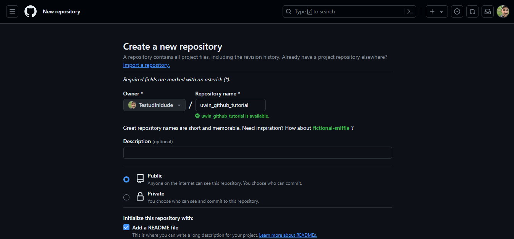
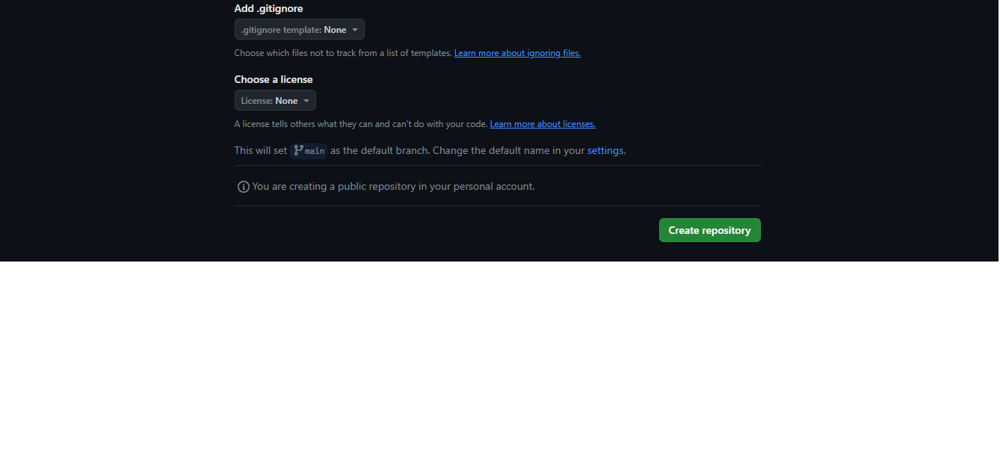
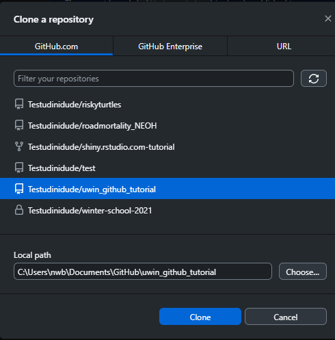

## GitHub tutorial

By: Nathan Byer and Mason Fidino

In this tutorial, we will go over some basics of how to use GitHub. Throughout, we will focus on the use of GitHub Desktop Graphical User Interface (GUI) for repository management, but just remember - **this is just one of a few approaches you can use!** Here are a few notes on this before we proceed:

1. RStudio has native GitHub integration. It can be a bit limited in functionality, but can be useful for R-based repository management. 
2. Git has robust command-line utilities, some of which may be needed for more advanced repository management. It is also exhaustively documented elsewhere.

With these caveats in mind, let's get started with GitHub!

### Creating a GitHub account

Before using GitHub, there's a pretty important initial step: **you need to sign up for a GitHub account!** If you have already done this, feel free to proceed to the next section. If not, please follow the instructions below.

First, navigate to github.com. You should see the following:

<div align="center">

</div>

Go ahead and enter your email in the box we have outlined in red, and proceed with any instructions necessary. You will be prompted to create a username and password, so make sure you remember what those are!

Now that you have an account, when you navigate to github.com, you should see the following:

<div align="center">

</div>


This is your *dashboard*. We won't go into a ton of detail about this, but your recently used repositories should be displayed on the left (outlined in a green box), whereas a feed of repository-related activity for your collaborators will be displayed in the center (outlined in a blue box). 

### Creating a GitHub Repository

In the previous image, you likely noticed the little green button that says "New". Go ahead and click on that - to create your first github repository!

You should see something that looks like this:

<div align="center">

</div>


As you can see in this image, fill in a name (I suggested one related to this tutorial, but it doesn't really matter as long as the name is not offensive!). Then, go ahead and click "add read me" - we will describe that a bit further below.

Towards the bottom of this page, you should see a few other options:

<div align="center">

</div>


The `.gitignore` file allows you to tell github *not* to track certain files in local repository folders, which can be useful (more on this later). There are programming
language specific `.gitignore` template files that we suggest using (there even
one for `R`).

Note that you can also set a license for your repository! These outline usage rights, limitations, and terms for your repository.

You can safely ignore those for now, but just be aware of these for future repositories. For now, go ahead and click the green "create repository" button at the bottom to proceed.

### Initial commits - and the read me

After clicking “create repository”, you should now see a landing page for your repository. Basically, you have done it! You just created your first repository. Let’s break down this landing page a bit further.

<div align="center">

</div>

At the top (in the green box), you should now see a number of tabs, all relevant to repository management. These are all *specific to your current repository* - and provide a number of features for managing, documenting, and supporting your new repository. We will not go over these in depth, but would encourage you to review these tabs.

Instead, let’s focus on the highlighted section in the red box. You should see your own profile name next to “initial commit.” As reviewed in the quarto presentation, **a commit is a summary of changes made to a repository**. By telling GitHub to add a “read me” file to this repository (designated by the white star in the image above), GitHub automatically created this file for you - and created a **commit** to add this file to the repository. So congratulations - you have made your first GitHub commit without even meaning to do so!

Do you see how the “read me” file has a .md file extension? That means it is a **markdown** file. **Markdown** is essentially a convenient way of translating plain text into formatted text - which can then be easily displayed in a variety of rendered formats, such as PDFs or HTML. As a matter of fact, the tutorial you are currently reading has been rendered in markdown format!

Do you see the “read me” panel at the bottom of the page? Ideally, this would provide relevant documentation about the repository itself. Instead, we just have a title - so let’s change that! Click on the pencil icon at the top of the this panel to begin editing. You should now see the following:

<div align="center">

</div>


Let’s add a bit of further text to this read me - and see what this does. Add text to your `README.md` to look like this:

<div align="center">

</div>

Here is a code block with that text, in case the above is a bit tricky to see:

```
# uwin_github_tutorial

This is a sample repository for use with the Urban Wildlife Information Network's "Github and Data Reproducibility" workshop. We can use this to play around with a bit of basic markdown formatting.

## This is how we make a sub-header

In this section, we will have some **bold text**.

### This is how we make a sub-sub-header

In this section, we will have some *italicized* text. 

I will also bold this to make it stand out: **see https://www.markdownguide.org/cheat-sheet/ for more markdown tips and tricks!**
```

Then click the “commit changes…” button at the top. GitHub should ask if you want to make a commit called “Update README.md”. Go ahead and click “commit changes” again.

Here is what you should see:

<div align="center">

</div>

### Cloning a repository

Up until now, all of our repository management has been handled through our web browser. In practice, it is often easiest to create the initial repositories this way, you are likely creating that repository to help out with *version control* for locally-hosted files. In this section, we will take your remotely-stored repository and create a local copy - in a process called *cloning*. 

In order to do so, however, we recommend that you use GitHub Desktop. If you have not done so already, navigate to https://desktop.github.com/ to download the GitHub Desktop installer appropriate for your operating system. Once you have GitHub Desktop installed, you will need to associate your GitHub account with the Desktop client; see https://docs.github.com/en/desktop/overview/getting-started-with-github-desktop for details on how to do this. 

You can *clone* your first repository in one of two ways: 

1. go to File... --> clone repository (or simply use the keyboard shortcut ctrl + shift + O).
2. Click the arrow in the "Current Repositories" panel, in the top left. Then, click "add", and select "clone repository". 

Regardless of the approach taken, you should see this:

<div align="center">

</div>

As you can see, I have already selected my uwin_github_tutorial repository created above. Click your own repository name, and see how this changes the Local path below. By default, GitHub Desktop will use the  C:/Users/{username}/Documents/GitHub directory for all local repositories, but you can point this wherever you would like. 

After you have pointed GitHub Desktop to the correct remote repository and desired local directory, click the **Clone** button. After a few progress bars, you should then see the following:

<div align="center">

</div>

If you are  not sure if this repository is actually available locally, click the "Show in Explorer" button. You should see a folder with a single file - the README.md you edited before! If so, **congratulations - you have cloned your first repository**!

### Adding files to a local repository with an R project

Now that we have a local copy of our repository, we can work on adding some files to this repository. We will do so by creating an **R project** in this local repository. If you've never used R projects, they are a reproducible way to keep all the files associated to a coding project together (e.g., data, code, and figures). I like R projects specifically as it provides a way to automate where your working directory is for a project, and as such, makes it far easier to write your code in a reproducible way by using relative file paths. 

After opening up Rstudio, follow these instructions to create your R project.

1. Select the File dropdown and click on 'New project'.
2. From the pop-up, select 'Existing Directory' as we already have the folder
spun up for GitHub.
3. Click 'Browse' option and select the folder that houses your repository.
4. Select 'Create project'

This is what you should now see in RStudio:

<div align="center">

</div>

Notice the bottom right corner? That displays contents in your current project directory. You should see your `README.md`, but two new, additional files: `uwin_github_tutorial.Rproj` and `.gitignore`. We won't go into much detail on these files yet; for now, open up GitHub Desktop to take a look at your repository now! You should see something like this:

<div align="center">

</div>

Basically, GitHub Desktop has detected these new files. Most of the page is taken up by a panel that tracks changes to each file; `+` signs indicate added lines. Since every line in both the `.gitignore` and `uwin_github_tutorial.Rproj` is new, you should see `+` signs by every line.

On the bottom right, you will notice a blue button that says **Commit to main**. We will get into what `main` means here, but for now, you will notice that you can't actually select that button yet! This is because GitHub Desktop needs you to provide some narrative description for this commit under "Summary (required)". Go ahead and add some descriptive text there - for instance, you could say "Created R Project for repository" as the commit message. Go ahead and click **Commit to main** after this. You should now see this:

<div align="center">

</div>

Basically, your commit has not yet been *pushed* to the remote repository - and is not reflected in the remote repository yet. Go ahead and click the **Push origin** button when you are ready! 

To prove to ourselves that we have successfully pushed these changes, go back to your web browser - and take a look at the remote repository. 

<div align="center">

</div>

You should see all of the files created during the course of creation of the R project. If that is the case, **congratulations - you have successfully pushed local changes to a remote repository**!

### Managing repositories

Managing a repository can range from simple to complex, and typically depends on two things. First, the number of users contributing to a project can increase complexity. In the simplest case, a single user may be pushing commits to the main branch of a private repository. When this happens, you may not need to put many rules in place to avoid issues using GitHub. With multiple users, however, it is helpful to put some rules in place so that everyone is aware of how to contribute. This could include using branches to develop parts of the code base, conducting code reviews for pull requests, and taking some time to provide documentation on how to contribute. Second, the 'product' you are working on can influence how you manage your repository. If your repository is meant to house some data and code for an analysis, then you may not worry as much about best practices so long as the code runs. If your repository is meant to house a website, a shiny app, or something else people may use without running code, then you may want to ensure you have protections in place to ensure you always have a working version of the 'product' 
running while you work on the code base.

In our experience, GitHub management for ecologists is often quite simple as most
research projects typically revolve around either one or a small number of people doing the data analysis. Regardless, even when working on our own projects we often still use a lot of GitHub's features as it is easier. In the section below we'll cover how to use a number of GitHub's features via the GitHub Desktop GUI.

#### The `.gitignore` file

Sometimes you have sensitive data that you do not want to put up into the cloud,
or perhaps some files are too large and cannot be stored on GitHub. To tell GitHub to ignore entire folders, types of files, or specific files, you need to add them
to the repositories `.gitignore` file. R already has a default `.gitignore` 
template that you can opt to use when spinning up a repository, and we suggest
you use that. Imagine you have sensitive data (e.g., the location of an endangered species) in a file titled `my_species_data.csv`. You can add that file to the .gitignore in two ways.

1. Open up the `.gitignore` file in Rstudio and add `my_species_data.csv` to a
new line and save it.
2. When you put `my_species_data.csv` into your repository, before you commit it, 
right click on the file name in the GitHub GUI and select `ignore file`. This will
add the file to the `.gitignore` as well.

It is important to note that `.gitignore` files use regular expressions if
that is something you know how to use. If not, look it up later, regular expressions are a great way to search through text!

#### Creating and using branches

As a reminder, branches are contained copies of your repository where you can 
safely create new features, fix bugs, or try out new ideas for a project.
There are no limits to how many branches you can make, and branches can be made
off of any other branch (e.g., a branch off a branch off a branch). For a small
team of collaborators, branches will be by far the easiest way to collaborate on a project. You can add people as collaborators to a repository on it's settings page, which can be accessed via an Internet browser. 

To view your branches on the GitHub GUI you just need
to select the correct repository and then click the current branch dropdown. For
example, while working on this tutorial we generated a `github-workshop`
branch off of the main branch of the `UWIN_tutorials` repository.

<div align="center">

</div>

Creating a new branch with the GitHub GUI is easy. After clicking on the dropdown, type the name of the new branch in the associated text field and click on the "Create new branch" button. Let's do that now. Create a new branch titled `my first branch`. After clicking this button a pop-up will appear and you may notice two things:

1. That the created branch is hyphen-separated. GitHub branches cannot have spaces
and so the GitHub GUI will replace all spaces with hyphens. 
2. You need to decide what to branch off of if you already have multiple branches. In the event that you have no other branches, then you will branch from the `main` branch. If you have more than one branch, you will need to select which branch you are branching from. 

Confirm the creation of your branch by clicking on the `Create branch` pop-up. Finally, at this moment the branch does not exist in the cloud. To send it up, simply click the `Publish branch` button at the top of the screen (you can do this either before or after making some commits to this branch). 

Creating branches is easiest when you have already pushed all your commits to your
repository and your local copy is caught up with your repository. However, when working on a project you may have some non-committed changes to the code and you realize you are either not on the correct
branch or you should make a new branch to store these edits. You will notice if you have edits that are not committed in the GitHub GUI as it shows changes
you have made to a script by highlighting them in either green or red. Green highlights are new code and red highlights are code that has been removed. So, what do you do in these situations?

Fortunately, if you either try to switch branches or create a new branch with uncommitted code the GitHub GUI will ask you whether you want to either:

1. Leave those changes on the current branch.
2. Bring those changes over to either the new branch you may be creating.
3. Bring those changes over to the another branch that already exists.


If needed, branches can be renamed. Likewise, branches can be deleted. Typically,
we delete branches after merging them into another branch. For example, if your branch was made to create a new R function for your analysis, then you won't need
that branch anymore after the function is available in the main branch. There are
times when you may not want to delete a branch. For example, lots of repositories will have a `dev` branch that must be merged into before the `main` branch. After testing, changes made to the `dev` branch can then be pushed into the `main` branch with a pull request. This is often done so developers can test out the functionality of new code in a production-like environment. As such, in this case the `dev` branch would never get deleted after merging with the `main` branch.

#### Forking repositories

Forking a repository is typically done for one of two reasons:

1. You want to contribute to an open source project. Forking serves as a way to test out changes to the code of a project without affecting the upstream repository in any way. In this case, the original maintainer of a project could evaluate whether proposed changes from your forked repository are acceptable, and if so, merge them into the open source project. As such, forking makes it so people can collaborate on projects without having to share 'collaborator' status on projects, which may is especially helpful for open source projects.
2. You want to use the code in a repository as the foundation for a project you
are building. For example, you may want to fork a repository that contains 
the foundation for a personal website. In that case, you could fork the initial repository, make changes to your fork, and use your forked repository to create
your website. In this example, you are likely forking a repository with no intent on trying to suggest code changes to the original upstream repository. That is totally
okay and encouraged for stuff like this!

So, what is the difference between forking and branching? As their names suggest, forking and branching are VERY similar to one another. Forking, however, creates an independent copy of a repository, while branching means you can develop in parallel within the same repository. 

In practice, you will most often using branching instead of forking. But if you 
did want to fork a repository, you can do that through the GitHub GUI by:

1. Selecting the dropdown associated to your 'Current repository' in the top
left corner.
2. Clicking the 'Add' dropdown button and select 'Clone repository'
3. Selecting the 'URL' option.
4. Imputing the username and repository name separated by a slash (e.g., `mfidino/my-cool-repo`).
5. Telling the GUI where you want the local copy of the repo stored.


<div align="center">

</div>

When you try to clone a repository in this way, and you do not have write access
to the repository (i.e., you did not create the repository and you do not have
collaborator status), then a fork of the repository will be made.

So, following the instructions above, fork a copy of the `urbanwildlifeinstitute/UWIN_tutorials` repository. You will want a forked
copy of this repository anyways so that you have access to all the data and code
for these workshops.


#### Pull requests

Pull requests are how you merge code from one branch or forked repository into another.

As such, a pull request requires two key components.

1. The name of the branch that has the code changes you want to merge.
2. The name of the branch where you want the changed code to get merged into.

While you can make pull requests through the GitHub GUI, in practice we've found
it far easier to create them via the Internet browser. So, to make our pull
request, let's modify the repository you created at the start of this tutorial
so that we can follow some best practices for a GitHub project. As you have already set up an R project for this repo, our next steps are going to be to create a set of sub-folders to store different
components of an analysis (e.g., code, data, etc.) and then populate them with some code and data. Thus, before we even make a pull request, let's create a new branch off of your repository called `tidy-up-repo` (see above for a refresher for how to switch among repositories and creating a branch off of a repository). 

After you have made a branch off the repository and have ensured your local copy is working off of it (i.e., `tidy-up-repo` is selected as your current branch on the GitHub GUI), go ahead and open up Rstudio.


In Rstudio it is very easy to switch between projects, just click the project icon
in the top right corner, select `Open project` and then locate and click on the R project file you want to open. However, as you just made the project file earlier, you likely already have RStudio opened up with the project activated (Rstudio defaults to using the last opened project when opened). From here,
we are going to create a few sub-folders in this project. Go to your R console (i.e., the pane in Rstudio where code gets ran) and run the following lines of code:

```R
dir.create("R")
dir.create("data")
dir.create("plots")

```

The `dir.create()` function can be used to create a directory (i.e., a folder), and requires you input the number of the folder you want to make as a character object. The names of these sub-folders should be pretty self-explanatory. You put your
R code in the R folder, data in the data folder, and any plots you produce goes into the plots folder. I always make these folders when starting a new analysis project. If you end up using other programming languages you may also want to create sub-folders for them. For example, if you wrote up some models in either `NIMBLE` or `JAGS`, then you may want a nimble of jags folder in your project. Likewise,
if you did some of your data processing in python, then it would make sense to
have a `python` sub-folder.

Finally, just to show how relative pathing works, let's create an R script within
the R sub-folder that we can use to create some fake data and plot it. To create
a file in the R sub-folder using the R console you can use the `file.edit()` function. 

```R
file.edit("./R/simulate_data.R")
```

If you already know about relative pathing (i.e., the `.` in the filepath above), feel free to skip past the next couple of paragraphs enclosed in some header lines. Otherwise, read on!

---

The dot notation in the filepath above  represents 'from my current working directory.' What does that mean? In R, your working directory represents the location on your computer that R
uses to read and write files. If you want to check what your working
directory is, you can use the `getwd()` function in R. 

How does R figure out what your working directory should be when you open up Rstudio? If you do not have an R project opened, Rstudio has a default working directory it will use (this can be checked and changed under Tools > Global options > General). If you do have an R project opened (and you should), then Rstudio will use the location of
the `.Rproj` file you selected as the working directory. As your `.Rproj` file is located in the main folder of your repository, that means that so long as you
code filepaths relative to this location your code can easily run across multiple computers. Essentially, to make your code more reproducible (i.e., able to run on multiple computers) you should avoid using absolute file paths (e.g., `C:/Users/mfidino/Documents/GitHub/my-cool-repo/R/simulate_data.R`) when you could 
instead use a relative path instead (e.g., `./R/simulate_data.R`). Personally, the
only time I encourage absolute paths is when using data that you know will not
be stored in your repository (e.g., a spatial data layer). In that case, you
simply want to make sure you provide sufficient metadata (e.g., in your readme file, in comments in your code, etc.) that the user will need to download the given data layer and modify specific parts of the code base to ensure the code can be ran.

---

So, back to our example, we are telling R 'from my current working directory, make an R script within the `R` sub-folder titled `simulate_data.R`'.  

Copy and paste this code into the script, save it, and run it.

```R
# Simulate data for a linear regression

# Model parameters
intercept <- 3
slope <- -1

# Sample size
n <- 100

# covariate
set.seed(145)
x <- rnorm(n)


y_deterministic <- intercept + slope * x

# add noise
y <- rnorm(
  n,
  mean = y_deterministic,
  sd = 2.5
)

# package up data and save it
to_save <- data.frame(
  y = y,
  x = x
)

write.csv(
  to_save,
  "./data/simulated_data.csv",
  row.names = FALSE
)

# plot it out and save it
jpeg("./plots/example.jpg")
plot(
  y ~ x,
  xlab = "x",
  ylab = "y",
  type = "p",
  bty = "l",
  las = 1
)
dev.off()
```

We are ALMOST ready to make a pull request. Commit all of these changes to your `tidy-up-repo` branch. In this case, all the folders we created should have gotten
pushed up to this branch. In the future, you may notice that some files or folders may not be transferred. This is either because the folder is empty (and empty folders and not sent up to GitHub) or they've been added to the `.gitignore` file associated to your browser. 

After pushing your commits to the `tidy-up-repo` branch, head over to your
repository via your internet browser. In my case, I would head to www.github.com/mfidino/uwin-example-repo. You can start a pull request in two ways.

1. If you just recently pushed some changes to a branch, then there may be a 
notification on the main page of your repository asking if you would like to `Compare & Pull Request`. If it is the correct branch, then you could just select that.
2. Click the `Pull requests` tab and select `New pull request`.

If you do the latter, then you must also select what branch you are merging (i.e., `tidy-up-repo`) and where you are merging it into (i.e., `main`). Continue clicking on the `create pull request` buttons until it has been made.


So long as you followed these instructions, the screen you are looking on your
Internet browser should look something like this:

<div align="center">

</div>

This page contains a bunch of summary information, but you can also select other 
tabs to see what commits were made, whether any automated checks were 
made (which can be done if you set them up via GitHub Actions), and all the changes made to files in the pull request. This would be where a code review
occurs. For example, another collaborator could look over your suggested changes, comment on them, and ask for further changes before the pull request is merged. Personally, I've never done a code review for an ecological analysis project, but have done them before when collaborating with others in tech. 

After creating a pull request, GitHub will also check to determine if the pull request can be automatically merged. So long as you followed the insturctions, 
there should be no conflicts with the base branch and you can go ahead and merge
this pull request (do so now). Afterwards, you will have the option to delete the 
`tidy-up-repo` branch. It is helpful to keep your repositories tidy, and so in
this case it would be a great idea to delete this branch.


#### What are conflicts?

Conflicts occur when Git cannot resolve code differences between multiple commits. You are typically alerted to this issue when making a pull request. These issues
can occur when:

1. You create a new branch to edit a script (e.g., `my_script.R`), but somewhere along the line you pushed some commits to `my_script.R` to the main branch. 
2. You modify the same script multiple times across branches made off the main branch.

Conflicts are always a pain to address and can take considerable time to fix.
So, let's create an example of one to show how you can debug them in Rstudio.
