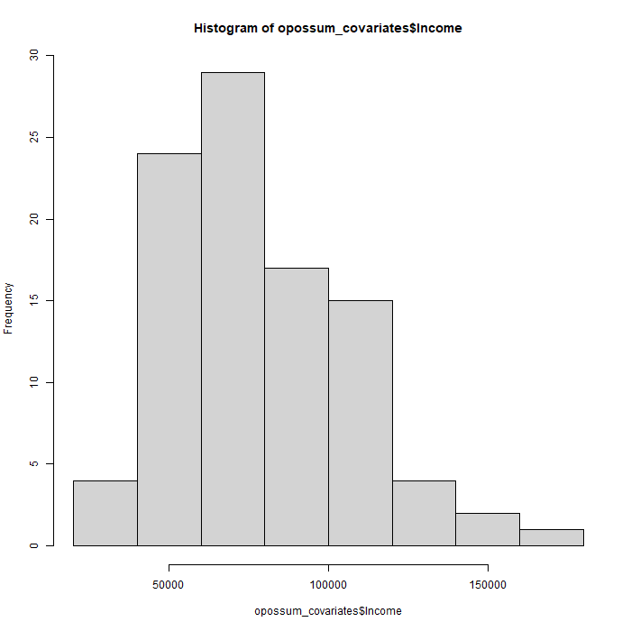
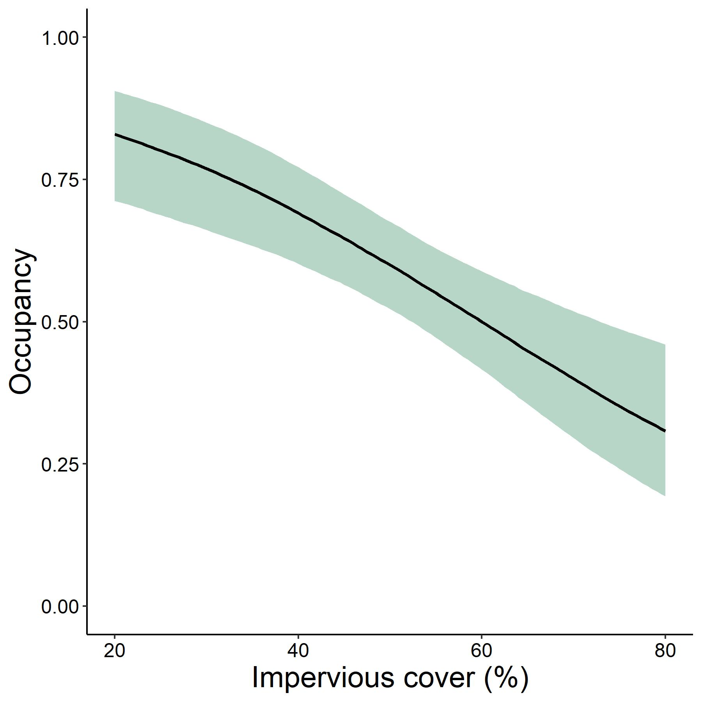
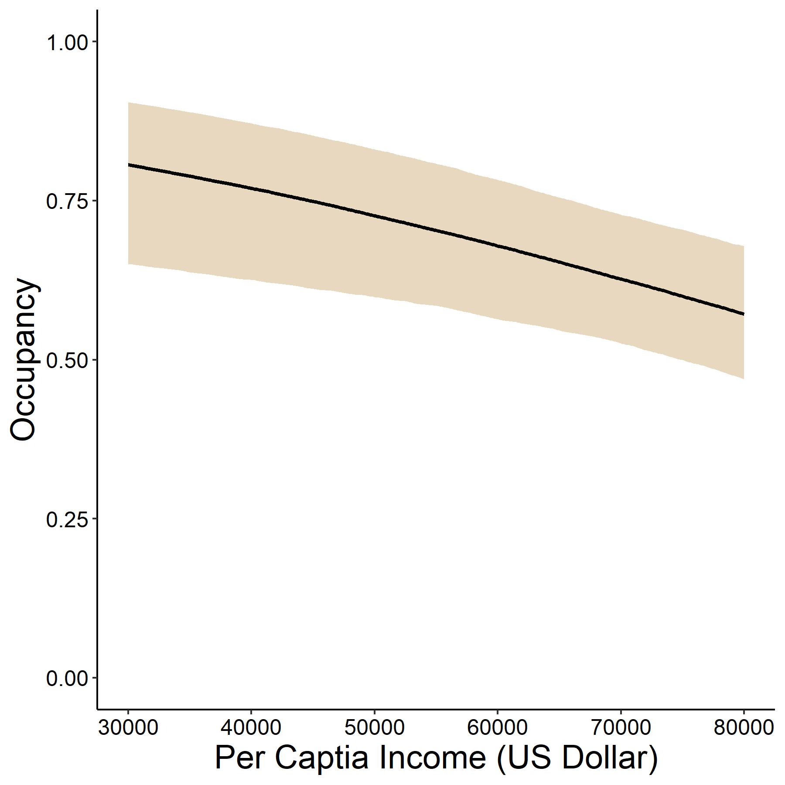

# UWIN Tutorial: Autologistic Occupancy
*Created by Kimberly Rivera and Mason FIdino - last updated May 2024 by Mason Fidino*

This tutorial is aimed at folks interested and new to occupancy modeling, or as refresher for those already familiar. This tutorial was designed with the support of outside resources listed below and via workshops developed by Mason Fidino.

### Some helpful references:
1. [An introduction to auto-logistic occupancy models](https://masonfidino.com/autologistic_occupancy_model/) - Mason Fidino
2. [Occupancy models for citizen-science data](https://besjournals.onlinelibrary.wiley.com/doi/10.1111/2041-210X.13090) - Res Altwegg & James D. Nichols

### Tutorial Aims:

#### <a href="#occupancy"> 1. What are Autologistic occupancy models?</a>

#### <a href="#formatting"> 2. Formatting data</a>

#### <a href="#models"> 3. Fitting models</a>

#### <a href="#plots"> 4. Predicting & plotting model outputs</a>


<a name="occupancy"></a>

## 1. What are Autologistic occupancy models?

Though static occupancy models can be a useful tool to study a species distribution at a single point in time they are limited to a 'static' system, meaning we cannot account for temporal changes in the environment or species occupancy. By considering a dynamic system (i.e., one that can change over time), we can account for things like changing environmental conditions (such as climate or fire), impacts of management interventions, or variations in sampling methodologies. Often, scientists are interested in modeling temporal dynamics or how a species' habitat use changes across time. There are [a variety of ways we can model](https://besjournals.onlinelibrary.wiley.com/doi/full/10.1111/2041-210X.12100) such a dyanmic system. Some common ways to account for temporal changes include dynamic occupancy models, multi-state occupancy models, or with the incorporation of random site effects. However, all these methods require large amounts of data to estimate all affiliated parameters. An alternative to these methods is to add a temporal autologistic parameter to the model so that the occupancy status of a species at one time point depends in part on the occupancy status in the previous timestep. Unlike the other methods listed above, autologistic occupancy models only introduce one new parameter. To get into the nitty gritty of the equations, please review [this blog post](https://masonfidino.com/autologistic_occupancy_model/) (also listed in references above). Rather, let's get into an example and see how this approach can be applied. 

<a name="formatting"></a>

## 2. Formatting data for an Autologistic model
For this example, we will use data collected by the UWIN Chicago contained within the `autoOcc` package. We will specifically look at changes in Virginia opossum occupancy across four seasons using the package `autoOcc`. Like a static occupancy model, we will need a column for 'sites' and 'visits' (or 'occasions' if data is collapsed). We will also need a new column which describes the temporal sampling period, in this case 'season'. 

| season  | site | occ_1 | occ... | occ_J |
|---------|------|-------|--------|-------|
| Season1 | A    | NA    | 0      | 1     |
| Season1 | B    | NA    | 0      | 0     |
| Season1 | C    | 0     | 1      | 1     |
| Season2 | A    | 1     | 0      | 0     |
| Season2 | B    | NA    | NA     | NA    |
| Season2 | C    | 0     | 0      | 1     |

Let's load in and examine our data...
```R
# Load in libraries
library(dplyr)
library(ggplot2)
library(devtools)

# Install autoOcc incase you have not yet
devtools::install_github(
  "mfidino/autoOcc",
  build_vignettes = TRUE
)
library(autoOcc)

# Create a plots sub-folder as well to store figures
#  from analysis
dir.create("plots")

# Set your local working directory and load in data that is stored
#  in autoOcc package.
data("opossum_det_hist")
data("opossum_covariates") 

# examine data
head(opossum_det_hist) 
```
The `autoOcc` package is built similarly to `unmarked`. For example, to prepare our detection / non-detection data for analysis we use the function `format_y()`, which is similar to `unmarkedFrameOccu` in `unmarked`. 

Unlike covariate data, site data can be missing within seasons. For example, Season1 may include sites a,b,c but Season2 may only include sites a,c. The function `format_y()` will account for these missing data and fill the array with NA's. To use this function we need: `x`, `site_column`, `time_column`, and `history_columns`. Be mindful to order your seasons properly before feeding into the function. Data can be input by column headers or by column numbers

```R
opossum_y <- format_y(
  x = opossum_det_hist,
  site_column = "Site",
  time_column = "Season",
  history_columns = "Week"
)

# Provides same result, though it is better to be explicit and use column
#  names as in above.
opossum_y <- format_y(
  x = opossum_det_hist,
  site_column = 1,
  time_column = 2,
  history_columns = 3:6,
  report = FALSE  # to output without ordering and history report
)
```
By looking at the output we can see the `format_y()` function breaks each week, or occasion, into a new dimension. We can call on certain aspects of the array to view our data. 

```R
# view the first week or occasion across all sampling periods
head(opossum_y[,,1])

# view all the detection / non-detection data for the first sampling period
head(opossum_y[,1,])
```
How about covariate data? With this model we can consider site, detection, or temporal covariates (here seasonal). There are two ways to format covariate data, as a date.frame or named list. A data.frame can be used if there **are no temporal covariates** (i.e., no covariates that vary across sampling periods). A named list is necessary when temporal covariates are present. As a reminder, a named list is simply a list with names to access elements of the list. For example: 

```R
x <- list(m = matrix(1:6, nrow = 2),
          l = letters[1:8],
          n = c(1:10))
```

Let's examine our spatial covariates (site-specific) and check that these data align with the output of `format_y()`

```R
# Check out site names in the covariate data.frame
opossum_covariates$Site

# Check out the same names in the detection / non-detection array
dimnames(opossum_y)[[1]]

# Are they the same?
all(opossum_covariates$Site == dimnames(opossum_y)[[1]])
```

And we can also look at their histograms to see if we should scale all covariates

```R
hist(opossum_covariates$Building_age)
hist(opossum_covariates$Impervious)
hist(opossum_covariates$Income)
hist(opossum_covariates$Population_density)
hist(opossum_covariates$Vacancy)
```

<p float="left">
  
   
   
   
   
</p>

Let's scale!

```R
# we can scale these one-by-one...
cov_scaled <- opossum_covariates %>% 
  mutate(Building_age = scale(Building_age)) %>% 
  mutate(Impervious = scale(Impervious)) %>%
  mutate(Income = scale(Income)) %>% 
  mutate(Vacancy = scale(Vacancy)) %>%
  mutate(Population_density = scale(Population_density)) 

# or we could use dplyr::across and dplyr::where to scale
#  all numeric columns.
cov_scaled <- opossum_covariates %>% 
  mutate(
    across(
      where(is.numeric), ~ as.numeric(scale(.))
   )
  )
```

As we've done with static occupancy, we will input our covariate data into a data.frame, in this case using the `auto_occ()` function. Then we are ready to fit a new model. 

```R
# we need to drop the sites column before inputting data into auto_occ()
cov_scaled = cov_scaled %>% select(-Site)
```

<a name="models"></a>

## 3. Fitting models
Now we are ready to fit some autologistic models using `auto_occ()`! The formula argument for this model should look familiar to that of `unmarked` where the first argument is for detection and the second for occupancy. However, this model includes an autologistic term.

We will fit 3 models, one for a null hypothesis, one with spatial covariates, and another that includes a temporal covariate, 'season' which is categorical. 

**null** - opossum occupancy is constant across sites <br>
**habitat hypothesis** - opossum occupancy is explained by spatial variables, impervious cover and income. We hypothesize that opossum occupancy will decrease with impervious cover due to limited habitat availability and increase with income as we suspect communities of higher income will be built closer to water and forested landscapes.  <br>
**temporal hypothesis** - opossum occupancy varies seasonally and we hypothesize occupancy will be lowest in the coldest months when they are mostly likely to hunker down in dens and spend less time foraging.

Furthermore, because we are using AIC to compare models we want to use a 
confidence interval width that more appropriately reflects the model
comparisons we are doing. As such, instead of 95% confidence intervals
we are using 85%. For additional details on this topic see this [paper here](https://royalsocietypublishing.org/doi/full/10.1098/rspb.2023.1261).

### null model (no covariates)
```R
# modeling with no covariates
m1 <- auto_occ(
  formula = ~1  # detection
            ~1, # occupancy
  y = opossum_y,
  level = 0.85
)

summary(m1)
```
We can see that our $\Psi$ - $\theta$ term (the autologistic term) is a positive **1.878**. This indicates that if opossum were present at a site at *t-1* (for example JA19), they are much more likely to be present at the same site at time *t* (e.g. AP19). We can now use this model to make predictions about the expected occupancy and average weekly detection probability (see <a href="#plots"> Predicting & plotting model outputs</a>)

### spatial model (impervious cover & income)
```R
# modeling with some spatial covariates: impervious cover and income
m2 <- auto_occ(
  ~1 # detection
  ~Impervious + Income, # occupancy
  y = opossum_y,
  occ_covs = cov_scaled,
  level = 0.85
)

summary(m2)
```
Note, we could include the same variables for detection if we believed that impervious cover and income would reduce the probability of detecting opossum. For this example, we'll keep it simple and only hypothesize about occupancy.

Here, $\Psi$ - $\theta$, is a positive **1.794**. Similar to the last model, this value indicates that if opossum were present at a site at *t-1* they are much more likely to be present at the same site at time *t*. 

### temporal model (season)
We can also add complexity with a categorical temporal covariate 'Season'. Remember that temporally varying covariates need to be a named list. For this example, the seasonal information is in the opossum detection history (opossum_det_hist). For temporal covariates on occupancy you can input a matrix as a list element with a number of rows equal to the number of sites and a number of columns equal to the number of primary sampling periods. The first column is data for the first sampling period, the second column is data for the second sampling period, etc. For only temporally varying covariates each site in a column would have the same value (e.g., JA19 for the JA19 sampling period). If data vary both spatially and temporally then values may change across rows (i.e., sites) and columns (i.e., sampling periods). Covariates that only spatially vary (e.g., impervious cover) are still included in our list as a vector.

```R
# make named list (don't worry about the warning)
season_frame <- list(
   Season = matrix(
     opossum_det_hist$Season,
     ncol = dim(opossum_y)[2],
     nrow = dim(opossum_y)[1]
   ),
   Impervious = cov_scaled$Impervious,
   Income = cov_scaled$Income
 )

# create model
m3 <- auto_occ(
   ~1
   ~Season + Impervious + Income,
   y = opossum_y,
   occ_covs = season_frame,
   level = 0.85
 )

summary(m3)
```

We see $\Psi$ - $\theta$ is an even higher positive value, **1.957**.

### Comparing models
#### AIC
We can use the build-in function `compare_models` to generate AIC values to determine the best fit model.

```R
# Comparing models
aic_results <- compare_models(
  list(m1,m2,m3),
  digits = 2
)

aic_results
```

It appears that the temporal model best explains our data! Normally, we would only continue to examine and plot our best fit model, m3, but for training, we will walk through all the models to give you some experience with plotting the data.

#### Model averaging
It is possible to model average if AIC values are similar, however we recommend using this method with caution. 

That is because 1) it is very difficult to make model predictions (even though many people do) because these models do not use the identity link (i.e., it is not a linear model) and 2) there may be a lot of uninformative parameters in your most competitive models. Some papers that go more in depth on this include:

* Cade, B. S. (2015). Model averaging and muddled multimodel inferences. Ecology, 96(9), 2370-2382.

* Arnold, T. W. (2010). Uninformative parameters and model selection using Akaike's Information Criterion. The Journal of Wildlife Management, 74(6), 1175-1178.


If you are still interested in model averaging, here is some code to help show
how you can do this (feel free to skip over this for now in the tutorial).

```R
# To model average, get the parameters in each model,
# and set up a binary matrix to denote if they were present or not in that model.

model_list <- list(
  null = m1,
  spatial = m2,
  temp = m3
)

# get only the model parameters 
parms <- lapply(
  model_list,
  function(x){
    x@estimates$parameter
  }
)

# select only unique parameters
all_parms <- unique(
  unlist(
    parms
  )
)

# make an empty matrix
parm_matrix <- matrix(
  0,
  ncol = length(
    all_parms
  ),
  nrow = length(
    model_list
  )
)
colnames(parm_matrix) <- all_parms

# Add '1's to models which have parameter present
for(i in 1:nrow(parm_matrix)){
  parm_matrix[i, parms[[i]]] <- 1
}

# calculate overall weight for each parameter. The easiest
#  way to do this is to make a weight matrix.
weight_matrix <- matrix(
  aic_results$AICwt,
  nrow = length(model_list),
  ncol = length(all_parms)
)

parm_weight <- colSums(
  parm_matrix * weight_matrix
)

#  We are going to take samples from the parameters (which
#  is the same thing we do to make predictions
#  via autoOcc::predict). To do that, we need
#  to get the variance covariance matrix
#  for each model.

cov_mat <- lapply(
  model_list,
  vcov
)

# and now the estimates (assuming you are not
# using any offsets in the model for this).

ests <- lapply(
  model_list,
  function(x) x@estimates$Est
)

# do 5000 samples for each parameter.
mvn_samps <- vector(
  "list",
  length = length(model_list)
)
nsim = 5000
set.seed(465)
for(i in 1:length(mvn_samps)){
  mvn_samps[[i]] <- mvtnorm::rmvnorm(
    nsim,
    mean = ests[[i]],
    sigma = cov_mat[[i]],
    method = "svd"
  )
  colnames(mvn_samps[[i]]) <- parms[[i]]
}

# do model averaging for each parameter
avg_parm <- data.frame(
  parameter = all_parms,
  est = NA,
  lower = NA,
  upper = NA
)

for(i in 1:nrow(avg_parm)){
  my_parm <- avg_parm$parameter[i]
  which_models <- which(
    parm_matrix[,i] == 1
  )
  
  weights <- weight_matrix[
    which_models,i
  ] * parm_matrix[
    which_models,i
  ]

  # get beta terms
  beta_mat <- matrix(
    NA,
    ncol = length(which_models),
    nrow = nsim
  )

  # multiply weight across columns while we do this
  for(j in 1:ncol(beta_mat)){
    beta_mat[,j] <- mvn_samps[[which_models[j]]][,my_parm] *
      weights[j]
  }

  # sum each row
  beta_mat <- rowSums(beta_mat)
  
  # divide by overall weight
  beta_mat <- beta_mat / parm_weight[i]
  
  # summarise
  avg_parm$est[i] <- median(beta_mat)
  avg_parm$lower[i] <- quantile(
    beta_mat,
    0.025
  )
  avg_parm$upper[i] <- quantile(
    beta_mat,
    0.975
  )
  
}

avg_parm
```

### Next steps
Now we can backtransform our estimates for occupancy on a scale of 0 to 1 (because we are working with probabilities. We can do this with the `predict` function (see below).

<a name="plots"></a>

## 4. Predicting & plotting model outputs
### null model (no covariates)
Because the null model does not consider any covariates, we will only use the `predict` function to estimate the intercept.

```R
# expected occupancy
(intercept_preds_psi <- predict(
    m1,
    type = "psi"))

# average weekly detection probability
(intercept_preds_rho <- predict(
    m1, 
    type = "rho"))
```

For our null hypothesis, we estimate **$\Psi$ (occupancy) = 0.59 (95%CI: 0.49, 0.69)** and **$\rho$ (detection) = 0.53 (95%CI: 0.48, 0.57)**. Note that occupancy
estimates from this class of model (or really any dynamic model) must be interpreted in a slightly different way. More specifically, occupancy estimates
generated via `autoOcc::predict()` represent the long-run average in occupancy at a site. If you are interested in the equation used check out the help file for
`autoOcc::predict()` (i.e., `?predict.auto_occ_fit`).

### spatial model (impervious cover & income)
To make predictions for our spatial model, we will generate realistic 'clean' data (to make pretty plots!) for impervious cover and income. To do this, we want to examine our actual data to set probable intervals of data. We also need to scale this data since we fed scaled data into our models.

```R
# look at real data to get an idea about the range
#  of values we should make predictions. Pick nice round
#  numbers close to the min and max of these values.
summary(opossum_covariates$Impervious)
summary(opossum_covariates$Income)

# generate new 'clean' data to predict over
imperv <- data.frame(
  Impervious = seq(20, 80, 0.5),
  Income = 0 # we use '0' because the data is scaled, thus the mean is zero.
)

income <- data.frame(
  Impervious = 0,
  Income = seq(30000, 80000, 100)
)

# scale data in the EXACT same way you scaled it in the model.
#  In other words, subtract the mean of the original covariate
#  and divide by the standard deviation.
imperv_scale <- imperv
imperv_scale$Impervious <-  (
  imperv_scale$Impervious - mean(opossum_covariates$Impervious)
) / sd(opossum_covariates$Impervious)


income_scale <- income
income_scale$Income <- (
  income_scale$Income - mean(opossum_covariates$Income)
) / sd(opossum_covariates$Income)

```

Now we are ready to predict an output using our spatial model (m2) and clean dataset.

```R
opo_imperv <- predict(
  object = m2,
  type = "psi",
  newdata = imperv_scale,
  level = 0.85
)

opo_income <- predict(
  object = m2,
  type = "psi",
  newdata = income_scale,
  level = 0.85
)
```

Awesome, our two data.frames `opo_imperv` and `opo_income` should contain three columns: estimate (the occupancy estimate), lower (the lower confidence interval for this estimate), and upper (the upper confidence interval). 

We can use these data.frames along with the clean data we generated to plot our data. If you want to save this plot locally and control the size, you can wrap theplotting code in a `png()` function ending with `dev.off()`. Note this won't plot within R, but will save to your local working directory which you can check with `get.wd()`.

```R
# plot data with basic R functions
png("./plots/opo_imperv_basic.png", height = 700, width = 700)
# generate a blank plot
plot(
  opo_imperv$estimate ~ imperv$Impervious,
  bty = "l",
  type = "n",
  las = 1,
  ylab = "Occupancy",
  xlab= "Impervious Cover (%)",
  ylim = c(0,1),
  lwd = 3
)
# add a shaded ribbon
polygon(
  x = c(
    imperv$Impervious,
    rev(
      imperv$Impervious
    )
  ),
  y = c(
    opo_imperv$lower,
    rev(
      opo_imperv$upper
    )
  ),
  col = "#72AD8F",
  border = NA
)
# Add predicted line
lines(
  opo_imperv$estimate ~ imperv$Impervious,
  lwd = 3
)
dev.off()
```
<p float="center">
  
</p>

You can also play around with the color using the package `colourpicker`. You can add multiple colors at a time or delete the extra colors to add one at a time. Once you install the library, simply click **Addins> Colour Picker** on the top of the R console and select any color.

let's try to make this plot again using `ggplot` and `Colour Picker`. To save a ggplot locally, we can use the `ggsave` function.

```R
library(colourpicker)

# make a data.frame that has the predictions and the gradient
#  we want to plot on.
imperv_plot <- data.frame(
  Impervious = imperv$Impervious,
  opo_imperv
)


ggplot(imperv_plot, aes(x = Impervious, y = estimate)) +
  geom_ribbon(aes(ymin = lower, ymax = upper), fill = "#72AD8F", alpha = 0.5) +
  geom_path(linewidth = 1) + # adds line
  labs(x = "Impervious cover (%)", y = "Occupancy") +
  scale_x_continuous(limits = c(20,80)) +
  ylim(0,1)+
  theme_classic()+ # drops gray background and grid
  theme(plot.title=element_text(size = 16, hjust=0.5), # centers titles
        axis.text.x = element_text(size = 12, color = "black"),    
        axis.text.y = element_text(size = 12, color = "black"),
        axis.title = element_text(size = 18)) 
ggsave("./plots/opo_imperv_ggplot.jpg", width = 6, height = 6)
```
<p float="center">
  
</p>

## Challenge 1. 
To plot opossum occupancy across income, we need to repeat this plotting process over. Try the same steps as above with the income dataset. 

<details closed><summary>Solution</a></summary>

```R
income_plot <- data.frame(
  Income = income$Income,
  opo_income
)


ggplot(income_plot, aes(x = Income, y = estimate)) +
  geom_ribbon(aes(ymin = lower, ymax = upper), fill = c("#D4B282"), alpha = 0.5) +
  geom_path(linewidth = 1) + # adds line
  labs(x = "Per Captia Income (US Dollar)", y = "Occupancy") +
  scale_x_continuous(limits = c(30000,80000)) +
  ylim(0,1)+
  theme_classic()+ # drops gray background and grid
  theme(plot.title=element_text(size = 16, hjust=0.5), # centers titles
        axis.text.x = element_text(size = 12, color = "black"),    
        axis.text.y = element_text(size = 12, color = "black"),
        axis.title = element_text(size = 18)) 
        
ggsave("./plots/opo_income_ggplot.jpg", width = 6, height = 6)
```
<p float="center">
  
</p>

</details>
