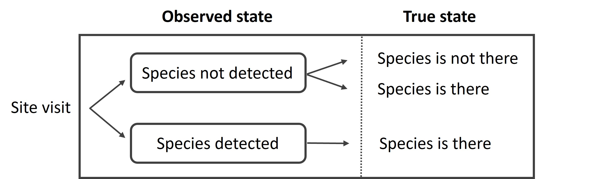
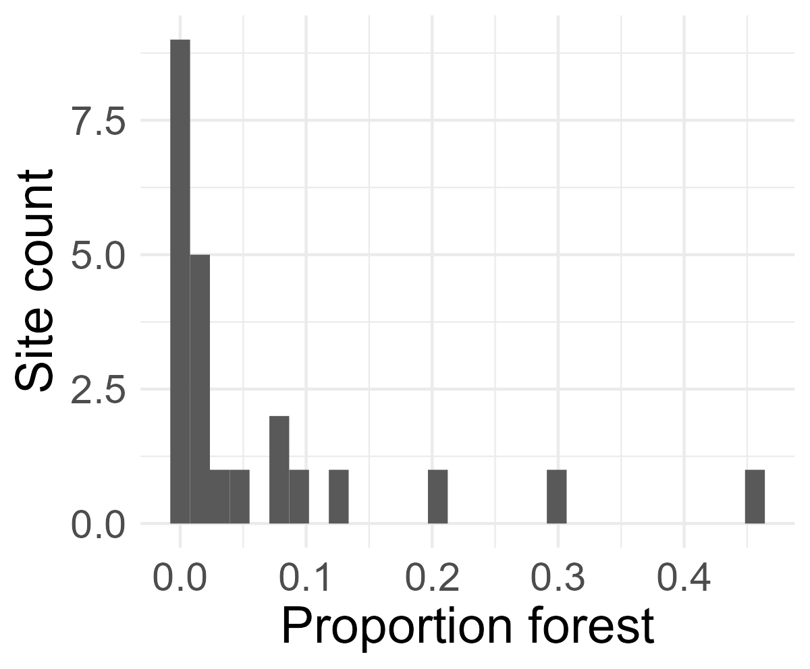
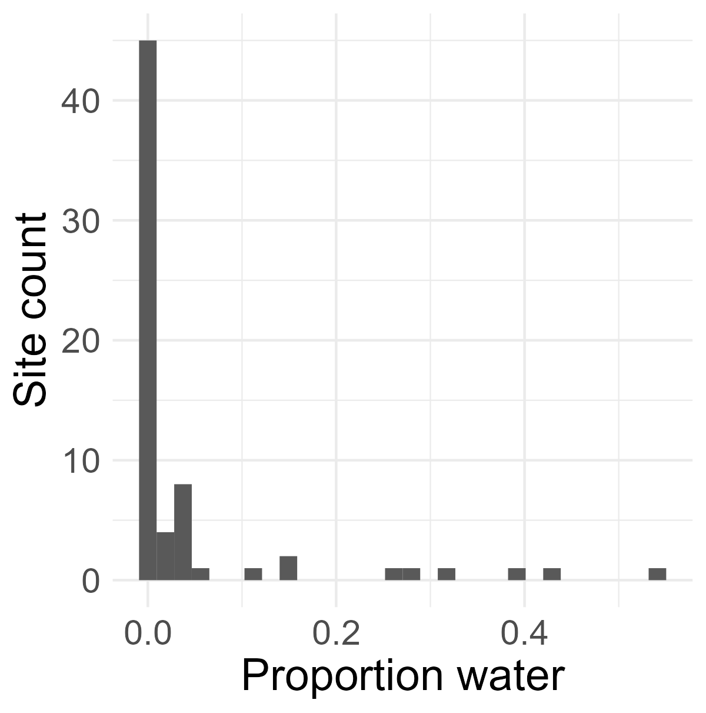
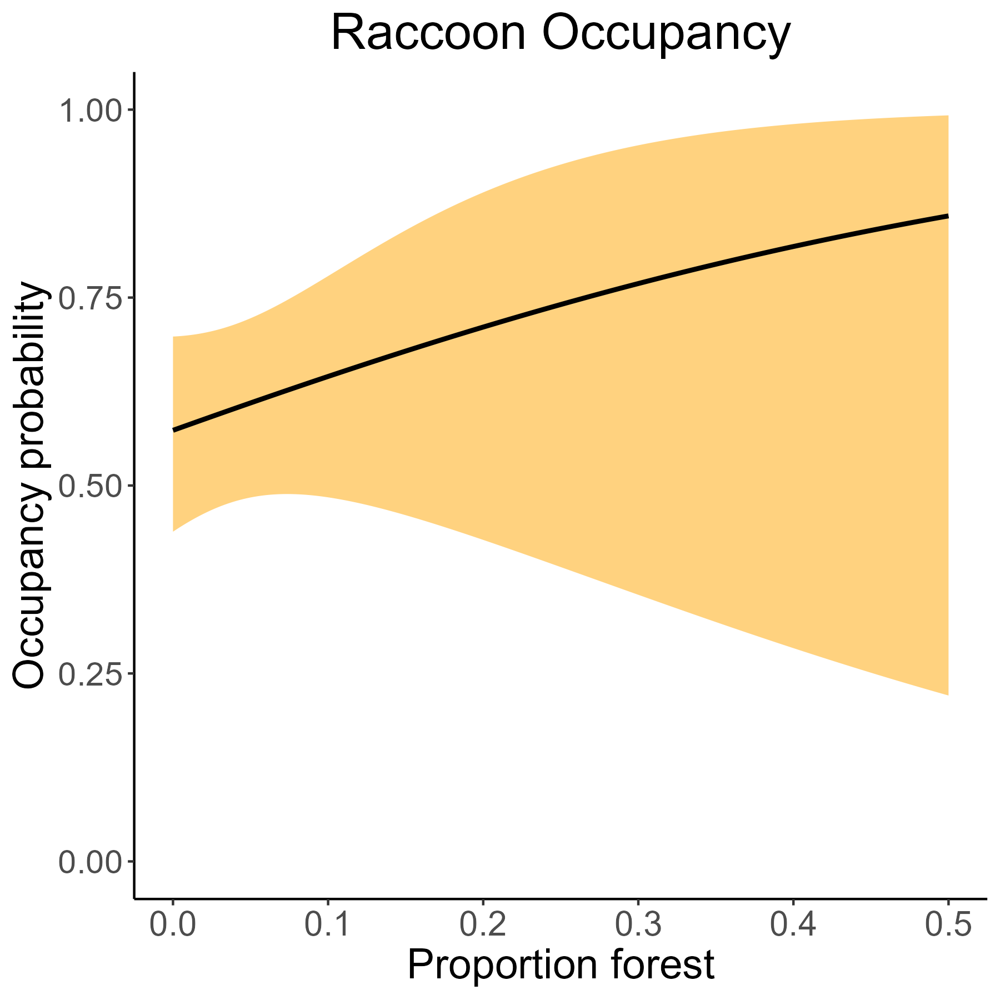

# UWIN Tutorial: Static Occupancy
*Created by Kimberly Rivera and Mason Fidino - last updated December 2023*

This tutorial is aimed at people who are either interested in and new to occupancy modeling, or as a refresher for those already familiar with occupancy modeling. This tutorial was designed with the support of outside resources listed below and via workshops developed by Mason Fidino.

### Some helpful references:
1. USGS's ['Occupancy to study wildlife'](https://pubs.usgs.gov/fs/2005/3096/fs20053096.pdf) - Larrisa Bailey
2. Lodestar's [Guide to 'Fitting occupancy models in unmarked'](https://doi90.github.io/lodestar/fitting-occupancy-models-with-unmarked.html) - David Wilkinson

### Packages needed for this tutorial

There are a number of R packages that you will need to install in order to do this tutorial. This includes `dplyr`, `ggplot2`, and the `unmarked` package. Here is a helper function to check and see whether or not you have these packages locally installed (and if not will install them for you).

```R
package_load<-function(packages = NA, quiet=TRUE, verbose=FALSE, warn.conflicts=FALSE){
  
  # download required packages if they're not already
  pkgsToDownload<- packages[!(packages  %in% installed.packages()[,"Package"])]
  if(length(pkgsToDownload)>0)
    install.packages(pkgsToDownload, repos="http://cran.us.r-project.org", quiet=quiet, verbose=verbose)
  
  # then load them
  for(i in 1:length(packages))
    require(packages[i], character.only=T, quietly=quiet, warn.conflicts=warn.conflicts)
}

package_load(
  c(
    "dplyr", "ggplot2", "unmarked"
  )
)

```

### [Tutorial Aims:](#tutorial-aims)

 [1. What is occupancy?](#1-what-is-occupancy)

 [2. Occupancy model assumptions](#2-occupancy-model-assumptions)

 [3. Formatting data](#3-formatting-data)

 [4. Fitting models](#4-fitting-models)

 [5. Predicting and plotting model outputs](#5-predicting-and-plotting-model-outputs)

## 1. What is occupancy?

Often in wildlife ecology, we are interested in the relationship between species presence and the environment, or species' occupied habitat (where species are found in space and time). 'Occupancy' is an effective way to model the occurrence of species and can be defined as the probability that a site (space) is occupied by a particular species at a particular time, mathematically represented as $\Psi$.

Estimating the abundance of species in a local area can be difficult and time-intensive. For example, to identify individuals you may need to conduct trapping, which is invasive, or you could identify certain species by unique markings, like stripes. A less intensive and non-invasive option is to estimate occupancy, which is easier and can be done with passive tools such as camera traps or acoustic monitors. Similarly, because we are most interested in whether a species is present on not in a local area, we don't need to worry about whether the species could have unique markings on them to identify them at an individual level. 

However, survey tools and our ability to detect species is imperfect. Thankfully, occupancy models account for these uncertainties, which can improve our estimate of a species 'true' occupancy (the true presence of a species) state from our 'observed' occupancy state (data we collect on species presence). We do this by repeatedly visiting sampling sites, collecting information about these sites, and feeding this information into our model. Here, we will focus on the most simple occupancy model, a single-species, single-season model. 

<p float="center">
  

</p>

We can convert surveys into data that can be used within occupancy models by creating 'detection histories'. These typically are formed as tables of '0's (no species was detected) and '1's (a species was detected) where rows indicate sites and columns indicate repeat visits. If there is uneven sampling across sites you can also have `NA` values for when sampling did not occur. From there, you can calculate the probability of that detection history with some mixture of $\Psi$ (the probability a site is occupied) and $\rho$ (the probability a species is detected given their presence). For example, the probability of the two detection histories below are:

<p float="center">
  
</p>

Written plainly, for the first detection history, we know that the species is present because it was detected at least once. The species was not detected on survey 1 and 3 and was detected on survey 2 and 4. Thus, we can calculate the probability of this specific detection history by taking the product of $\psi$ and the individual detection probabilities of each survey (or 1 minus that probability if the species was not detected). For the second detection history we have a full vector of 0's. This means one of two things, either the species was present and not detected on each survey or the species was not there. Because these two events are independent of one another, you can calculate the probability of each and just add them together. 

Note that you do not need to construct these likelihoods on your own. We are simply sharing what packages like `unmarked` are calculating under the hood once you supply data to them.

[Back to table of contents ⤒](#tutorial-aims)
## 2. Occupancy model assumptions

Like any type of statistical model, occupancy models make a number of assumptions. Some of these include:

1. Detection probability is constant across sites or visits, or explained by covariates
2. Occupancy probability is constant across sites or visits. or explained by covariates
3. The occupancy status does not change over our repeated surveys (also known as 'closed' to change or the 'closure' assumption)
4. There are no false detections (detecting a species when it is truly *not* there or misidentifying a species)

Hopefully, you can meet these assumptions by carefully developing your study design (based on our research questions) and by incorporating relevant and measurable covariates (e.g. environmental variability). Closure is perhaps the most likely assumption that is violated, especially as it is quite difficult to account for, but you can try to meet this assumption by having smaller sampling windows (e.g., a month of sampling vs a year of sampling).


[Back to table of contents ⤒](#tutorial-aims)
## 3. Formatting data

Let's learn more about occupancy modeling with an example. We will use raccoon data collected from UWIN Chicago in the summer of 2021. For those who use the Urban Wildlife Information Network's online database, you are welcome to work through your own data. Simply navigate to the [UWIN Database](https://www.urbanwildlifenetwork.org/)> Reports> Occupancy Report. Here you can select one species of interest over a specific date/time range. We would recommend starting with one sampling season (as species may change their occupancy season to season--another type of occupancy model!).  

As a reminder, you should have loaded the packages you needed at the very start of this tutorial. If you have not, then load `dplyr`, `ggplot2`, and `unmarked` (see above). We assume that these packages have been loaded. Let's take a peek at the data! 

Start by loading in necessary libraries and `chicago_raccoon.csv`.  Assuming that `chicago_raccoon.csv` is within your working directory, then you can read in the data like so (for UWIN occupancy reports you have to skip the first three rows, this is not something you would have to do for every occupancy analysis).

```R
raccoon <- read.csv("chicago_raccoon.csv", head = TRUE, skip = 3) 

# Check out what data we're working with.
head(raccoon)
```
By glancing at our environment, we see that this data contains information from 170 sites. We can choose to consider each 'day' as a visit or, if our species are rare or hard to detect, we can collapse each visit into multiple days as an 'occasion'. Given the large 'zero' or 'unoccupied' occurrence of raccoons, we will collapse each visit into a ~6 day occasions.

```R
# Let's confirm that there are no repeated sites
length(unique(raccoon$Site))

# Great, no repeats! Now let's collapse our data into 6-day sampling occasions. Let's grab all the columns that start with day...
day_cols <- raccoon[,grep("^Day_",colnames(raccoon))]

# split them into six day groups...
n_weeks <- ceiling(ncol(day_cols)/6)
week_groups <- rep(1:n_weeks, each = 6)[1:ncol(day_cols)]

# and write a function that keeps each occasion with all NA's as such and those with all 0's as 0, and those with at least 1 detection, as 1

combine_days <- function(y, groups){
  ans <- rep(NA, max(groups))
  for(i in 1:length(groups)){
    tmp <- as.numeric(y[groups == i])
    if(all(is.na(tmp))){
      next
    } else {
      ans[i] <- as.numeric(sum(tmp, na.rm = TRUE)>0)
    }
  }
  return(ans)
}

# Apply this function across rows (in groups of 6)
week_summary <- t( # this transposes our matrix
  apply(
    day_cols, 
    1, # 1 is for rows
    combine_days,
    groups = week_groups
  )
)

# Now update names
colnames(week_summary) <- paste0("Week_",1:n_weeks)

# drop visits
raccoon_wk <- raccoon[,-grep("^Day_", colnames(raccoon))]

# and add occasions
raccoon_wk <- cbind(raccoon_wk, week_summary)
```
Now, one issue that may arise from grouping occasions on a specific number of days is that when occasion lengths don't evenly break down into our total sampling days, we may have uneven occasions lengths as seen above (6 occasions in 31 days). We can either combine the remainder day into the fifth occasion or simply drop that day. For now, we will drop the last sampling day.

```R
raccoon_wk <- raccoon_wk %>% 
  select(-Week_6)
```

Though raccoons are well adapted to urban environments, we hypothesize that raccoon occupancy will be highest in proximity to forests and water sources given their preference for wooded and wet areas to den and forage. We will use the National Land Cover Database developed by the [United States Geological Survey](https://www.usgs.gov/centers/eros/science/national-land-cover-database) and join landcover covariates to our occasion data. These data were extracted using the `FedData` package in R. Learn more about mapping in the ['Detection Mapping'](https://github.com/urbanwildlifeinstitute/UWIN_tutorials/tree/main/tutorials/Detection%20Mapping) tutorial. Column values are the percent landcover within 1000m of each camera site.  

```R
landcover <- read.csv("Chicago_NLCD_landcover.csv", head = TRUE)
head(landcover)

# Let's join this dataset to our raccoon data. First we need to make sure 'sites' are named the same to join these datasets
colnames(raccoon_wk)
colnames(landcover)

# we'll go ahead and rename 'sites' to 'Site' in the 'landcover' dataset
landcover <- rename(landcover, Site = sites)

# Now we can join our datasets and drop NA's. 
raccoon_wk <- left_join(raccoon_wk, landcover, by = 'Site') %>% 
  na.omit(.)
```
Be mindful that it is OK to have missing or NA observation data (i.e., detection histories) BUT for each observation, there must be a covariate value otherwise this data will not be considered in the model and we won't be able to compare models using AIC. We only have landcover data for 119/170 sites, so these sites we do not have covariate data for are dropped using `na.omit()`.

We will be using the `unmarked` R package to model our data. Therefore, our data has to be formatted to `occu()` model fitting function within the package using a `unmarkedFrameOccu()` dataframe. The help file for this fucntion provides all the necessary details about how to format our data for analysis.

```R
?unmarkedFrameOccu()
```
We see there is one necessary argument and two optional arguments we can specify to run the `occu()` function: `y`, `siteCovs`, and `obsCovs`. Looking at the help file we need to supply our detection histories (`y`) and can supply site covariates to estimate occupancy (`siteCovs`) and detection covariates to estimate detection probability (`siteCovs`). Remember assumptions 1 & 2 from above? Occupancy and detection probability are constant across sites or visits, unless they are explained by covariates. For our study, we believe that our detection probability is constant, but raccoon occupancy will be explained by tree cover and water. Let's continue formatting our data to model an occupancy model based on this hypothesis.

```R
y <- raccoon_wk %>% 
  select(Week_1:Week_5)

siteCovs <- raccoon_wk %>% 
  select(c(water, forest))

```
We should also examine our covariates and note their structure, scale, and distribution.
```R
ggplot(raccoon_wk, aes(x = water)) +
  geom_histogram() +
  theme_minimal() +
  theme(text = element_text(size = 18)) +
  labs(x = "Proportion water", y = "Site count")

ggplot(raccoon_wk, aes(x = forest)) +
  geom_histogram() +
  theme_minimal() +
  theme(text = element_text(size = 18)) +
  labs(x = "Proportion forest", y = "Site count") 
```

<p float="left">
  
   
</p>

In this example, we have two covariates which share the same scale/units and fall within a small range of values. This will make it easier for our model to converge (i.e., reach a solution). However, it is common in most regression based analyses to incorporate covariates of various scales and ranges, thus scaling would be necessary. In addition, we also need to consider the biological meaning of each covariate within the framework of our model and system. For occupancy, it is generally helpful to have the intercept of the model represent occupancy at an average site. This can help us interpret whether species occurrence falls below or above average values. 

Thus, we will scale both 'water' and 'forest' before adding them to our `occu()` data.frame. The `scale()` function will center and scale each covariate by subtracting the mean and dividing by the standard deviation. That means that a value of 0 is average and that the standard deviation of this scaled covariate is 1. 

```R
# scale covariates
siteCovs <- siteCovs %>% 
  mutate(water_scale = scale(water)) %>% 
  mutate(forest_scale = scale(forest))

siteCovs_df <- data.frame(siteCovs)

# Now we can make our unmarkedFrameOccu() dataframe
raccoon_occ <- unmarkedFrameOccu(y = y, siteCovs = siteCovs_df)

# examine covariate details and site summary
summary(raccoon_occ)
```


[Back to table of contents ⤒](#tutorial-aims)
## 4. Fitting models

Let's fit two models, one for a null hypothesis and one which considers the habitat metrics mentioned above: <br />
**null** - raccoon occupancy is constant across sites <br />
**habitat hypothesis** - raccoon occupancy is explained by habitat variables, water and forest, where raccoon occupancy increases with increasing proportions of water and forests.

Static occupancy models have two linear predictors, one for detection and one for occupancy. Within `unmarked` we use a slightly modified R formula syntax to specify our two models. First, you do not need to specify what the response variable is (the function already knows that detection history you input into `y` is the response variable). Second, you input two linear predictors which are ordered as 'detection model' then 'occupancy model'. Thus, the code to fit our two models would look something like: 

```R
# learn more about this function modeled after MacKenzie et al. (2002)
?occu()

null_model <- occu(~1 # detection
                        ~1, # occupancy
                        data = raccoon_occ)

habitat_model <- occu(~1 # detection
                      ~ forest_scale + water_scale, # occupancy
                        data = raccoon_occ)
# examine model estimates and standard errors
null_model
habitat_model
```

We can also use functions `fitList` and `modSel` in `unmarked` to compare our models using AIC (Akaike information criterion which  estimates the prediction error/ quality of the models).

```R
fitlist <- fitList(m1 = null_model, m2 = habitat_model)
modSel(fitlist)
```

Our model with the best relative fit is the one with the lowest AIC. Here, we see that our null model has the lowest AIC. Let's examine the model parameters for detection and occupancy from this model

```R

# We can also use `confit` to calculate the associated error for each estimate
# 95% confidence intervals for occupancy
occ_error <- cbind(coef(null_model, type = "state"),
                         confint(null_model, type = "state"))
# 95% confidence intervals for detection
det_error <- cbind(coef(null_model, type = "det"),
                         confint(null_model, type = "det"))
```
This occupancy model is fit with a logit-link function, thus our estimates are given as log-odds or the logged ratio of the probability of success and the probability of failure. These can be tricky to interpret so it is good practice to convert these estimate to probabilities on a scale of 0 to 1. 

```R
# Convert confidence intervals back to probability from log-odds estimate
# plogis() = to exp() / 1 + exp()
plogis(occ_error)
plogis(det_error)
```
How about **naive occupancy**? You may have heard of this term before and it simply means the raw estimate without accounting for imperfect detection. This is calculated by counting the number of sites where the species was observed and dividing that number by the total number of sites. Note that this value should always be smaller than the estimated occupancy. 

```R
# Our naive occupancy
siteValue <- apply(X = y,
                   MARGIN = 1, # 1 = across rows
                   FUN = "max", na.rm = TRUE) # This function finds the max value

mean(siteValue)
```


[Back to table of contents ⤒](#tutorial-aims)
## 5. Predicting and plotting model outputs

Though our null hypothesis was most supported (e.g. a lower AIC), we can use the `habitat_model` to demonstrate how to predict occupancy across covariates, or in this example, proportion of forest or water. Let's plot how occupancy changes across varying proportions of forest cover.

To do this we need to consider two types of data, our original forest values, and the scaled values we fed into our model. Let's examine the ranges of those data to inform our prediction data set.

```R
# examine the ranges of both data types
range(siteCovs_df$forest)
range(siteCovs_df$forest_scale)
```
Since we want to make a 'clean' or pretty plot, we will want to use the real range of our forest data to pick our plotting values without extrapolating our prediction. Here, our real (unscaled) 'forest' data ranges from 0 to .49. For plotting purposes, we will create a new prediction dataframe from 0 to .5 and scale this clean sequence of values in the same way we scaled our real data fed into the model. We must also add other model covariate data into our predicted dataframe, in this case, water. Since we are just interested in how occupancy changes across variation in forest cover, we will hold water to it's mean scaled value, or zero (remember when we scale data, the means will center on zero). 

```R
# recreate 'clean' data for plotting later
forest_real <- c(0, 0.5)

# Create a prediction dataframe and make sure to use the same covariate names as included in the occupancy model
dat_plot <- data.frame(
  forest_scale = seq(forest_real[1], forest_real[2], length.out = 400),
  water_scale = 0 # zero because water has been scaled/centered
)

# rescale 'clean' forest data exactly how we did in our model
dat_pred <- dat_plot
dat_pred$forest_scale <- (dat_pred$forest_scale - mean(siteCovs_df$forest)) / sd(siteCovs_df$forest)
```
Now that we have the cleaned version of our data scaled, we are ready to make predictions and plot. 
```R
# Make predictions with these data
pred_forest <- predict(habitat_model, type = "state", newdata = dat_pred)
head(pred_forest)
```
Note that the `predict()` function converts data into probabilities so we do not need to use `plogis()` as we have done previously with the output of the `occu()`

We can use base R to plot our predicted occupancy values and confidence intervals on the y-axis and our clean/pretty covariate data on the x-axis.
```R
plot(pred_forest$Predicted ~ dat_plot$forest_scale, # y-axis ~ x-axis
     type = "l",  # plot out a line
     bty = "l", # box type is an L around plot
     xlab = "Proportion forest", # x label
     ylab = "Occupancy", # y label
     ylim = c(0, 1), # range to y axis
     xlim = c(0,.5),
     lwd = 2, # width of the line
     las = 1 # have numbers on y axis be vertical
)
# add 95% confidence intervals
lines(pred_forest$lower ~ dat_plot$forest_scale, # y-axis ~ x-axis
      lty = 2 # make a checked line
) 
lines(pred_forest$upper ~ dat_plot$forest_scale, # y-axis ~ x-axis
      lty = 2 # make a checked line
)
```

<p float="center">

  

</p>

We can also plot this figure using `ggplot` functions.
  
```R
# first merge the two datasets (predicted occupancy and forest data)
all_dat <- bind_cols(pred_forest, dat_plot)

ggplot(all_dat, aes(x = forest_scale, y = Predicted)) +
  geom_ribbon(aes(ymin = lower, ymax = upper), fill = "orange", alpha = 0.5) +
  geom_path(size = 1) + # adds line
  labs(x = "Proportion forest", y = "Occupancy probability") +
  ggtitle("Raccoon Occupancy")+
  scale_x_continuous(limits = c(0,.5)) +
  ylim(0,1)+
  theme_classic()+ # drops gray background and grid
  theme(plot.title=element_text(hjust=0.5), axis.text.x = element_text(size = 15), 
        text = element_text(size = 18))
  ```
<p float="center">
  
</p>


Nice work! If you are interested in furthering your occupancy journey, try this tutorial again with your own data or check out other UWIN tutorials like ['Autologistic occupancy'](https://github.com/urbanwildlifeinstitute/UWIN_tutorials/tree/main/tutorials/Auto-logistic%20occupancy).

[Back to table of contents ⤒](#tutorial-aims)


<p float="center">
  
</p>


