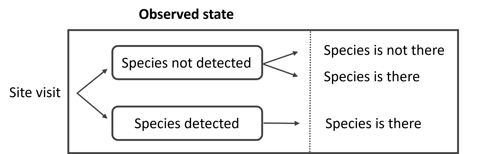
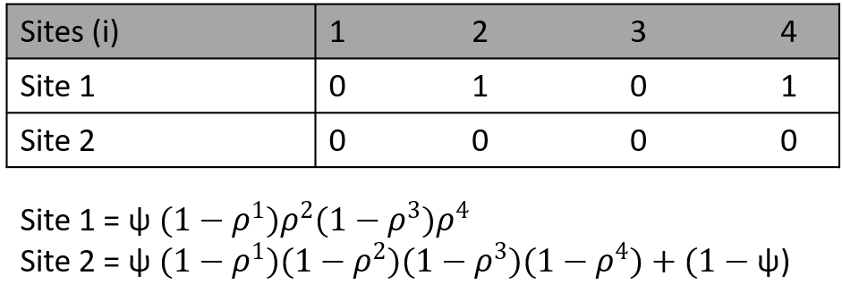
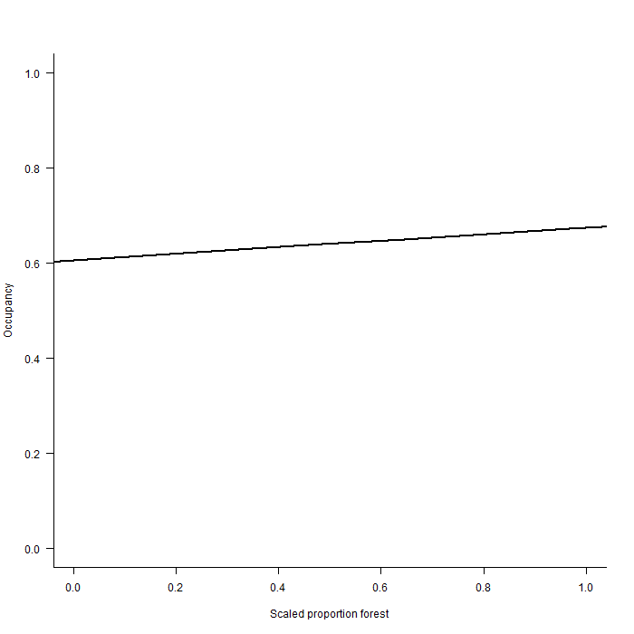
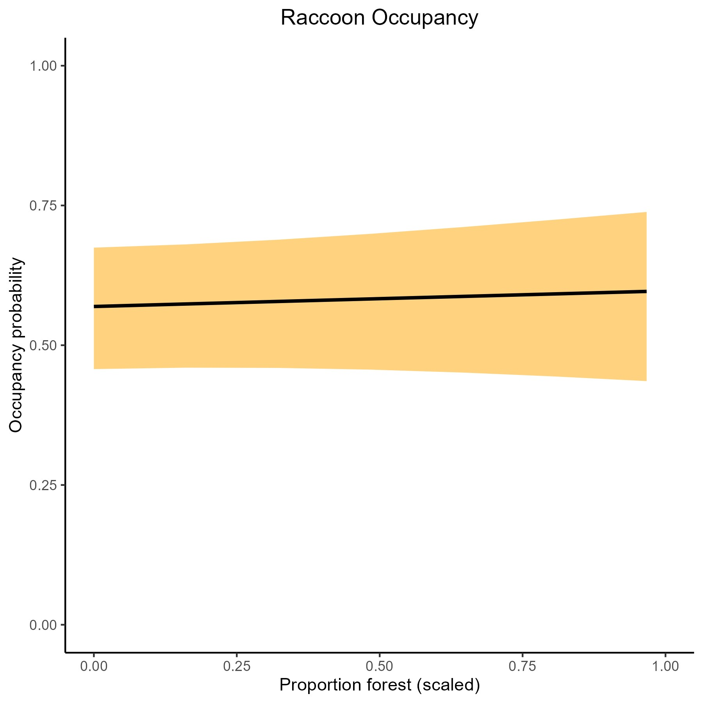

# UWIN Tutorial: Static Occupancy
*Created by Kimberly Rivera - last updated October 2023 by Kimberly Rivera*

This tutorial is aimed at folks interested and new to occupancy modeling, or as a refresher for those already familiar. This tutorial was designed with the support of outside resources listed below and via workshops developed by Mason Fidino.

### Some helpful references:
1. USGS's ['Occupancy to study wildlife'](https://pubs.usgs.gov/fs/2005/3096/fs20053096.pdf) - Larrisa Bailey
2. Lodestar's [Guide to 'Fitting occupancy models in unmarked'](https://doi90.github.io/lodestar/fitting-occupancy-models-with-unmarked.html) - David Wilkinson

### Tutorial Aims:

#### <a href="#occupancy"> 1. What is occupancy?</a>

#### <a href="#assumptions"> 2. Occupancy model assumptions</a>

#### <a href="#formatting"> 3. Formatting data</a>

#### <a href="#models"> 4. Fitting models</a>

#### <a href="#plots"> 5. Predicting & plotting model outputs</a>


<a name="occupancy"></a>

## 1. What is occupancy?

Often in wildlife ecology, we are interested in unpacking the relationship between species presence and the environment, or species' occupied habitat (where species are found in space and time). 'Occupancy' is an effective way to model the occurrence of species and can be defined as the probability that a site (space) is occupied by a particular species at a particular time, mathematically represented as $\Psi$.

Rather then try to count or estimate the abundance of species in a given environment, we can use passive tools such as cameras traps or acoustic detectors, to monitor areas that may or may not host species (specifically 'unmarked species') of interest. The term 'unmarked' means individuals cannot be identified via unique markings or tags (such as ear tags or spot patterns).

However, survey tools and our ability to detect species is imperfect. Thankfully, we can use occupancy models to account for these uncertainties, therefore improving our estimate of a species 'true' occupancy (the true presence of a species) state from our 'observed' occupancy state (data we collect on species presence). We do this by repeatedly visiting sampling sites, collecting information about these sites, and feeding this information into our model. Here, we will focus on the most simple occupancy model, a single-species, single-season model. 

When conducting surveys, the following may occur:

<p float="center">
  
</p>

<a name="assumptions"></a>


We can convert surveys into mathematical equations by creating 'detection histories'. These typically are formed as tables of '0's (no species was detected) and '1's (a species was detected) where rows indicate sites and columns indicate repeat vistis. For example:

<p float="center">
  
</p>

<a name="assumptions"></a>
In these equations, $\Psi$ represents the probability a site is occupied by a species while ***p*** represents the probability of detecting a species during that particular visit.  


## 2. Occupancy model assumptions

Under this model we assume that:

1. Detection probability is constant across sites or visits, or explained by covariates
2. Occupancy probability is constant across sites or visits. or explained by covariates
3. The occupancy status does not change over our repeated surveys (also known as 'closed' to change)
4. There are no false detections (detecting a species when it is truely *not* there or misidentifying a species)

We comply to these assumptions by carefully developing our study design (based on our research questions) and by incorporating relevant and measurable covariates (e.g. environmental variability). 

<a name="formatting"></a>

## 3. Formatting data

Let's learn more about occupancy through an example. We will use raccoon data collected from UWIN Chicago in the summer of 2021. For those who use the Urban Wildlife Information Network's online database, you are welcome to work through your own data. Simply navigate to the [UWIN Database](https://www.urbanwildlifenetwork.org/)> Reports> Occupancy Report. Here you can select one species of interest over a specific date/time range. We would recommend starting with one sampling season (as species may change their occupancy season to season--another type of occupancy model!).  

Let's take a peek at the data! Start by loading in necessary libraries and `chicago_raccoon.csv`. We will continue to use `dplyr` and `ggplot2`.

```R
# Load in libraries
install.packages("dplyr")
install.packages("ggplot2")
library(dplyr)
library(ggplot2)

# Set your local working directory
setwd()
raccoon <- read.csv("chicago_raccoon.csv", head = TRUE, skip = 3) 

# Check out what data we're working with.
head(raccoon)
```
By glancing at our environment, we see that this data contains information from 170 sites. We can choose to consider each 'day' as a visit or, if our species are rare or hard to detect, we can collapse each visit into multiple days as an 'occasion'. Given the large 'zero' or 'unoccupied' occurrence of raccoons, we will collapse each visit into a ~6 day occasions.

```R
# Let's confirm that there are no repeated sites
length(unique(raccoon$Site))

# Great, no repeats! Now let's collapse our data into 6-day sampling occasions. Let's grab all the columns that start with day...
day_cols <- raccoon[,grep("^Day_",colnames(raccoon))]

# split them into six day groups...
n_weeks <- ceiling(ncol(day_cols)/6)
week_groups <- rep(1:n_weeks, each = 6)[1:ncol(day_cols)]

# and write a function that keeps each occasion with all NA's as such and those with all 0's as 0, and those with at least 1 detection, as 1

combine_days <- function(y, groups){
  ans <- rep(NA, max(groups))
  for(i in 1:length(groups)){
    tmp <- as.numeric(y[groups == i])
    if(all(is.na(tmp))){
      next
    } else {
      ans[i] <- as.numeric(sum(tmp, na.rm = TRUE)>0)
    }
  }
  return(ans)
}

# Apply this function across rows (in groups of 6)
week_summary <- t( # this transposes our matrix
  apply(
    day_cols, 
    1, # 1 is for rows
    combine_days,
    groups = week_groups
  )
)

# Now update names
colnames(week_summary) <- paste0("Week_",1:n_weeks)
raccoon_wk <- raccoon[,-grep("^Day_", colnames(raccoon))]
raccoon_wk <- cbind(raccoon_wk, week_summary)
```
Now, one issue that may arise from grouping occasions on a specific number of days is that when occasion lengths don't evenly break down into our total sampling days, we may have uneven occasions lengths as seen above (6 occasions in 31 days). We can either combine the remainder day into the fifth occasion or simply drop that day. For now, we will drop the last sampling day.

```R
raccoon_wk <- raccoon_wk %>% 
  select(-Week_6)
```

Though raccoons have adapted to urban ecosystems, we hypothesize that raccoon occupancy will be highest in proximity to forests and water sources given their preference for wooded and wet areas to den and forage. We will use the National Land Cover Database developed by the [United States Geological Survey](https://www.usgs.gov/centers/eros/science/national-land-cover-database) and join landcover covariates to our occasion data. These data were extracted using the `FedData` package in R. Learn more about mapping in the ['Detection Mapping'](https://github.com/urbanwildlifeinstitute/UWIN_tutorials/tree/main/tutorials/Detection%20Mapping) tutorial. Column values are the percent landcover within 1000m of each camera site.  

```R
landcover <- read.csv("Chicago_NLCD_landcover.csv", head = TRUE)
head(landcover)

# Let's join this dataset to our raccoon data. First we need to make sure 'sites' are named the same to join these datasets
colnames(raccoon_wk)
colnames(landcover)

# we'll go ahead and rename 'sites' to 'Site' in the 'landcover' dataset
landcover <- rename(landcover, Site = sites)

# Now we can join our datasets and drop NA's. 
raccoon_wk <- left_join(raccoon_wk, landcover, by = 'Site') %>% 
  na.omit(.)
```
Be mindful that it is OK to have missing or NA observation data BUT for each observation, there must be affiliated covariate data, otherwise this data will not be considered in the model and we won't be able to compare models using AIC. We only have landcover data for 119/170 sites, so these sites are dropped using `na.omit()`.

We will be using the `unmarked` R package to model our data. Therefore, our data has to be formatted to `occu()` model fitting function within the package using a `unmarkedFrameOccu()` dataframe. 

```R
install.packages("unmarked")
library("unmarked")
?unmarkedFrameOccu()
```
We see there are a few necessary arguments we need to specify to run the `occu()` function: `y`, `siteCovs`, and `obsCovs`. Remember assumptions 1&2 from above? Occupancy and detection probability is constant across sites or visits, unless they are explained by covariates. For our study, we believe that our detection probability is constant, but raccoon occupancy will be explained by tree cover and water. Let's continue formatting our data to model an occupancy model based on this hypothesis.

```R
y <- raccoon_wk %>% 
  select(Week_1:Week_5)

siteCovs <- raccoon_wk %>% 
  select(c(water, forest))

# We should also examine our covariates of interest to see if they should be scaled
hist(raccoon_wk$water)
hist(raccoon_wk$forest)
```
<p float="left">
  
   
</p>

Looks like it's a good idea to scale these data before adding to our `occu()` data.frame

```R
# scale covariates
siteCovs <- siteCovs %>% 
  mutate(water_scale = scale(water)) %>% 
  mutate(forest_scale = scale(forest)) %>% 
  select(-c(water, forest)) # drop unscaled covariates

siteCovs_df <- data.frame(siteCovs)

# Now we can make our unmarkedFrameOccu() dataframe
raccoon_occ <- unmarkedFrameOccu(y = y, siteCovs = siteCovs_df)
summary(raccoon_occ)
```

<a name="models"></a>

## 4. Fitting models

Let's fit two models, one for a null hypothesis and one which considers the habitat metrics mentioned above: <br />
**null** - raccoon occupancy is constant across sites <br />
**habitat hypothesis** - raccoon occupancy is explained by habitat variables, water and forest, where raccoon occupancy increases with increasing proportions of water and forests

```R
?occu()

null_model <- occu(~1 # detection
                        ~1, # occupancy
                        data = raccoon_occ)

habitat_model <- occu(~1 # detection
                      ~ forest_scale + water_scale, # occupancy
                        data = raccoon_occ)
null_model
habitat_model
```

We can also use functions `fitList` and `modSel` in `unmarked` to compare our models.

```R
fitlist <- fitList(m1 = null_model, m2 = habitat_model)
modSel(fitlist)
```
Our best fit model is that with the lowest AIC. Here, we see that our null model has the lowest AIC. Let's examine the model parameters for detection and occupancy from this model

```R
plogis(coef(null_model, type = "state")) # probability for occupancy
plogis(coef(null_model, type = "det")) # probability for detection

# We can also use `confit` to calculate the associated error
# 95% confidence intervals for occupancy
occ_error <- cbind(coef(null_model, type = "state"),
                         confint(null_model, type = "state"))
# 95% confidence intervals for detection
det_error <- cbind(coef(null_model, type = "det"),
                         confint(null_model, type = "det"))
                         
# Convert confidence intervals back to probability 
plogis(occ_error)
plogis(det_error)
```
How about **naive occupancy**? You may have heard of this term before and it simply means the raw estimate without accounting for imperfect detection. This is calculated by counting the number of sites where the species was observed and dividing that number by the total number of sites.

```R
# Our naive occupancy
siteValue <- apply(X = y,
                   MARGIN = 1, # 1 = across rows
                   FUN = "max", na.rm = TRUE) # This function finds the max value

mean(siteValue)
```

<a name="plots"></a>

## 5. Predicting & plotting model outputs

If we chose to go with our habitat hypothesis, we could use `habitat_model` to predict occupancy across varying proportions of forest or water. Let's plot changes in occupancy with proportion of forest as an example.

We know that the proportion of forest ranges from 0 to 1, so we will predict across these values in intervals of .05 while holding water equal to the mean scaled value. We also have to remember that we scaled our predictors, so we must do that again here.

```R
# Create a new dataframe 
new_dat <- data.frame(forest = seq(from = 0, to = 1, by = 0.05),
                     water_scale = mean(siteCovs$water_scale))
# Scale the data
new_dat <- new_dat %>% 
  mutate(forest_scale = scale(forest))
  
# Make predictions with these data
pred_forest <- predict(habitat_model, type = "state", newdata = new_dat)
head(pred_forest)
```
Now we are in good shape for plotting! Let's make a rough plot first then play around with `ggplot`.

```R
plot(pred_forest$Predicted ~ new_dat$forest_scale, # y-axis ~ x-axis
     type = "l",  # plot out a line
     bty = "l", # box type is an L around plot
     xlab = "Scaled proportion forest", # x label
     ylab = "Occupancy", # y label
     ylim = c(0, 1), # range to y axis
     xlim = c(0,1),
     lwd = 2, # width of the line
     las = 1 # have numbers on y axis be vertical
)
  
# add 95% confidence intervals
lines(pred_forest$lower ~ new_dat$forest_scale, # y-axis ~ x-axis
      lty = 2 # make a checked line
) 
lines(pred_forest$upper ~ new_dat$forest_scale, # y-axis ~ x-axis
      lty = 2 # make a checked line
)
```
<p float="center">
  
</p>

We can make this a bit cleaner using `ggplot` functions.
  
```R
# first merge the two datasets (predicted occupancy and forest data)
all_dat <- bind_cols(pred_forest, new_dat)

ggplot(all_dat, aes(x = forest_scale, y = Predicted)) +
  geom_ribbon(aes(ymin = lower, ymax = upper), fill = "orange", alpha = 0.5) +
  geom_path(size = 1) + # adds line
  labs(x = "Proportion forest (scaled)", y = "Occupancy probability") +
  ggtitle("Raccoon Occupancy")+
  scale_x_continuous(limits = c(0,1)) +
  ylim(0,1)+
  theme_classic()+ # drops gray background and grid
  theme(plot.title=element_text(hjust=0.5)) # centers titles
  ```
<p float="center">
  
</p>

Nice work! If you are interested in furthering your occupancy journey, try this tutorial again with your own data or check out other UWIN tutorials like ['Autologistic occupancy'](https://github.com/urbanwildlifeinstitute/UWIN_tutorials/tree/main/tutorials/Auto-logistic%20occupancy).
